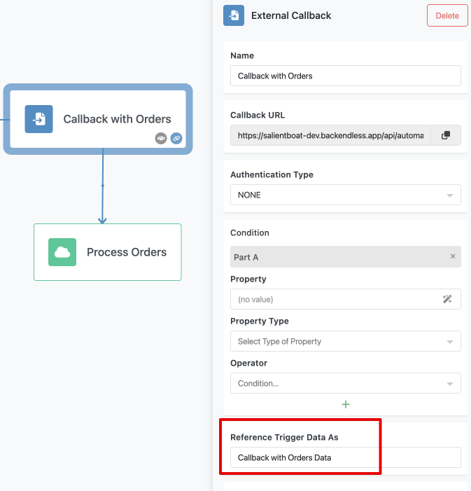
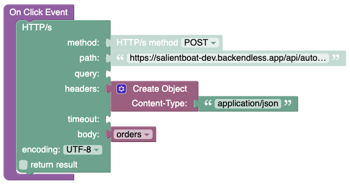
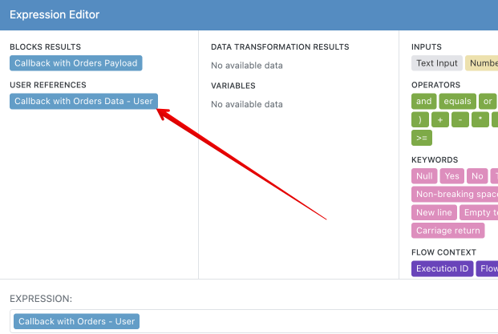
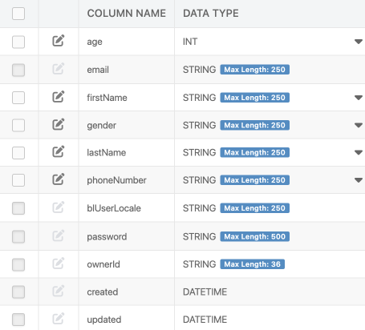
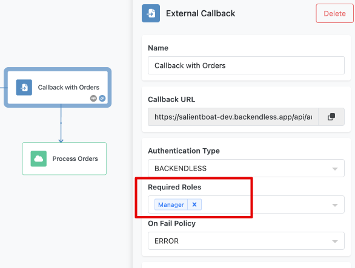

Imagine you are running an e-commerce platform, and you need to process orders only after the payment is confirmed by a third-party payment gateway. This is where FlowRunner’s External Callback trigger shines. It pauses the workflow and waits for an external event to activate it, ensuring that the flow continues only when certain conditions are met. Let's dive into the details of how this powerful feature works.

Let’s consider a scenario where you want to process an order only after payment confirmation. Here’s how you can set up your workflow using the External Callback trigger:

1. **Order Received**: The flow starts when a new order is placed.
2. **Process Order Details**: The flow processes the order details.
3. **External Callback Trigger**: The flow pauses here and waits for the payment confirmation.
4. **Complete Order**: Once the External Callback trigger is activated, the flow continues to complete the order and notify the customer.

When the flow reaches the External Callback trigger, it pauses and waits for the payment gateway to call a dedicated URL unique to that trigger. The payment gateway sends the confirmation by calling this URL, optionally passing data in a key/value structure (JSON object). This data remains available to the subsequent blocks in the flow, ensuring a smooth continuation of the process.

## External Callback Block

The External Callback trigger is a block within FlowRunner. When you add the block to your flow, you will get a dedicated URL that uniquely identifies the trigger in the flow. 


When you run the flow and it reaches this trigger, it pauses and waits until the trigger is activated by an external call to this URL. The external system (e.g., a payment gateway, an email verification service, or a supplier system) activates the trigger by making an HTTP request to the URL. 

## Callback Request Format
A callback request must adhere to the following specifications:

 **Endpoint**: 
    ```
    POST https://xxxx.backendless.app/api/automation/flow/[FLOW-ID]/trigger/[TRIGGER-ID]/activate
    ```
    where:
    
`[FLOW-ID]` and `[TRIGGER-ID]` are unique identifiers assigned to the flow version and the trigger by the system. Use the block's properties panel as described below to get the complete callback URL value.

**HTTP Headers**:
```
Content-Type: application/json
user-token: value 
```
The `user-token` header is optional. When it is used, the identity of the user represented by the token is passed to the trigger and will be available in the successor blocks.

**Request Body**:
```json
{
  any valid JSON object can be passed to the trigger
}
```
Any data passed to the trigger will be available as the trigger's "result" element to all successor blocks through the [Expression Editor](../flow-editing/expressioneditor.md) interface.

**Response Body**

None. A successful trigger activation request returns no data.

## Accessing Trigger's Data

A request to an External Callback URL may include additional data in the form of a key/value structure (JSON object), which will be accessible to other blocks in the flow that follow the trigger. Any data sent to the trigger's callback URL is referenced in the system as `Trigger Data`. Consider the example below. Notice the assigned name of the trigger is `Callback with Orders`. Any data sent to the trigger is called `Callback with Orders Data`: 



Below is a sample Backendless Codeless block that sends an HTTP request to the specified External Callback URL:



Notice the data it sends with the request, it is a variable called `orders`. Below is the same request in a cURL format:
```
curl 'https://demoapp.backendless.app/api/automation/flow/AC0B2747-EAD8-4C9A-BB9C-9F0A4EBEAB81/trigger/C778279B-B151-6272-EDA7-76C9141E1F11/activate' \
  -H 'Content-Type: application/json' \
  --data-raw '{ \
      "data":[ \
         {"name":"shampoo","price":9.95}, \
         {"name":"conditioner","price":8.99}, \
         {"name":"body wash","price":5.99}\
      ]\
  }'
```

 When the trigger is activated in the flow, any successor blocks of the trigger will be able to access that data via [Expression Editor](../flow-editing/expressioneditor.md).


## Callback with a Logged-In User

The [trigger activation request](#callback-request-format) can include a reference to a logged-in Backendless User by using an HTTP header called `user-token`. This token is assigned by the Backendless system to the logged-in user. For more details, refer to the [Backendless Login API](https://backendless.com/docs/rest/users_login.html).

When the trigger activation request includes a `user-token`, the system retrieves the complete user object, which is a key/value structure. This user object is then available for all subsequent blocks via the Expression Editor:



The `user` structure contains properties with values corresponding to the columns in the `Users` table in the Backendless application where the flow is running. For example, consider the following schema for the `Users` table in the application:



Based on this schema, the `user` element accessible through the Expression Editor will have the following structure:

```json
{
  "lastLogin": 1719591614000,
  "lastName": "Bond",
  "userStatus": "ENABLED",
  "gender": "male",
  "firstName": "James",
  "phoneNumber": "+44 007007007",
  "name": null,
  "age": 45,
  "email": "jamesbond@mi6.co.uk",
  "created": 1719589705912,
  "accountType": "BACKENDLESS",
  "socialAccount": "BACKENDLESS",
  "ownerId": "087A2B43-EB71-4322-AD34-EDA9CA77B77E",
  "oAuthIdentities": null,
  "blUserLocale": "en",
  "updated": null,
  "objectId": "087A2B43-EB71-4322-AD34-EDA9CA77B77E"
}
```

The Expression Editor simplifies accessing these property values:


## Required Authentication

You can configure the External Callback Trigger to require authentication, ensuring that a reference to an authenticated user is present in the callback request. To enable this, select the trigger block and set the `Authentication Type` property to `BACKENDLESS`:


With this setting, the trigger will activate only when a callback has a valid user reference through the `user-token` HTTP header. Additionally, you can specify the security roles that the referenced user must possess. This selection is made in the `Required Roles` drop-down list:



The `On Fail Policy` setting allows you to define how the trigger activation request should be handled if there is no authenticated user or if the user does not belong to the specified roles:


If the policy is set to `ERROR`, FlowRunner will return the following error for trigger activation requests that fail the authentication or role check:

```json
{
    "code": 1000,
    "message": "Unable to execute the callback. User is missing required security role(s)"
}
```

If the policy is set to `IGNORE`, the trigger activation request will be completed successfully, but the trigger will not be activated if the user reference is missing or the user does not have the required roles.

By using these authentication settings, you can ensure that your workflows are secure and only triggered by authorized users.

## Conditional Trigger Activation
The External Callback trigger can have a condition associated with it. When the callback URL is executed, FlowRunner™ evaluates the condition. If the condition evaluates to `TRUE`, the trigger is activated. If the condition evaluates to `FALSE`, the callback request is ignored. For more information about setting up and using conditions, see the [Conditional Logic](../flow-editing/conditions.md) section of this guide.