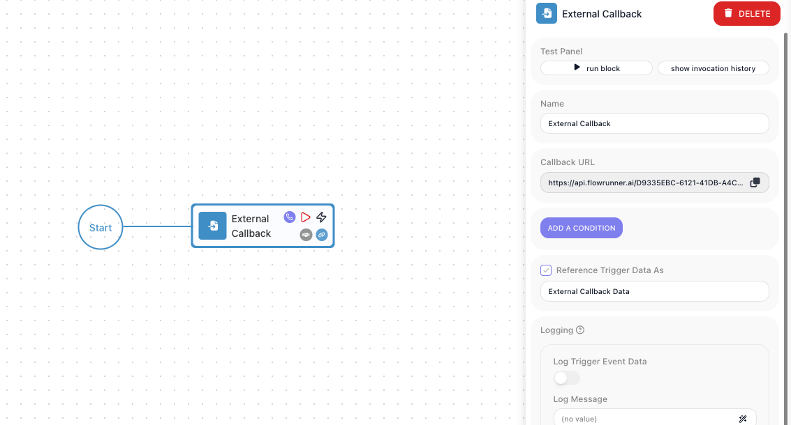

<!-- GENERATED FILE - do not edit. Source: block-knowledge/external-callback.yaml. Regenerate: make refgen -->
<!-- doclint: allow-unlinked: External Callback -->
# External Callback

This trigger lets an outside system start - or resume - your flow when an event happens out there: a payment confirms, a webhook fires, another service posts an update. FlowRunner gives the flow its own web address, the <span class="fr-control">Callback URL</span>, and whatever the caller sends becomes data your flow can read.

## How it works

This trigger lives in the Triggers palette category. Think of the <span class="fr-control">Callback URL</span> as a private
doorbell for this flow. The trigger hands you one unique address that points only here, and the
flow waits at it. When an outside system makes an HTTP request to that address, the trigger
answers: it takes whatever came in, hands it to the rest of the flow under an alias you name in
<span class="fr-control">Reference Trigger Data As</span> (<span class="fr-expr">External Callback Data</span> by default), and the run proceeds. The
door is only open while the flow is in the LIVE state, so a request that arrives at any other time
goes unanswered and starts nothing.

A trigger has no result of its own to compute; the data it exposes is the request that came in. So
before you can point steps at individual fields, the trigger needs to know what those fields are.
That is what <span class="fr-control">Learning Mode</span> is for. It is not a field in the block's settings panel - you turn it on from
the block's hover toolbar on the canvas, then send one real sample request to the <span class="fr-control">Callback URL</span>, and
the trigger records the structure of what arrived. From then on, a downstream step reads a field
through the Expression Editor: the alias appears there as a reference you pick, and you walk into
a field with `->`, so the email address arrives as <span class="fr-expr">External Callback Data → customer.email</span>.
<span class="fr-control">Learning Mode</span> works while you are still building, before the flow is ever LIVE.

## When to use it

Reach for it when something outside FlowRunner needs to kick off your flow - a payment provider announcing a charge, a form submission, another service posting an event. You give that system the <span class="fr-control">Callback URL</span> and it calls you, rather than you polling it. <span class="fr-control">ADD A CONDITION</span> lets you gate the trigger so it fires only for the requests you care about, which keeps unrelated calls from starting runs. The same trigger can also pick up where a paused run left off, covered below.

## Resuming a paused run

Most triggers only ever begin something. This one can also finish something. Placed at the start
of a flow, an <span class="fr-block">External Callback</span> begins a new run for every call that comes in. But placed mid-flow,
it does not start anything new at all - it wakes a specific run that paused earlier, waiting for
exactly this callback.

That difference is what makes a hand-off possible. Your flow can reach out to an outside system,
ask it for something that takes time, and then stop and wait rather than guessing how long to
sleep. When that system finishes and calls the <span class="fr-control">Callback URL</span> back, the waiting run picks up right
where it left off and carries on with the answer in hand, so the right run wakes for the right call.

## Example

Suppose a payment provider should kick off your flow every time a customer pays. In the provider's dashboard you paste this trigger's <span class="fr-control">Callback URL</span> as the webhook target. When a payment clears, the provider sends a POST to that URL with a JSON body like this:

```json
{
  "event": "payment.succeeded",
  "orderId": "ORD-4417",
  "amount": 4999,
  "currency": "USD",
  "customer": { "email": "dana@example.com" }
}
```

Before wiring anything up, you turn on <span class="fr-control">Learning Mode</span> and have the provider send one test payment to the <span class="fr-control">Callback URL</span>. The trigger records the structure above, so later steps can reference fields by name instead of guessing. The whole body is now available under the alias <span class="fr-expr">External Callback Data</span>. To read the order number, a later step opens the Expression Editor, picks that alias, and walks into the field with `->`, giving <span class="fr-expr">External Callback Data → orderId</span>.

The provider also sends other events to the same URL - refunds, disputes - that you do not want to act on here. <span class="fr-control">ADD A CONDITION</span> that checks <span class="fr-expr">External Callback Data → event</span> equals `"payment.succeeded"`, so a refund or dispute notification arrives but does not start a run.

Set the flow LIVE. Now each successful payment posts to the <span class="fr-control">Callback URL</span>, the condition passes, a new run begins with that payment under the <span class="fr-expr">External Callback Data</span> alias, and the steps after the trigger can read <span class="fr-expr">External Callback Data → orderId</span> and <span class="fr-expr">External Callback Data → amount</span> to record the sale.



## Configuration

| Field | Description |
| --- | --- |
| Callback URL | The flow's unique web address, generated for you with a copy button. Give this to the outside system so it can call your flow; the URL identifies the workspace and flow it belongs to. |
| Add a Condition | An optional gate on whether the trigger fires for a given request. If the condition is false for an incoming call, the trigger does not start a run for it. |
| Reference Trigger Data As | The name you use to read the incoming request elsewhere in the flow. A trigger has no computed result, so this alias points at the request that came in. |

**Common settings** (available on most blocks):

| Field | Description |
| --- | --- |
| Name | A label for this block on the canvas. |
| Logging | What to log to the Logging panel while the flow is LIVE, both on start and on completion. |
| Notes | Freeform notes for documenting the block; they do not affect execution. |

## Things to watch for

- The trigger listens only while the flow is in the LIVE state. A request that arrives when the flow is not LIVE is not handled and starts no run.
- Used at the start of a flow, the trigger begins a new run for each call. Used to continue a run that paused waiting on a callback, it resumes that existing run instead of starting a new one.
- Reference fields in the incoming request only after you have captured its shape with <span class="fr-control">Learning Mode</span> - otherwise there is nothing to point your expressions at. <span class="fr-control">Learning Mode</span> does not need the flow to be LIVE; it listens for one sample request while you build.
- When you turn <span class="fr-control">Learning Mode</span> on, the trigger waits for a real request to the <span class="fr-control">Callback URL</span>. Send that sample yourself with a test tool such as Postman, or have the integrating system send one; FlowRunner does not generate it for you.

## Related

- [Triggers Group](triggers-group.md)
