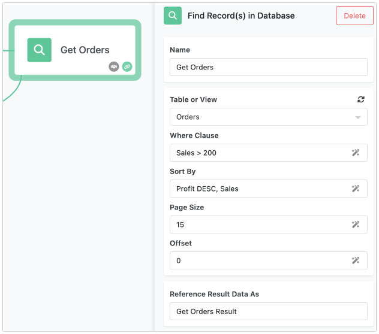
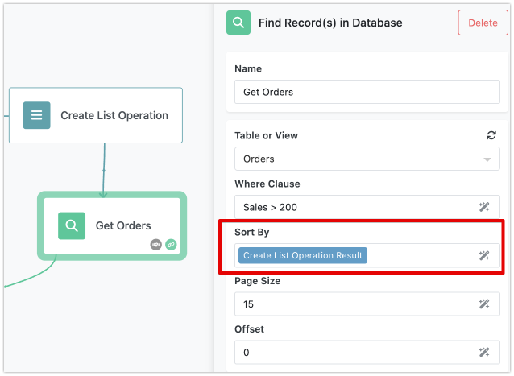

The "Find Record(s) in Database" action block is a powerful feature in FlowRunner™ that allows you to tap into the full potential of your Backendless database. Whether you’re managing customer information, tracking inventory, or analyzing sales data, this block makes it easy to retrieve the exact records you need.

Your Backendless workspace includes a complete, cloud-based database where you can store and manage all kinds of data. As your data grows, you’ll often need to filter, sort, and retrieve specific records to use in your automated workflows. That’s where the "Find Record(s) in Database" block comes in.

This block is essential for any process that requires pulling data from your database—whether you’re sending personalized emails to customers, generating reports, or triggering actions based on specific criteria. With it, you can pinpoint the exact data you need, ensuring your workflows are both efficient and precise.

## How It Works

The "Find Record(s) in Database" block allows you to retrieve records from any table in your Backendless database. You can customize the data retrieval by using an optional "where clause" query, sorting the results, and managing the number of records returned through pagination settings.

## Block's Properties

The "Find Record(s) in Database" action block comes with several configurable properties that allow you to tailor the data retrieval to your specific needs. Let’s go through each of these properties to understand how they work.



### Table or View
This property allows you to specify the source from which you want to retrieve records. In your Backendless workspace, you can select either a database table or a view. Tables store your data directly, while views are virtual tables that represent the result of a query. Selecting the appropriate table or view is the first step in ensuring that you pull the relevant records into your Flow. Simply choose the table or view that contains the data you need.

### Where Clause
A where clause instructs the database to filter the records retrieved by setting specific criteria. This clause uses Backendless' ["where clause" syntax](https://backendless.com/docs/rest/data_search_with_where_clause.html) to define the conditions that records must meet to be included in the results. For example, you could use a where clause to find all customers who have made a purchase in the last 30 days or to retrieve records that match a certain status. If you leave this field empty, the block will return records starting from the specified "Offset" up to the "Page Size."

### Sort By
This property lets you determine the order in which the records are returned. You can specify one or more columns by which to sort the results, and choose whether to sort each column in ascending or descending order. If you sort by multiple columns, the block will first sort by the primary column; any records with the same value in this column will then be sorted by the secondary column, and so on. There are several formats to specify the columns names:

* Comma delimited string value:
    ```
    Name,Price
    ```
* List of string values. For the demonstration purposes, the first screenshot below creates a list of string values. The second screenshot shows how to utilize the list in the **Sort By** parameter:
    
     

    This feature is useful when you need your data organized in a specific way, such as listing customers alphabetically by last name or ordering sales transactions by date.

### Page Size
This property controls how many records are returned in a single query. This is particularly useful when working with large datasets, as it allows you to retrieve a manageable number of records at a time. If you don’t specify a page size, the system will default to returning 10 records. Adjusting the page size can help you balance between performance and the volume of data you want to work with. Maximum page size in the Backendless Development System is 100 records. You can customize it in the [self-hosted version of the Backendless Platform](https://backendless.com/pricing/backendless-pro/). For additional information about database paging, see the [Data Retrieval with Paging section](https://backendless.com/docs/rest/data_data_paging.html) in the Backendless Development System documentation.

### Offset
Determines where the data retrieval starts within the dataset. By default, the offset is set to 0, meaning the block will start retrieving records from the very beginning of the table. If you’re paging through results or want to skip a certain number of records, you can adjust the offset to begin retrieval from a different point. This property is essential when you need to manage large amounts of data across multiple queries.

## Result Format

The records retrieved by the "Find Record(s) in Database" block are returned as a JSON list. Each record in the list is represented as a JSON object (a key/value structure), where the keys correspond to the column names in the database table/view, and the values are the corresponding data values from the records. This format makes it easy to process and manipulate the data further in your Flow.

## Handling Errors

If something goes wrong during the data retrieval—such as an invalid query or a connection issue - the error can be managed using the [Error Handler](../flow-editing/error-handling.md) block. This ensures that your Flow can gracefully handle issues and continue running or take alternative actions as needed.
