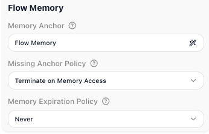
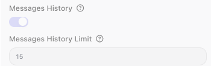

<!-- GENERATED FILE - do not edit. Source: block-knowledge/flow-memory-concept.yaml. Regenerate: make refgen -->
# Flow Memory (Agent Memory)

Flow Memory is how an [AI Agent](ai-agent.md){.fr-block} remembers what happened on earlier runs. Turn on Messages History and the agent keeps a running record of its recent exchanges, so each new run can build on what was already said instead of starting from nothing.

## How it works

By default an AI Agent has no memory. Every run starts cold: the only things it knows are its
System Prompt and the User Prompt for this run, and the moment the run ends it forgets them. That
is the right behavior for a step that judges one thing at a time, but it is no good for a
conversation, where the agent needs to remember what came before.

Flow Memory is what you turn on to fix that. With Messages History on, the agent keeps a running
record of its recent turns - each run's prompt and the agent's reply are added to that record, and
on the next run the agent is shown the record along with the new prompt. So it can follow a thread:
remember a name the user gave it a moment ago, build on an answer it already gave, stop asking for
something it has already been told.

The record is bounded. You set a limit - up to 20 - and only that many of the most recent messages
are carried forward; older turns fall off the back. The memory belongs to that one agent block and
travels with the flow, which is where the name Flow Memory comes from.

Underneath, Flow Memory lives in Shared Memory - the flow's own key/value store that holds its
values between runs. You never touch those keys yourself; the agent reads and writes them for you.
But it explains two things worth knowing. The memory survives from one run to the next the same way
anything in Shared Memory does. And clearing the flow's Shared Memory clears the agent's memory
along with it - a [Shared Memory: Delete](shared-memory-delete.md){.fr-block} with All on wipes Flow Memory together with everything else.
By default the whole flow shares one memory, but you can change that on the Flow Settings panel to
give each user or session its own - see below.

## When to use it

Turn Flow Memory on when an agent is one voice in an ongoing exchange rather than a one-shot worker: a chat assistant that should remember the last thing it was told, a multi-step helper that refers back to a decision made a few turns ago, anything where each run is the next turn in the same conversation. Leave it off when every run stands alone - a classifier that rates one item at a time has no use for what it saw last time, and dragging that history along would only add noise and cost. Mind the limit when it is on: every remembered message makes the prompt longer and the call dearer, so keep the window only as wide as the conversation actually needs.

## Giving each user their own memory

So far this describes one memory for the whole flow. Often that is not what you want: if the same flow serves many people - or many outside systems calling in - one caller's conversation must not bleed into another's. The flow editor's Flow Settings panel has a Flow Memory section that controls exactly this.

- **Memory Anchor** - the value the memory is filed under. Left at its default, every run shares a single memory. Set it instead to an expression that identifies the caller - a customer id, a chat session id, the id of the external system invoking the flow - and each one gets its own separate Flow Memory, so sessions never see each other's history. This is what makes per-user, per-session memory possible, where a "user" can just as easily be another system that triggers the flow.
- **Missing Anchor Policy** - what FlowRunner should do when that anchor value is not there at run time, for instance when the id you anchor on comes through empty. With **Terminate on Memory Access**, the run stops the moment it reaches for memory, rather than quietly falling back to the wrong session.
- **Memory Expiration Policy** - how long a memory is kept before FlowRunner drops it. **Never** keeps it indefinitely; a shorter policy lets stale sessions age out on their own.

## Example

Picture a support chat backed by an AI Agent, where each message from the customer is one run of the block. On the first run the customer writes "Hi, I'm Dana and order 10473 still has not arrived." The agent answers, and that exchange is saved to Flow Memory.

On the next run the customer writes only "So when will it get here?" - no name, no order number. With Flow Memory on, the agent still has the earlier turn in view: it knows the customer is Dana and the order in question is 10473, so it answers about that order without asking again. With Flow Memory off, this second run would have no idea what "it" refers to and would have to ask the customer to repeat themselves.

Turning it on is a single toggle on the agent, with a limit for how many recent messages to keep:

## Configuration

| Field | Description |
| --- | --- |
| Messages History | Turn on to give the agent Flow Memory. When on, the messages from recent prior runs of this block are fed back to the model along with the new prompt, up to the limit you set (maximum 20). When off, every run starts with no memory of earlier runs. |

## Things to watch for

- Flow Memory only carries context while Messages History is on, and even then only up to the limit you set (maximum 20). With it off, each run starts cold.
- The memory is kept in Shared Memory, so a Shared Memory: Delete with All on erases it. Resetting the flow's whole store also resets the agent's conversation.
- More remembered messages mean a longer prompt and a larger bill on every run. Set the limit to the smallest window the conversation actually needs.

## Related

- [AI Agent](ai-agent.md)
- [Shared Memory: Delete](shared-memory-delete.md)
- [Shared Memory: Read](shared-memory-read.md)
