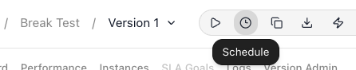
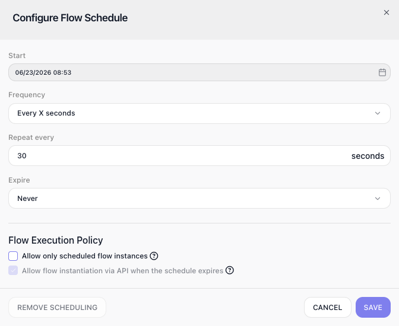
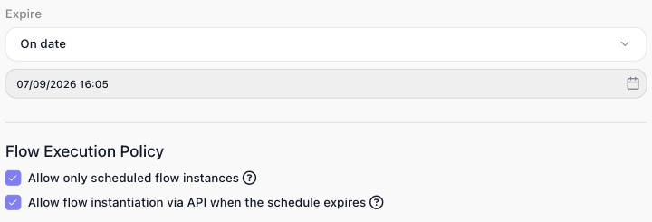

<!-- GENERATED FILE - do not edit. Source: block-knowledge/flow-scheduling-concept.yaml. Regenerate: make refgen -->
<!-- doclint: allow-unlinked: Flow Scheduling -->
# Flow Scheduling

Flow scheduling starts a run of a flow on its own, on a timetable you set, so it happens without anyone or anything kicking it off - a nightly cleanup, a poll every few minutes, a weekly report.

## How it works

A schedule is a timetable attached to one version of a flow. You give it a start time, a
frequency, and an end (or no end), and from then on FlowRunner™ starts a fresh run of that
flow every time the timetable comes due. A scheduled run is a new Instance with its own
data - the same kind of run a trigger firing or a [Call Flow](call-flow.md){.fr-block} API call would start, only begun
by the clock instead. So a schedule set to every five minutes produces a steady series of
independent Instances, one per due time.

A schedule is part of the version's definition, and it produces runs only while that version
is LIVE. Starting the version - the START FLOW control, or the equivalent API - turns it
LIVE and the clock begins; the version's Pause and Stop controls take the whole
version back offline, which halts every way it starts - trigger, Call Flow API, and schedule
alike. So a schedule you have defined but never started - or have paused - just sits there:
the timetable exists, but it produces no runs until the version is LIVE.

A schedule belongs to one version, and that has two consequences. Cloning a version copies its
schedule along with everything else, so the clone starts life with the same timetable already
set. And since a schedule produces runs only while its version is LIVE, starting a different
version - which makes that one LIVE in its place - stops the old version's scheduled runs and
lets the new version's schedule drive.

<!-- verified 2026-07-08 (product owner): a cloned version DOES inherit the schedule - the clone opens with the same Frequency / Start / Expire already set (this corrects an earlier draft that wrongly said a clone does not inherit it). The new-version-takes-over behaviour is derived from the verified LIVE-gating rule (a schedule produces runs only while its version is LIVE) plus one-LIVE-version-at-a-time (versionmanagement.md), not a separately tested claim. -->
<!-- doclint: no-shot: conceptual - Call Flow is named only as one of the ways a run can start; it is documented on its own reference page -->

## When to use it

Reach for a schedule whenever a flow should start itself on a timetable rather than waiting for a trigger, an API call, or a manual launch - a nightly cleanup job, a poll that checks a source every few minutes, a weekly report, a recurring batch of emails. The trade-off to weigh is control: a schedule starts runs on the clock whether or not there is anything to do, so for work that should start in response to an event (a record changed, a request came in) a trigger fits better. Pick a schedule when the timing itself is the thing that should drive the flow.

## Setting up a schedule

The controls all sit in the flow editor's top toolbar, just right of the version dropdown. The
clock icon opens Configure Flow Schedule, where you build the timetable; the play icon is
START FLOW, which turns the version LIVE - once it is LIVE, the version's Pause and
Stop controls appear in the same toolbar.

<!-- verified in-product 2026-07-09 (Break Test flow): the flow editor top toolbar, right of the Version dropdown, carries a play icon (tooltip "Start flow"), a clock icon (tooltip "Schedule", opens Configure Flow Schedule), then copy/export icons. Screenshot flow-scheduling-toolbar.png cropped from that toolbar. -->

Say you have a flow that polls a source, and you want a fresh run to fire on its own every
half-minute. In Configure Flow Schedule you set Start to the current date and time,
Frequency to Every X seconds with Repeat every set to 30, and Expire left on
Never so it keeps going. Each time the timetable comes due, FlowRunner starts a fresh
Instance of the flow with its own data:

With that saved and the version started, a fresh Instance runs every 30 seconds, each one
independent of the last. The definition you typed stays put no matter how many runs come
and go.

Frequency is where you pick the cadence. It offers six shapes:

- Once - runs the flow a single time at Start and never again.
- Every X seconds - repeats every N seconds, set in Repeat every.
- Daily - repeats every N days, set in Repeat every.
- Weekly - repeats on the weekdays you choose in an On picker.
- Monthly - schedules by month and day-of-month or weekday.
- Cron - takes a full [cron expression](https://crontab.guru/), for any cadence the others cannot express.

So a nightly cleanup goes on Daily, and a weekly report on Weekly.

<!-- verified in-product 2026-07-09 (Block Captures, Configure Flow Schedule): Frequency dropdown lists exactly Once / Every X seconds / Daily / Weekly / Monthly / Cron. Weekly exposes "Repeat every" + an "On" day-of-week picker (Mon..Sun); Monthly exposes "Months" (Jan..Dec) + "Days" with a "Day-Of-Month/Week" choice (1..31). "Every X seconds" ACCEPTS Repeat every = 30 in the current UI - the field took 30 with no validation error and SAVE stayed enabled - so the 30-second example is reproducible; the legacy scheduledflows.md "60 seconds or longer" floor is STALE. START FLOW is the version's start control (versionmanagement.md: "The START FLOW button activates a flow version, making it the current LIVE version"); a LIVE version exposes PAUSE (halts new executions) and STOP (takes the version offline) - both version-wide. -->
<!-- doclint: allow-unlinked: Repeat -->
<!-- doclint: no-shot: the Frequency sub-fields are named here; the popup itself is shown above -->

## The Flow Execution Policy

A schedule is not always the only way its flow can start. If the flow also has a trigger,
or if something calls it through the Call Flow API, those create runs of their own
alongside the scheduled ones. The Flow Execution Policy, a pair of options at the
bottom of the Configure Flow Schedule popup, is where you decide whether the schedule
shares that job or takes it over.

Allow only scheduled flow instances makes the schedule the sole way new runs start.
With it on, a trigger no longer starts a fresh run on its own; if the flow begins with a
trigger, its data is only accepted into a scheduled run that is already going. A Call Flow
API call is turned away too, answering with "Flow can be called only by scheduler." Reach
for it when the timetable is the only thing that should ever create a run, and nothing else
should be able to slip one in.

<!-- verified in-product 2026-07-08: with "Allow only scheduled flow instances" ON, a Call Flow REST activate-by-name call returned 400 code 28045 "Flow can be called only by scheduler."; with it OFF the same call returned 200 + an executionId. The trigger-into-a-running-instance behavior is the option's own help tooltip, captured verbatim. Enablement verified 2026-07-09: the second checkbox is disabled while Expire=Never and becomes enabled once Expire is set to a date. -->

Allow flow instantiation via API when the schedule expires covers what happens after
an Expire date passes, so it only applies to a schedule that has an end date - the
checkbox stays greyed out until you set one. Once that date arrives the schedule stops
producing runs, and normally the Call Flow API is shut out along with it; turn this on and
a Call Flow API call can still start a run after the schedule has expired - a deliberate
escape hatch for launching the flow by hand once its automatic timetable is done.

The two options act on different windows of time, so turning both on - as the screenshot
does - is not the contradiction it first looks like. Allow only scheduled flow instances
governs the schedule's active life: while the schedule is live, a Call Flow API call is
refused. Allow flow instantiation via API when the schedule expires governs only the
window after the Expire date has passed, re-opening the API once the schedule is done. So
with both ticked, a Call Flow API call is turned away while the schedule is running and
accepted once it has expired.

<!-- verified 2026-07-09: the second policy's behaviour is stated verbatim by the option's own help tooltip - "When this option is enabled and the flow's schedule has expired, a new flow instance can be created by using the 'Call Flow' API." The checkbox is disabled until an Expire date is set, matching allowApiInitiationsWhenScheduleExpired governing only the after-expiry window. -->
<!-- doclint: no-shot: both Flow Execution Policy checkboxes are shown together in flow-scheduling-policy.png above; this paragraph explains the second one. -->

## Starting and stopping scheduled runs from a flow

The version's Pause and Stop controls halt the schedule, but they are a blunter
tool than that: they take the whole version offline, so a trigger and the Call Flow API
stop starting runs right along with the schedule. To switch off just the schedule -
leaving the version LIVE so triggers and API calls still work - and to do it from inside a
flow rather than by hand, you use the [Start Scheduled Runs](start-scheduled-runs.md){.fr-block} and [Stop Scheduled Runs](stop-scheduled-runs.md){.fr-block} blocks.
Each one names a target flow and turns only that flow's schedule on or off, so one flow can
drive another's schedule, or its own, in response to something that only becomes true while
it runs.

They earn their keep when the schedule should be live only under a condition the clock
cannot predict. Suppose a job kicks off a large export at your data warehouse, and a flow
polls it every few minutes to see whether the file is ready. Polling on a timetable is a
natural fit - but there is no point polling once the file has landed, and you cannot know
in advance which minute that will be. So the flow that requests the export runs a Start
Scheduled Runs block against the poller to begin checking, and the poller, on the run where
it finally finds the file, runs a Stop Scheduled Runs block against itself and stops. The
polling schedule is defined once; the blocks turn it on when there is something to poll for
and off the moment there is not.

<!-- scope basis: Start/Stop Scheduled Runs toggle metaInfo.schedule.enabled on the target flow (api.schedule_schema; notes.md 'SCHEDULED RUNS DEMO' - Stop flips schedule.enabled=false while frequency/dates are preserved), which is independent of the version's LIVE state - so the version stays LIVE and its triggers / Call Flow API keep working. Cross-checked 2026-08-06 against the product's own legacy behavior docs: flow-management/scheduledflows.md:29 documents "Allow only scheduled flow instances" as a SEPARATE gate ("If disabled, and the flow begins with a trigger, instances can also be created by events generated by the trigger"), confirming the scheduler and the trigger/API paths are independently gated rather than one switching off the other. Basis: schema + demo + legacy behavior docs. -->
<!-- doclint: no-shot: conceptual - the Start/Stop Scheduled Runs blocks are shown on their own reference pages -->

## Things to watch for

- REMOVE SCHEDULING deletes the timetable outright, so there is nothing left to restart - you would have to set it up again. Halting the schedule is a different thing entirely: taking the version offline with Stop, or switching the schedule off with a Stop Scheduled Runs block, leaves the definition intact, so starting again picks it back up unchanged. <!-- doclint: no-shot: conceptual - Stop Scheduled Runs is shown on its own reference page -->

## Related

- [Start Scheduled Runs](start-scheduled-runs.md)
- [Stop Scheduled Runs](stop-scheduled-runs.md)
- [Call Flow](call-flow.md)
- [Triggers Group](triggers-group.md)
