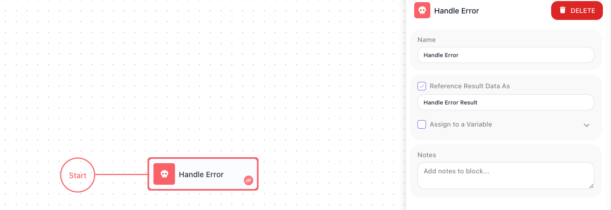

<!-- GENERATED FILE - do not edit. Source: block-knowledge/handle-error.yaml. Regenerate: make refgen -->
# Handle Error

This block catches the failure of another block and sends the flow down a recovery path instead of stopping the run. It gives you a place to react when a step goes wrong.

## How it works

A <span class="fr-block">Handle Error</span> is the recovery path for a block that might fail. You attach it to a block that can go wrong, and from then on that block has two exits: its normal path when it succeeds, and the <span class="fr-block">Handle Error</span> when it fails. If the block fails, the flow does not stop - instead it diverts to the <span class="fr-block">Handle Error</span>, which hands you the error that occurred and then continues down its own steps, the ones you build to recover. The error it hands you has three parts: a **code**, a **message** describing what went wrong, and a **source** saying which block produced it. One <span class="fr-block">Handle Error</span> can be the recovery path for several blocks at once, or each risky block can have its own.

## When to use it

Reach for it around any step that can fail for reasons outside your control: an [HTTP Request](http-request.md){.fr-block} to a service that might be down, a database write that might be rejected, a [Custom Cloud Code](custom-cloud-code.md){.fr-block} block that might throw. Without a <span class="fr-block">Handle Error</span>, the first failure ends the whole run. With one, you decide what happens next - log it, send a notification, fall back to a default, or pause and retry. It is the difference between a flow that gives up on the first hiccup and one that copes with the things that go wrong in the real world.

## Example

Suppose your flow calls a payment provider with an <span class="fr-block">HTTP Request</span>, and that provider is sometimes briefly unavailable. On its own, a failed call ends the run. Instead, attach a <span class="fr-block">Handle Error</span> to the <span class="fr-block">HTTP Request</span> so the call gains a recovery path. Now the request has two exits: when it succeeds the flow carries on as normal, and when it fails the flow diverts to the <span class="fr-block">Handle Error</span>.

Inside the recovery path, you want to wait a moment and try the call once more, so you place a [Wait](wait.md){.fr-block} block after the <span class="fr-block">Handle Error</span> and then run the same <span class="fr-block">HTTP Request</span> again. The recovery path looks like this: when the call fails, the flow reaches the <span class="fr-block">Handle Error</span>, then the <span class="fr-block">Wait</span> pauses for 30 seconds, then the call runs a second time.

The <span class="fr-block">Handle Error</span> also hands you the error itself, which later steps read through its result. Say the second attempt fails too and you want to notify someone with the reason - a notification step can read the error's message and source from the <span class="fr-block">Handle Error</span>'s result, so the alert says exactly which block failed and why:

```json
{
  "code": 503,
  "message": "Service Unavailable",
  "source": "Charge Card (HTTP Request)"
}
```

So a single <span class="fr-block">Handle Error</span> turns a one-shot call that would have killed the run into a step that retries once, and, if it still fails, reports the reason instead of disappearing.



## Configuration

| Field | Description |
| --- | --- |
| Reference Result Data As | The alias later steps use to read the caught error, which has a code, a message, and a source naming the block that failed. |

**Common settings** (available on most blocks):

| Field | Description |
| --- | --- |
| Name | A label for this block on the canvas. |
| Reference Result Data As | The alias used to reference this block's result in later blocks. |
| Assign to a Variable | Optionally store the result in a Data Bucket variable too; you choose the bucket and the variable name. |
| Notes | Freeform notes for documenting the block; they do not affect execution. |

## Things to watch for

- A <span class="fr-block">Handle Error</span> is not wired with an ordinary connection between two steps. You attach it to the block you want to guard, and that block keeps its normal success path while gaining this failure path - so the same block can lead to two different places depending on whether it succeeds or fails.
- A failure with no <span class="fr-block">Handle Error</span> attached stops the run. Any step you cannot afford to have end the flow needs one.
- It carries very little configuration of its own, because its job is structural: it marks where a failed block's recovery begins. The real work lives in the steps you build after it.

## Related

- [Wait](wait.md)
- [Custom Cloud Code](custom-cloud-code.md)
- [HTTP Request](http-request.md)
- error-handling-concept
