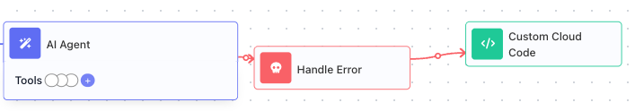
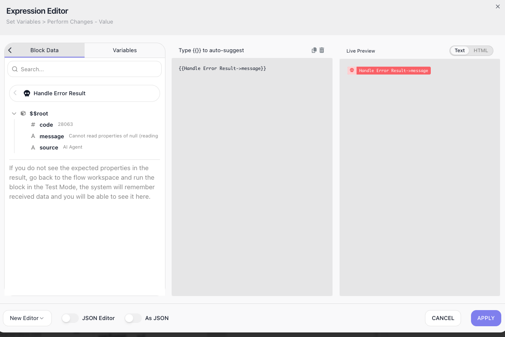

<!-- GENERATED FILE - do not edit. Source: block-knowledge/handle-error.yaml. Regenerate: make refgen -->
<!-- doclint: allow-unlinked: Handle Error -->
# Handle Error

This block catches the failure of another block and sends the flow down a recovery path instead of stopping the run. It gives you a place to react when a step goes wrong.

## How it works

A Handle Error is the recovery path for a block that might fail. You connect a block that can
go wrong to a Handle Error - the failure-prone block points to the handler, not the reverse -
and from then on that block has two exits: its normal path when it succeeds, and the
Handle Error when it fails. If the block fails, the flow does not stop; it diverts into the
Handle Error and runs the steps you built after it - the recovery path. So a Handle Error is rarely the
end of the line: it sits between the block it guards and the steps that react to the failure.

Those recovery steps work only because the Handle Error hands them the error it caught. You read
that error the same way you read any block's result - through the Handle Error's
Reference Result Data As alias, Handle Error Result by default, in the Expression Editor.
It carries a **message** describing what went wrong and a **source** naming the block that
failed; some failures add a numeric **code**, but many carry none, so build your recovery on
message and source. The source earns its place because one Handle Error can be the recovery path
for several blocks at once - it is how you tell which of them actually failed. (Each risky block
can also have its own Handle Error.)

## When to use it

Reach for it around any step that can fail for reasons outside your control: an [HTTP Request](http-request.md){.fr-block} to a service that might be down, a database write that might be rejected, a [Custom Cloud Code](custom-cloud-code.md){.fr-block} block that might throw. You will find Handle Error in the **Utils** category of the block palette. Without one, the first failure ends the whole run; with one, the flow diverts into a recovery path you build instead. What to put in that recovery path - reacting to different error codes, and the retry, fallback, and notify patterns - is the subject of the [Error Handling](error-handling-concept.md) concept guide; this page covers the block itself.

## Example

Suppose your flow hands some input to an [AI Agent](ai-agent.md){.fr-block}, and that step can fail - a transient model error, or input the agent cannot make sense of. With the AI Agent connected to a Handle Error (as in the diagram above), a failure no longer ends the run; it diverts into the recovery step you built after the handler - here a Custom Cloud Code block that alerts your team. That step's whole job is to read what went wrong and act on it.

It reads the failure through the Handle Error's result. In the recovery step, open the Expression Editor on a field, switch to its **Block Data**, and there is Handle Error Result - the caught error, with its **message**, its **source**, and (when the failure provides one) its **code**:

Pick the field you need and it drops into the expression: Handle Error Result → message for the reason, Handle Error Result → source for the block that failed. A notification built from both - Handle Error Result → source failed: Handle Error Result → message - tells a person exactly which block broke and why.

Whether a **code** is there depends on the failure: an HTTP call that comes back 500 carries one you can branch on, but a Custom Cloud Code block that throws carries none. The message and source are always present, so build your recovery on them and treat code as a bonus when it appears. What to do with the error once you have it - retry, fall back, or notify, and branching on code - is the subject of the Error Handling concept guide.

## Configuration

| Field | Description |
| --- | --- |
| Reference Result Data As | The alias later steps use to read the caught error in the Expression Editor, under Block Data. The error has a message and a source naming the block that failed, plus a numeric code when the failure provides one. |

**Common settings** (available on most blocks):

| Field | Description |
| --- | --- |
| Name | A label for this block on the canvas. |
| Reference Result Data As | The alias used to reference this block's result in later blocks. |
| Assign to a Variable | Optionally store the result in a Data Bucket variable too; you choose the bucket and the variable name. |
| Notes | Freeform notes for documenting the block; they do not affect execution. |

## Things to watch for

- You wire a Handle Error with an ordinary connection, drawn the right way round: the edge runs FROM the block you want to guard TO the Handle Error, and that edge becomes the block's error path. The block keeps its normal success path too, so the same block can lead two ways - onward when it succeeds, to the Handle Error when it fails.
- A failure in a block that is not connected to a Handle Error stops the run. Connect any step you cannot afford to have end the flow.
- Not every failure carries a code. An HTTP call that fails comes back with one - and it is FlowRunner's own numeric code, not the response's HTTP status - but a Custom Cloud Code block that throws produces none at all. The message and source are always there, so read those to log or report what happened, and branch on code only when you know the failure provides one.
- You read the caught error in a downstream block by referencing the Handle Error's result alias in the Expression Editor: open Block Data, expand Handle Error Result, and pick message, source, or code. It inserts as an expression like Handle Error Result → message.
- It carries very little configuration of its own, because its job is structural: it marks where a failed block's recovery begins. The real work lives in the steps you build after it.

## Related

- [Wait](wait.md)
- [Custom Cloud Code](custom-cloud-code.md)
- [HTTP Request](http-request.md)
- [Error Handling](error-handling-concept.md)
