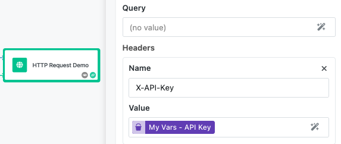

# HTTP Request Block

The HTTP Request block enables your workflow to communicate with external APIs, web services, and endpoints by making HTTP requests. This block provides complete control over request configuration, allowing you to integrate with virtually any REST API, webhook, or web service that accepts HTTP communications.

This block is essential for building workflows that interact with external systems such as CRM platforms, payment processors, notification services, data providers, and third-party APIs. Whether you need to fetch data, submit forms, trigger external processes, or synchronize information across systems, the HTTP Request block provides the flexibility to handle diverse integration scenarios.

Common use cases include calling REST APIs for data retrieval, posting form submissions to external services, triggering webhooks for event notifications, integrating with payment gateways, updating records in external databases, and connecting with social media platforms or marketing automation tools.

## Input Configuration

The HTTP Request block offers comprehensive configuration options to construct and customize HTTP requests for any external service or API.

 

### URL

The URL field specifies the complete endpoint address for your HTTP request. This field supports the Expression Editor, allowing you to dynamically construct URLs using data from previous workflow blocks.

You can build URLs dynamically by combining base URLs with dynamic parameters. For example, you might construct an API endpoint like the one shown below:
```text
https://api.example.com/users/${userId}/orders
```
where `userId` comes from a previous block's result. This dynamic URL built with the Expression Editor may look as shown below:


**URL Construction Tips**:

- Always include the complete URL with protocol (https:// or http://)
- Use the Expression Editor to inject dynamic values into the URL path
- Ensure proper URL encoding for special characters when building dynamic URLs
- Consider using query parameters for optional or variable data rather than embedding everything in the URL path

### HTTP Method

The HTTP Method dropdown allows you to select the appropriate HTTP verb for your request, determining how the receiving server should process your request.

**Available Methods**:

- **GET**: Retrieve data from the server (most common for API calls)
- **POST**: Send data to create new resources or submit forms
- **PUT**: Update existing resources with complete replacement
- **PATCH**: Partially update existing resources
- **DELETE**: Remove resources from the server
- **HEAD**: Retrieve headers only, without the response body

Choose the method that matches the API's expected behavior. Most data retrieval operations use GET, while form submissions and data creation typically use POST. Update operations generally use PUT for complete replacement or PATCH for partial updates.

### Request Body

The Body field contains the data payload sent with your HTTP request. This field supports the Expression Editor, enabling you to send dynamic content constructed from previous workflow steps.

**Body Usage Guidelines**:

- Required for POST, PUT, and PATCH requests when sending data
- Typically empty for GET, DELETE, and HEAD requests
- Most APIs expect JSON format, but can also send XML, form data, or plain text
- Use the Expression Editor to construct JSON payloads dynamically
- Ensure the body content matches the Content-Type header you specify

**Example JSON Body**:
```json
{
  "name": "${userName}",
  "email": "${userEmail}",
  "data": {
    "timestamp": "${currentTimestamp}",
    "source": "FlowRunner™"
  }
}
```

### Query Parameters

The Query field allows you to specify URL query parameters that are appended to the request URL. This field supports the Expression Editor for dynamic parameter construction.

Query parameters are ideal for filtering, pagination, sorting, and optional request modifiers. Format parameters as key-value pairs, for example:

```text
page=1&limit=50&sort=created_date&filter=${categoryName}
```


**Query Parameter Best Practices**:

- Use for GET requests to filter or modify results
- Include pagination parameters for large datasets
- Add API keys or tokens if required by the service
- URL encoding is handled automatically for special characters
- Keep parameter names consistent with the API documentation

### Headers

The Headers section allows you to specify HTTP headers as name-value pairs. You can add multiple headers using the "+" button, and the Value fields support the Expression Editor for dynamic header construction.

**Common Headers**:

- **Content-Type**: Specifies the format of the request body (e.g., `application/json`)
- **Authorization**: Contains authentication tokens or API keys
- **Accept**: Indicates the expected response format
- **User-Agent**: Identifies your application to the receiving server
- **X-API-Key**: Custom header for API authentication

**Example Header Configuration**:

- Name: `Content-Type`, Value: `application/json`
- Name: `Authorization`, Value: `Bearer ${apiToken}`
- Name: `X-API-Key`, Value: `${dynamicApiKey}`
- Name: `Accept`, Value: `application/json`



## Understanding the Results

The HTTP Request block returns only the response body from the target server. Status codes and headers are not included in the block result.

**Example API Response Body**:
```json
{
  "id": 12345,
  "name": "John Doe",
  "email": "john@example.com",
  "created_at": "2024-01-15T10:30:00Z",
  "status": "active"
}
```

### Accessing Response Data

The HTTP response body becomes available to subsequent workflow blocks through the Expression Editor. You can access the returned data directly as it was sent by the server.For JSON responses, you can directly access object properties and array elements. For text responses, the entire content is available as a string value.

### Error Handling

Since the HTTP Request block returns only the response body, HTTP errors and status codes are not directly accessible in the block result. However, many APIs include error information in their response body when errors occur.

**API Error Response Examples**:
```json
{
  "error": "Not Found",
  "message": "User with ID 12345 does not exist",
  "code": 404
}
```

```json
{
  "success": false,
  "error_code": "INVALID_TOKEN",
  "error_message": "Authentication token is invalid or expired"
}
```

Handle errors by checking for error indicators in the response body content rather than HTTP status codes. Use conditional logic in subsequent blocks to detect error responses based on the API's error format.

## Configuring the Block

Like all FlowRunner™ blocks, you can customize how the HTTP Request block appears in your workflow and how its results are referenced by subsequent blocks.

### Block Naming

Use the "Name" field to assign a descriptive name that reflects the block's purpose in your workflow. Examples include "User Profile API Call," "Payment Processing Request," or "Webhook Notification" to make your workflow more readable and maintainable.

### Result Reference

The "Reference Result Data As" field determines how other blocks in your workflow access the HTTP response. Choose clear, descriptive names like "APIResponse" or "UserData" that make sense when building expressions in subsequent blocks.

## Implementation Strategies

### Authentication Patterns

Different APIs use various authentication methods. Implement authentication using headers:

**API Key Authentication**: Add a header like `X-API-Key` with your API key value.

**Bearer Token Authentication**: Use an `Authorization` header with value `Bearer ${token}`.

**Basic Authentication**: Use an `Authorization` header with value `Basic ${encodedCredentials}`.

### Error Handling and Retry Logic

Implement robust error handling by checking for error indicators in the response body content. Create conditional paths for success and failure scenarios based on the API's response format, and consider implementing retry logic for transient failures.

### Data Transformation

Often, API responses need transformation before use in subsequent workflow steps. Combine HTTP Request blocks with data processing blocks to extract, format, or restructure response data as needed.

### Rate Limiting and Performance

Be mindful of API rate limits and implement appropriate delays between requests when making multiple calls. Some APIs include rate limit information in response headers that you can use to adjust request timing.

### Security Considerations

Never hardcode sensitive information like API keys or passwords directly in the configuration. Use Expression Editor to reference secure data from previous blocks or external configuration sources. Ensure HTTPS is used for sensitive data transmission.

### Pagination Handling

For APIs that return paginated results, implement logic to handle multiple requests by tracking pagination tokens or page numbers, and combine results from multiple requests as needed.