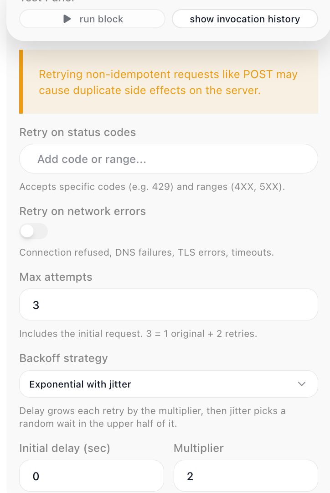

<!-- GENERATED FILE - do not edit. Source: block-knowledge/http-request.yaml. Regenerate: make refgen -->
<!-- doclint: allow-unlinked: HTTP Request -->
# HTTP Request

Reach any web API or external service from inside a flow and turn its response into data the rest of the flow can use. You describe the call you want to make, and the result is whatever the service sends back - records to read, a confirmation to check, structured data for later blocks to act on.

## How it works

You describe a request - where it goes, how to make the call, and what to send with it - and the block makes that call for you and hands back the response for later steps to read. The where is the address you point at. The how is the <span class="fr-control">Method</span>, which tells the service what you mean to do there: GET reads, POST creates, PUT and PATCH update, DELETE removes, HEAD checks. The what is whatever the call needs to carry along - the data you are sending, the parameters that narrow down what you want, the named values that prove who you are. You are not writing networking code; you are filling in a description of the call, and the block turns that into a real request, waits for the reply, and gives you back the response body - the data the service returned - ready for the next step to read.

## When to use it

Reach for it whenever your flow needs to talk to a service that FlowRunner does not already have a dedicated block for: pulling records from a third-party API, posting an update to a webhook, kicking off a job in another system. You will find it in the Actions category of the block palette. If a purpose-built block exists for the service you are calling, that block is usually less work because it handles the address and the authentication for you. This block is the general-purpose option for everything else - any service with a web API is reachable from here.

## Retrying a failed call

A call to an outside service can fail for reasons that have nothing to do with your request -
the service is briefly overloaded, or the network drops the connection. Turn on the block's
<span class="fr-control">Retry Policy</span> and it reattempts the call on its own before it hands the failure on.

A Retry Policy decides three things:

- **What is worth retrying.** For a service that answered with an error status, list the codes
  or ranges to retry on in <span class="fr-control">Retry on status codes</span> - a specific code like `429` (too many
  requests), or a range like `5XX` for server errors. For a call that never reached the service,
  turn on <span class="fr-control">Retry on network errors</span> - connection refused, DNS failures, TLS errors, and
  timeouts. A response the policy does not match is treated as final.
- **How many times to try.** <span class="fr-control">Max attempts</span> counts the first call: `3` means the original
  request plus two retries.
- **How long to wait between tries.** <span class="fr-control">Backoff strategy</span> is either <span class="fr-control">Fixed</span> - the same delay
  before every retry - or <span class="fr-control">Exponential with jitter</span>, which grows the wait each retry by a
  <span class="fr-control">Multiplier</span> and then picks a random wait in the upper half of it, so a burst of failing
  runs does not retry in step. Fixed takes a single <span class="fr-control">Delay</span>; Exponential takes an
  <span class="fr-control">Initial delay</span> and the <span class="fr-control">Multiplier</span>.

Retry a request only when repeating it is safe. A GET can be retried freely; a non-idempotent
request - a POST that creates a record or charges a card - repeats that side effect on each
attempt, so retry those with care.



## Example

Suppose you want to list the public organizations a GitHub user belongs to. GitHub's API answers that at a fixed address, so set the <span class="fr-control">Method</span> to GET and the <span class="fr-control">URL</span> to the endpoint for that user:

```text
https://api.github.com/users/octocat/orgs
```

GitHub asks callers to identify the kind of response they want, so add one <span class="fr-control">Header</span> - a <span class="fr-control">Name</span> of Accept and a <span class="fr-control">Value</span> of application/vnd.github+json. A GET request like this carries no <span class="fr-control">Body</span>, since you are reading rather than sending. With that filled in, open the block's <span class="fr-control">Test Panel</span> and press <span class="fr-control">run block</span> - this sends the real request once, so you can see exactly what comes back before you wire anything downstream. The response body is a list of organizations, each one an object:

```json
[
  { "login": "github",     "id": 9919,   "url": "https://api.github.com/orgs/github" },
  { "login": "octo-org",   "id": 583231, "url": "https://api.github.com/orgs/octo-org" }
]
```

That captured shape is what makes the result ready to use next. The block exposes its response under the alias set in <span class="fr-control">Reference Result Data As</span>, <span class="fr-expr">HTTP Request Result</span> by default. In a following block you open the Expression Editor on a field, switch to its Block Data, and there is <span class="fr-expr">HTTP Request Result</span> to expand and drill into. Because the body is a list, you index it: the first organization's login reads as the reference below, and the Expression Editor offers login, id, and url for you because the test run showed it the real structure.

```text
{{HTTP Request Result->[0].login}}
```

Drop that reference into a Send Email block's body, or feed the whole list into a [List Iterator](list-iterator.md){.fr-block} to act on every organization in turn - the payoff is that one block turned a public API into structured data your flow can read and act on.


## Configuration

| Field | Description |
| --- | --- |
| URL | Required. The full web address to send the request to. It can be a fixed address or an expression that builds the address from earlier values. A URL that already carries a query string is sent as you wrote it, so a ready-made address - an S3 pre-signed URL, whose signature lives in the query string - works pasted straight in. |
| HTTP Method | What you want to do at that address: GET reads, POST creates, PUT and PATCH update, DELETE removes, HEAD checks. Defaults to POST. |
| Body | The data you are sending with the request, usually JSON. Used by methods that write, such as POST, PUT, and PATCH; a GET typically has none. |
| Query | Extra parameters appended to the URL, such as a search term, a page number, or a filter the service understands. They are added to whatever the URL already carries, so you can paste an address with a query string and still add parameters here. |
| Headers | Named values sent alongside the request, each a Name and a Value. Most often used for authentication (an API key, a Bearer token, or Basic credentials) and to declare the content type. |

**Common settings** (available on most blocks):

| Field | Description |
| --- | --- |
| Name | A label for this block on the canvas. |
| Reference Result Data As | The alias used to reference this block's result in later blocks. |
| Assign to a Variable | Optionally store the result in a Data Bucket variable too; you choose the bucket and the variable name. |
| Skip Block | When on, the block is skipped during execution and the value in Simulated Result is used as its output. |
| Logging | What to log to the Logging panel while the flow is LIVE, both on start and on completion. |
| Notes | Freeform notes for documenting the block; they do not affect execution. |

## Things to watch for

- The result the block hands you is only the response body - the data the service sent back - so the reference syntax reaches straight into that data (<span class="fr-expr">HTTP Request Result → [0].login</span>), with no status or headers wrapper around it. Because the status code and the response headers are not exposed separately, you cannot test the numeric status to tell success from failure; instead check for a value the body itself contains, such as an id on a created record or an error field the service returns.
- Before you reference the result in later blocks, run this block once from its <span class="fr-control">Test Panel</span> with <span class="fr-control">run block</span>. The reason: the Expression Editor can only offer field names it has actually seen, and a test run sends the real request and captures the real shape of the response. Skip it and downstream blocks have only a placeholder to work from, so the names you want to reference will not appear.
- Authentication usually travels in a <span class="fr-control">Header</span> - the request itself carries no separate credentials field, so the auth value rides in as a header Name/Value pair. If a call comes back rejected, the first thing to check is whether the right auth header (an API key, a Bearer token, or Basic credentials) is present and correct.

## Related

- [Custom Cloud Code](custom-cloud-code.md)
- [Handle Error](handle-error.md)
