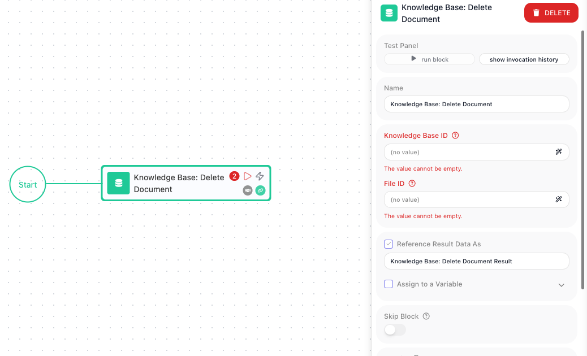

<!-- GENERATED FILE - do not edit. Source: block-knowledge/knowledge-base-delete-document.yaml. Regenerate: make refgen -->
# Knowledge Base: Delete Document

This block removes one document from a Knowledge Base. You pick the Knowledge Base and give the block the document's id, and that single document is taken out of it.

## How it works

A Knowledge Base holds a set of documents, and each one carries its own id - a `fileId` that the Knowledge Base assigned when the document was added. This block deletes the one document whose `fileId` you hand it, leaving every other document in place. It works on exactly one document per run, identified by that id and nothing else, so you have to know which document you mean before the block runs. The usual way to get a `fileId` is to read it from an earlier List Documents block, which returns the documents and their ids.

## When to use it

Reach for it when you already know the exact document you want gone - most often a `fileId` you just pulled from a List Documents result, or one you saved when the document was added. It is the right choice for surgical, one-at-a-time removal: retiring a single outdated file, or cleaning up a document a flow created earlier. If instead you want to remove every document that matches some condition - say everything tagged with an old version - reach for Knowledge Base: Delete By Filter, which removes a set in one step rather than making you delete each id on its own.

## Example

Suppose a flow keeps a Knowledge Base of product manuals, and you want to drop the manual for a discontinued model. Start with a List Documents block pointed at that Knowledge Base, filtering on the metadata you tagged the manuals with. It returns a list of files, each one a document with its own `fileId`:

```json
{
  "files": [
    { "fileId": "doc_8f21a", "metadata": { "model": "X100", "type": "manual" } },
    { "fileId": "doc_3b07c", "metadata": { "model": "X200", "type": "manual" } }
  ]
}
```

The discontinued model is the X100, the first entry, so the document you want to remove is the one with `fileId` `doc_8f21a`. In the Delete Document block, choose the same Knowledge Base from the dropdown, and for File Id point at that id from the List Documents result - for example its first file, written as an expression that reads `List Documents Result->files[0].fileId`.

When the flow runs, the block removes only that one document. The X100 manual is gone from the Knowledge Base, while the X200 manual stays untouched. Run List Documents again afterward and `doc_8f21a` is no longer in the list - confirmation the right document, and only that document, was deleted.



## Configuration

| Field | Description |
| --- | --- |
| Knowledge Base | Required. The Knowledge Base to delete the document from. Pick it from the list of your Knowledge Bases. |
| File Id | Required. The id of the document to delete. This is the `fileId` the Knowledge Base assigned the document, usually supplied as an expression that reads it from an earlier List Documents result. |
| Retry Policy | Optional. How the block should retry if the delete request fails, so a brief hiccup does not stop the flow. |

**Common settings** (available on most blocks):

| Field | Description |
| --- | --- |
| Name | A label for this block on the canvas. |
| Reference Result Data As | The alias used to reference this block's result in later blocks. |
| Assign to a Variable | Optionally store the result in a Data Bucket variable too; you choose the bucket and the variable name. |
| Logging | What to log to the Logging panel while the flow is LIVE, both on start and on completion. |
| Notes | Freeform notes for documenting the block; they do not affect execution. |

## Things to watch for

- This block deletes by document id, not by name or content. You have to give it the exact fileId the Knowledge Base assigned the document; a title or filename will not match. The reliable way to get that id is from a List Documents block, which returns each document together with its fileId.
- Only the one document with the fileId you supply is removed. To remove several documents at once, use Knowledge Base: Delete By Filter instead of repeating this block for each id.

## Related

- [Knowledge Base: List Documents](knowledge-base-list-documents.md)
- [Knowledge Base: Delete by Filter](knowledge-base-delete-by-filter.md)
- [Knowledge Bases (RAG stores)](knowledge-bases-concept.md)
