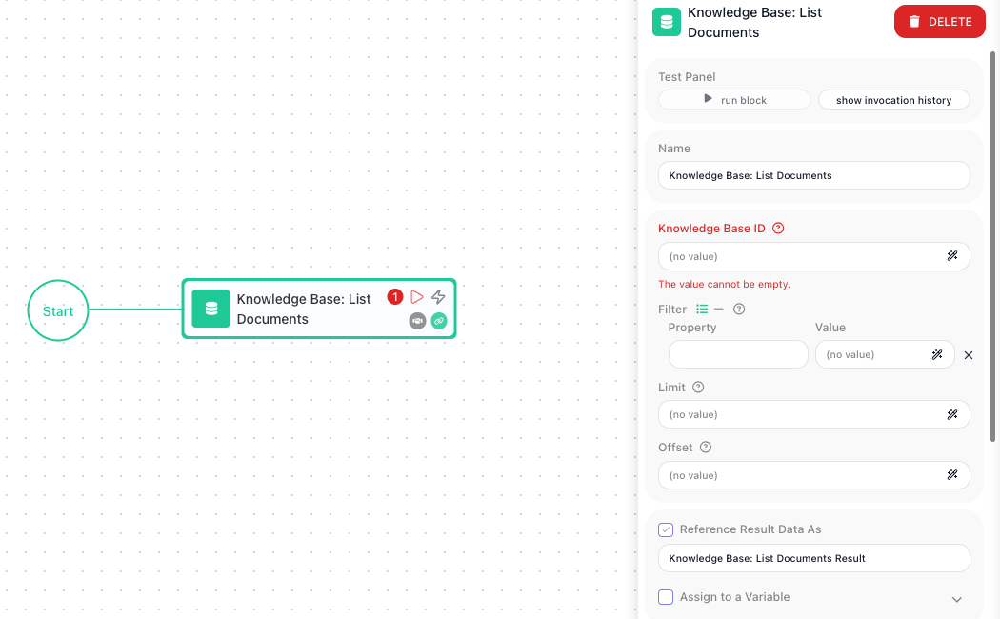

<!-- GENERATED FILE - do not edit. Source: block-knowledge/knowledge-base-list-documents.yaml. Regenerate: make refgen -->
# Knowledge Base: List Documents

This block reads back the documents stored in a Knowledge Base. You point it at one of your Knowledge Bases and it returns the documents in it, optionally narrowed to the ones whose metadata matches values you give.

## How it works

Think of it as asking a Knowledge Base "which documents do you hold?" and getting a list back. The result is a list of documents, where every document carries its own id (its file id) plus whatever metadata was saved with it when it was added. If you leave the Filter empty you get every document; if you fill the Filter in, you get only the documents whose metadata matches. Because the list can be long, you read it in pages: Limit sets how many documents come back at once, and Offset sets how far into the full list that page starts.

## When to use it

Reach for it whenever a flow needs to see what is actually in a Knowledge Base rather than just add to it. Two cases come up most. First, taking stock - confirming a document was added, or counting how many documents match a category. Second, and more common, getting the file id of a document so a later step can act on it: the only way to delete a specific document is to hand its file id to a [Knowledge Base: Delete Document](knowledge-base-delete-document.md){.fr-block} block, and this block is how you obtain that id. If you already know the exact document you want and have its id from somewhere else, you do not need this block at all.

## Example

Suppose you keep a Knowledge Base called Support Articles, and each article was added with metadata recording the product area it belongs to and whether it is still current. You want to clean out the retired billing articles. The first step is to find them, so you add a <span class="fr-block">Knowledge Base: List Documents</span> block, pick Support Articles as the Knowledge Base, and set the Filter to match the documents you care about:

```json
{
  "area": "billing",
  "status": "retired"
}
```

The Filter matches on every pair you give and only on exact values, so this returns the documents whose metadata has both area equal to billing and status equal to retired, and no others. The block hands back a list of those documents. A trimmed view of the result looks like this:

```json
{
  "files": [
    { "fileId": "a17c-9f20", "metadata": { "area": "billing", "status": "retired" } },
    { "fileId": "b48e-1c03", "metadata": { "area": "billing", "status": "retired" } }
  ]
}
```

Each entry is one document, and the part you usually want is its fileId. To remove the first match, you feed that document's file id into a <span class="fr-block">Knowledge Base: Delete Document</span> block - the file id at files index 0 in this result. Pair this block with a [List Iterator](list-iterator.md){.fr-block} and you can walk the whole list, deleting every retired billing article in one pass.



## Configuration

| Field | Description |
| --- | --- |
| Knowledge Base | Required. The Knowledge Base to read documents from, chosen from the ones you have created. |
| Filter | Optional. Metadata values a document must match to be included. Each row is a property name and the value it must equal; give several rows and a document has to match all of them. Matching is exact, and only flat values are compared, so nested objects are not supported. Leave the Filter empty to return every document. |
| Limit | How many documents to return at most. Use it with Offset to read a long list one page at a time. |
| Offset | How far into the full list to start, counting from 0. With Limit, this is how you step through the documents a page at a time - for example, Offset 50 with Limit 50 returns the second page. |

**Common settings** (available on most blocks):

| Field | Description |
| --- | --- |
| Name | A label for this block on the canvas. |
| Reference Result Data As | The alias used to reference this block's result in later blocks. |
| Assign to a Variable | Optionally store the result in a Data Bucket variable too; you choose the bucket and the variable name. |
| Logging | What to log to the Logging panel while the flow is LIVE, both on start and on completion. |
| Notes | Freeform notes for documenting the block; they do not affect execution. |

## Things to watch for

- The result is a list of documents under files, not a bare array of ids. To act on a single document, read its file id from the entry you want, for example the entry at index 0.
- An empty Filter returns every document, bounded only by Limit and Offset. If you meant to narrow the results, make sure the Filter is actually filled in.
- The Filter compares exact values and matches every pair you give, so a document is only returned when all of its metadata values match exactly. A near match or a partial value will not be found, and the comparison only looks at flat values - it cannot reach into a nested object.
- Limit and Offset cap how many documents come back in one call. If a Knowledge Base holds more documents than your Limit, raise the Limit or read further pages with Offset, or you will miss the rest.

## Related

- [Knowledge Base: Add Document](knowledge-base-add-document.md)
- [Knowledge Base: Delete Document](knowledge-base-delete-document.md)
- [Knowledge Bases (RAG stores)](knowledge-bases-concept.md)
- [List Iterator](list-iterator.md)
