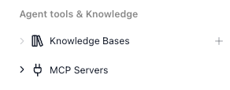

<!-- GENERATED FILE - do not edit. Source: block-knowledge/knowledge-bases-concept.yaml. Regenerate: make refgen -->
<!-- doclint: allow-unlinked: Knowledge Bases -->
# Knowledge Bases (RAG stores)

A Knowledge Base lets an [AI Agent](ai-agent.md){.fr-block} answer from your own documents instead of only from what the model was trained on. You feed it your content - a product manual, a policy handbook, your support articles - and at question time the agent can pull back the passages that match what it was asked, so its answer is grounded in your material. This retrieve-then-answer approach is the pattern commonly called RAG, short for retrieval-augmented generation.

## How it works

A Knowledge Base does three things: it stores the documents you give it, it indexes them so
their meaning can be searched, and at question time it finds the pieces most relevant to what
was asked. So an AI Agent can answer from those pieces instead of guessing from its general
training.

The indexing is what makes a meaning-based search possible. When you add a document, FlowRunner
does not keep it as one long block of text. It breaks the document into smaller pieces, called
chunks, and turns each chunk into an embedding - a list of numbers that captures the meaning of
that piece of text. Those embeddings live in a vector store, a kind of database built to compare
meanings and return the closest matches.

So when an AI Agent asks the Knowledge Base a question, the question is turned into an embedding
too, and the store hands back the chunks whose meaning is nearest - not the ones that happen to
share the same words. That is how a Knowledge Base answers from your content: it finds what is
relevant by meaning, and the agent writes its answer from those passages.

A Knowledge Base is a standing resource: you set it up once, then feed and manage its documents over
time. How it slices and embeds your text is fixed when you create it.

<!-- doclint: no-shot: conceptual - how RAG storage, indexing, and retrieval work; the Knowledge Base's own surfaces (nav, setup screen) are shown in the sections below -->
<!-- doclint: allow-unlinked: Knowledge Base -->

## When to use it

Reach for a Knowledge Base when you want an AI Agent to answer from facts you supply - a product manual, a policy handbook, a set of support articles - rather than from whatever the model already knows. It keeps answers grounded in your material and lets you update what the AI knows by changing documents instead of retraining anything. The trade-off is that it is a standing resource you configure and feed, not a single block you drop into a flow, so it is worth setting up when an agent needs real, current domain knowledge, and overkill when a short fixed instruction in the agent's prompt would do. <!-- doclint: no-shot: conceptual guidance on when a Knowledge Base is worth it; the AI Agent that draws on it is shown on its own reference page --> <!-- doclint: allow-unlinked: Knowledge Base -->

## Creating a Knowledge Base

You create a Knowledge Base from the Knowledge Bases group in the workspace navigation - hover
it and click the +.

## The setup screen

The setup screen takes a few things:

- Title and Description - a name and summary for the Knowledge Base.
- Embedding Model - the model that turns your text into vectors, and an AI API Key for it to run under.
- Vector Store - the store that holds those vectors.
- Chunk Size and Chunk Overlap - how each document is sliced into chunks.

Together these decide how your text is stored and searched.

!!! warning "In Memory is for testing only"
    The In Memory vector store does not persist - anything you add to it is held for a
    short window and then dropped. Use it only while you are trying things out; for anything
    you need to keep, pick a vector store that persists.

<!-- verified in-product 2026-07-10 (MyProjects -> Knowledge Bases -> Create New AI Knowledge Base): the create dialog carries exactly Title, Description, Embedding Model (default "Text Embedding 3 Small"), AI API Key ("Select API Key Setup or enter new key"), Vector Store (default "In Memory"), Chunk Size (2000), Chunk Overlap (300). Chunk help tooltips verbatim as in the ui block. knowledge-bases-setup.png still matches these fields. -->
<!-- doclint: no-shot: the setup screen is shown by knowledge-bases-setup.png above; this text names the fields it depicts -->
<!-- doclint: allow-unlinked: Knowledge Base -->

## Giving a Knowledge Base to an agent

Creating a Knowledge Base does nothing on its own - an agent has to be pointed at it. You do that
on the AI Agent block: open Manage Capabilities, go to Knowledge, and add the Knowledge
Base from the list of the workspace's knowledge bases. From then on the agent can search it and
answer from its documents.

<!-- verified in-product 2026-07-10 (Tests workspace, "Agent With Knowledge" flow): the AI Agent's Manage Capabilities -> Knowledge category has two groups - "Document Management" (the Add/Delete/List action tools) and "Search", which lists the workspace's knowledge bases (here "Test KB") each with a + to attach. -->
<!-- LABEL DRIFT observed 2026-08-06 (Documentation Flows, zero KBs): the groups render as "DOCUMENT MANAGEMENT ACTIONS" and "KNOWLEDGE BASES" (empty state: "There are no registered knowledge bases in the workspace. Create a new knowledge base."). Prose above deliberately describes rather than quotes the group label until this is reconciled; the with-KB state could not be re-driven (KB creation needs an embedding-capable key; only an Anthropic key is saved). RECAPTURE kb-attach-to-agent.png + reconcile labels once a KB exists here. -->

## Keeping a Knowledge Base up to date

A Knowledge Base is read at question time, but you also have to get documents into it and keep
them current. A flow can do that with the Knowledge Base action blocks:

- [Add Document](knowledge-base-add-document.md){.fr-block} - add a document.
- [List Documents](knowledge-base-list-documents.md){.fr-block} - list what the Knowledge Base holds.
- [Delete Document](knowledge-base-delete-document.md){.fr-block} - remove one document by its file id.
- [Delete by Filter](knowledge-base-delete-by-filter.md){.fr-block} - remove several at once by a metadata filter.

Because a flow manages the documents, the Knowledge Base can stay in sync with wherever your
content lives. A flow that runs when a file lands in a Git repo, a row is added to a Google
Sheet, or a record is created in Airtable can add that content on its own - and remove a
document just as easily when the source goes away.

You can also hand those same action blocks to an AI Agent as tools. Then the agent decides for
itself when to add or delete a document - saving something it was told to remember, or clearing
an entry that is out of date - instead of you wiring every change into a flow.

<!-- verified in-product 2026-07-10 (Manage AI Agent Capabilities, keyword "knowledge base"): the four Knowledge Base action blocks are attachable to an AI Agent as tools - descriptions verbatim: "Adds a document to a knowledge base for later retrieval." / "Lists documents in a knowledge base with optional metadata filter, limit, and offset." / "Deletes a specific document from a knowledge base by file ID." / "Deletes documents from a knowledge base matching a metadata filter." -->
<!-- doclint: no-shot: each Knowledge Base action block is shown on its own reference page; this section explains when to reach for them from a flow or an agent -->

## Things to watch for

- The embedding model, chunk size, chunk overlap, and vector store are set when you create the Knowledge Base and lock once it holds any documents. You cannot change how existing content was sliced or embedded after the fact, so choose these with care up front - to switch, you create a fresh Knowledge Base and add the documents again. The title, description, and AI API Key stay editable, so you can rename it or rotate the key at any time.
- Adding a document is not instant. A new document shows as Processing while it is being chunked and embedded, and only becomes searchable once it reaches Completed. A query run right after you add will not find content that is still processing.

## Related

- [Knowledge Base: Add Document](knowledge-base-add-document.md)
- [Knowledge Base: List Documents](knowledge-base-list-documents.md)
- [Knowledge Base: Delete Document](knowledge-base-delete-document.md)
- [Knowledge Base: Delete by Filter](knowledge-base-delete-by-filter.md)
- [AI Agent](ai-agent.md)
