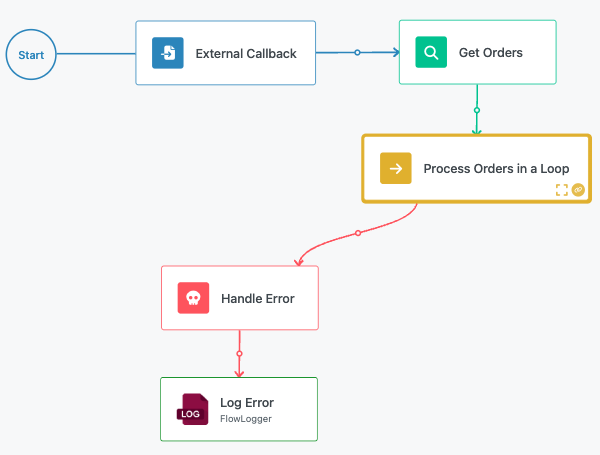

# List Iterator Block

The List Iterator block enables your workflow to process collections of data by executing a sequence of operations for each item in a list. This block functions as a loop mechanism, allowing you to apply the same logic repeatedly to every element in an array or collection, making it essential for bulk data processing, batch operations, and repetitive tasks.

The List Iterator block provides a sophisticated looping environment where you can design complex processing logic that executes once for each item in your input list. Whether you're processing user records, transforming data arrays, validating multiple items, or performing bulk operations across datasets, this block provides the control and flexibility needed for efficient list processing.

Common use cases include processing arrays of user data for bulk updates, transforming collections of records from API responses, validating multiple form submissions or uploads, generating reports from lists of transactions, and performing batch operations like sending emails to multiple recipients or updating multiple database records.

## Block Configuration

The List Iterator block requires a single input parameter that defines the collection of data to be processed.

### List Input

The List input field accepts any array or collection from previous blocks in your workflow. Use the Expression Editor to select arrays from API responses, database queries, file processing results, or any other source that provides list data.

**Supported List Types**:

- JSON arrays
- Database query result sets
- File processing outputs (CSV rows, etc.)
- User-generated collections
- Transformed data arrays from previous blocks

The List Iterator will execute its internal logic once for each item in the provided array, regardless of the data type or structure of the individual items.

## Internal Flow Design

The List Iterator block creates a contained execution environment where you design the logic that processes each list item. When you navigate into the List Iterator block, FlowRunner™ opens a dedicated canvas for building the iteration logic. To access the internal canvas, double click the List Iterator block, or click the Expand icon. You will navigate the block's internal design environment. This canvas operates identically to the main flow editor but represents the logic that executes for each iteration.

## Special Flow Context Elements

When designing logic inside a List Iterator, the Expression Editor provides access to special context elements that are specific to the current iteration and essential for most iterator implementations.

### Current Iteration Number

The "Current Iteration Number" element provides the zero-based index of the current loop cycle. This value starts at 0 for the first item and increments by 1 for each subsequent iteration.

**Use Cases for Iteration Number**:

- Creating unique identifiers or filenames
- Implementing pagination or batching logic
- Adding sequence numbers to processed items
- Conditional logic based on iteration position
- Progress tracking and logging

### Current Iteration Item

The "Current Iteration Item" element provides direct access to the data for the current list item being processed. The structure and content depend on the type of data in your input list.

**Accessing Item Data**:

- `Flow Context.Current Iteration Item`: The complete current item
- `Flow Context.Current Iteration Item.propertyName`: Specific properties of object items
- For simple arrays: the element value directly
- For object arrays: access object properties and nested data

## Loop Control and Termination

The List Iterator processes each item in the provided list sequentially. By default, it will iterate through every item in the collection, but you can implement early termination using loop control blocks.

### Break Block Integration

Within the List Iterator's internal flow, you can use a Break block to exit the loop early based on specific conditions. This allows you to implement scenarios where you only need to process items until a certain condition is met.

**Common Break Scenarios**:

- Stop processing when a target value is found
- Exit early when error thresholds are reached
- Terminate based on accumulated results or counters
- Implement timeout or resource limit controls

### Empty List Handling

When the List Iterator receives an empty array or null value, it skips execution entirely and continues to the next block in the main workflow. No iterations occur, and any blocks within the List Iterator are not executed.

## Variable Access and Data Return

The List Iterator block operates within the scope of the main workflow, providing specific patterns for accessing external data and returning results from the iteration process.

### Accessing External Variables

Logic inside the List Iterator can read and reference any variables or data declared in blocks that execute before the List Iterator. This includes results from previous blocks, trigger data, and any other workflow context.

**Available External Data**:

- Results from all previous blocks in the main flow
- Initial trigger data and parameters
- Global workflow variables and constants
- User session information and context data

### Returning Data from Iterations

The List Iterator block cannot directly return data through traditional result mechanisms. Instead, you must use external variables to collect and store iteration results using dedicated variable management blocks.

**Variable Update Mechanisms**:

- **[Set Variables](./set-variables.md) Block**: Assign values directly to predefined variables
- **[Transform Data](./transformer.md) Block**: Process data and assign the result to a variable

**Data Return Pattern**:

1. Create or initialize a variable in the main flow before the List Iterator
2. Within the iterator logic, use [Set Variables](./set-variables.md) or [Transform Data](./transformer.md) blocks to update external variables
3. After the List Iterator completes, access the accumulated results from the external variable

**Implementation Strategy**:

- Use Array or Object variables to collect results from each iteration
- Implement append or update operations to modify external variables
- Consider using conditional logic to filter which results to store
- Handle error scenarios to prevent incomplete data collection

## Error Handling Strategies

The List Iterator provides flexible error handling options that can be implemented at different levels of the iteration process.

### External Error Handling

Errors that occur within the List Iterator's internal logic are propagated to the main workflow level. You can connect the List Iterator block to a [Handle Error](./error-handler.md) block to manage these exceptions at the workflow level.

### Internal Error Handling

Alternatively, you can use Handle Error blocks within the List Iterator's internal flow to manage errors locally for individual iterations. This approach allows the iteration to continue processing remaining items even when individual items encounter errors.

**Internal Error Handling Benefits**:

- Continue processing remaining list items after individual failures
- Collect error information while maintaining overall progress
- Implement item-specific error recovery logic
- Maintain detailed error tracking per iteration

## Performance and Limitations

### Runtime Considerations

Every FlowRunner™ flow has limits on total runtime duration, which depend on your subscription plan. List Iterator blocks can consume significant execution time when processing large datasets or performing complex operations per iteration.

**Optimization Strategies**:

- Consider the size of input lists when designing iteration logic
- Implement efficient processing patterns within iterations
- Use Break blocks to exit early when objectives are met
- Monitor total execution time for compliance with plan limits

**Large Dataset Recommendations**:

- Break large lists into smaller batches using multiple List Iterator blocks
- Implement pagination or chunking strategies
- Consider asynchronous processing patterns for very large datasets
- Use conditional logic to skip unnecessary processing steps

### Execution Time Management

For very large lists, consider implementing execution strategies that optimize total flow runtime:

- Process only essential items based on filtering criteria
- Use parallel processing approaches with multiple smaller iterators
- Implement checkpoint patterns to resume processing across multiple flow executions
- Monitor and log progress to identify performance bottlenecks
