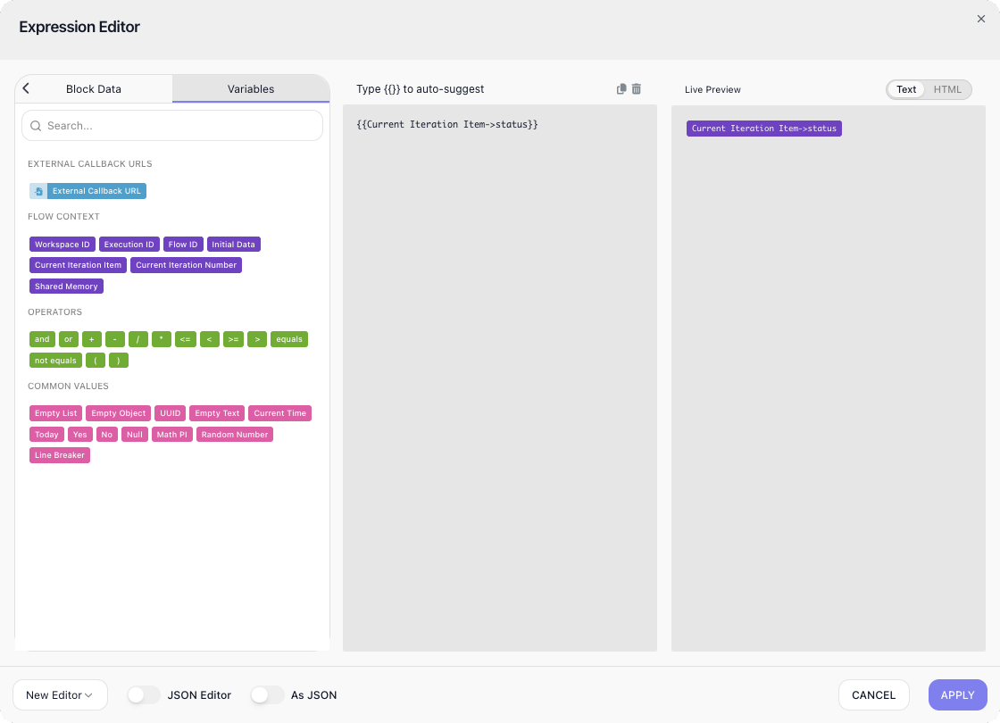
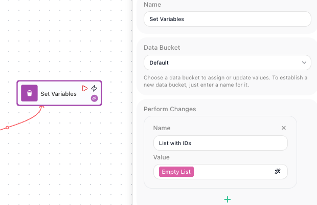
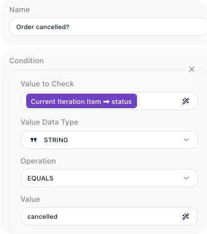
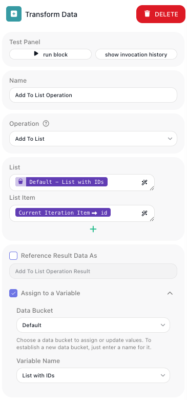
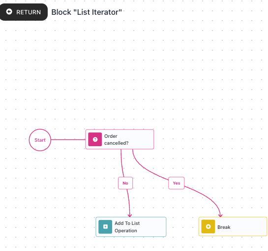

<!-- GENERATED FILE - do not edit. Source: block-knowledge/list-iterator.yaml. Regenerate: make refgen -->
# List Iterator

This block runs the same set of steps once for each item in a list. You give it an array, build the per-item steps inside it, and it runs them for every item.

## How it works

It is a block container: the steps you build inside it run once for each item in the list, and on each pass the current item is made available to those steps as `Current Iteration Item` - the whole item.

## When to use it

Reach for it whenever you have a list and need to do the same work for every entry: send a message to each recipient, validate each row, enrich each record. For a small, fixed set of items a few separate blocks might be simpler, but as soon as the count is dynamic, or you would be copying the same blocks again and again, one List Iterator is far cleaner.

## Example

Suppose an earlier block, an [HTTP Request](http-request.md), returned this list of orders:

```json
[
  { "id": 1024, "customer": "Acme",    "status": "open" },
  { "id": 1025, "customer": "Globex",  "status": "cancelled" },
  { "id": 1026, "customer": "Initech", "status": "open" }
]
```

Say you want to collect the id of every order you process, stopping as soon as you reach a cancelled one. Each entry is an order with an `id`, a `customer`, and a `status`. Point the loop's List at that result and the steps inside run once for each order, with that order handed to them as `Current Iteration Item` - the whole order. A step reads the order's status from `Current Iteration Item->status`:



So for the Acme order `Current Iteration Item->status` reads `"open"`, and for the Globex order, `"cancelled"` - the value the loop will check to decide whether to keep going.

Now the work. A loop cannot hand a value back to the rest of the flow on its own, so you collect what you build up in a variable that lives outside it - a [Data Bucket](../learn/concepts/variables.md) variable. Before the List Iterator, a [Set Variables](set-variables.md) block declares that variable, here `List with IDs`, and sets it to Empty List, a built-in value that gives you a fresh list with nothing in it yet:



Inside the loop, a [Condition](condition.md) - call it Order cancelled - checks `Current Iteration Item->status` equals `"cancelled"`:



A Condition splits the flow in two: its **Yes** branch runs when the check is true, its **No** branch when it is false. The check here is `status` equals `"cancelled"`, so the everyday per-order work sits on the No branch (the order is not cancelled) and the early exit on the Yes branch (it is). While an order is not cancelled, the Condition's No branch runs a [Transform Data](transform-data.md) block. A Transform Data block lets you pick an operation; here you choose Add To List, which appends the order's `id` to `List with IDs` and writes the result back to that same variable, so the list grows by one entry each pass:



The moment an order is cancelled, the Condition's Yes branch runs a [Break](break.md) that ends the loop. Put together, the loop looks like this:



Here is what happens, order by order:

- **The Acme order** (`1024`, `open`): not cancelled, so the No branch adds its id - `List with IDs` becomes `[1024]`.
- **The Globex order** (`1025`, `cancelled`): the Yes branch fires the Break and the loop stops; its id is never added.
- **The Initech order** (`1026`) is never reached.

After the loop, `List with IDs` holds `[1024]` - the orders you got through before the cancelled one - ready for the next block to read.

## Configuration

| Field | Description |
| --- | --- |
| List | Required. The array to loop over, usually an expression pointing at a previous block's result. |

**Common settings** (available on most blocks):

| Field | Description |
| --- | --- |
| Name | A label for this block on the canvas. |
| Skip Block | When on, the block is skipped during execution and the value in Simulated Result is used as its output. |
| Notes | Freeform notes for documenting the block; they do not affect execution. |

## Behavior

- The inner steps run once per item, and each pass exposes that item as `Current Iteration Item`.
- A Break block inside the loop ends it immediately, leaving any remaining items unprocessed.
- You can inspect any single pass afterwards in the flow's analytics - the view of a past run - stepping through each pass block by block.

## Things to watch for

- If you set List to an array you typed by hand, turn on the Expression Editor's As JSON toggle so it is read as structured data. Without it, FlowRunner sees the whole thing as one piece of text rather than a list of separate items, so there is nothing for the loop to step through. A list that comes from a previous block's result is already structured.
- If the list is empty, the inner steps do not run at all.
- To edit the steps inside the loop, step into it: hover the loop and choose Expand, then use Return at the top-left to come back out.
- You cannot return a result from inside the loop; carry values out by accumulating into a variable that lives outside it, then read it after the loop finishes (the Example walks through this).

## Related

- [Break](break.md)
- [Repeat](repeat.md)
- [Transform Data](transform-data.md)
- current-iteration-item
- instances-concept
- [Set Variables](set-variables.md)
