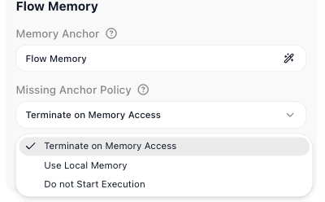

# Per-User Memory

One flow can serve a thousand callers at once, and each of them must get a memory of their own - never a stranger's. By default, though, every instance of a flow shares one [Shared Memory](../learn/concepts/shared-memory.md) store: right for a flow-wide counter, exactly wrong the moment a support assistant might answer one customer with another's history. This guide gives every caller a private store, using the flow's **Memory Anchor**.

## One flow, many callers

Picture a support chatbot built as a single flow. Each incoming message starts a new instance, and the flow keeps running notes in Shared Memory - what the customer asked, what was promised - so the conversation hangs together from one message to the next. With the default single store, Dana's notes and Sam's notes land in the same place, and Dana's next message is answered with Sam's history folded in. The flow is correct; its memory is just shared too widely.

What you want is one store per customer: every instance handling Dana sees Dana's notes and only Dana's. That is what the Memory Anchor gives you.

## How the anchor scopes memory

The **Memory Anchor** is a value pulled from the data an instance starts with. FlowRunner uses it to pick which store that instance reads and writes: instances with the same anchor value share one store, and a different value gets its own. Anchor on a value that identifies the caller - a customer id, a chat session id, the id of the system calling in - and each caller's memory is kept apart automatically, for every instance that runs for that caller. The anchor works underneath the Put, Read, and Delete blocks, deciding which store their keys land in for the instance at hand.

## Setting the anchor

<!-- doclint: allow-unlinked: Flow Memory -->
To split memory by caller, you point the anchor at a value that identifies them. The **Memory Anchor** lives in the flow's **Flow Memory** settings, on the **Flow Settings** tab (the gear at the top of the right-hand panel). Its field opens the **Memory Anchor Selection** dialog, where two choices do the whole job:

- ((Anchor Source)) - where the identifying value comes from. **Initial Data** reads it from the data the flow was started with; **Initial Trigger** reads it from the event that started the flow; **Flow Memory**, the default, means no per-caller split at all - every instance shares one store.
- ((Anchor Property)) - for Initial Data or Initial Trigger, the dot-notation path to the exact value to key on. For a customer id carried in the initial data, that is something like `data.customerId`.

That is the whole setup: with ((Anchor Source)) on Initial Data and ((Anchor Property)) pointing at the customer's id, two instances for the same customer share a store and build on each other's notes, while two different customers never see each other's - the same keys hold a separate value for each.

## When the anchor value is missing

((Missing Anchor Policy)) decides what happens when an instance starts with no value for the anchor - the id you key on arrives empty:

- ((Terminate on Memory Access)), the default, lets the instance start, but the moment it reaches for Shared Memory it stops, rather than quietly falling back to the wrong store.
- ((Use Local Memory)) - the instance carries on with its own isolated memory, shared with no one.
- ((Do not Start Execution)) - the instance never starts.

## How long a store lasts

The ((Memory Expiration Policy)) decides how long a store is kept once nothing has touched it. ((Never)), the default, keeps it for good. ((1 hour after last run activity)), ((12 hours after last run activity)), or ((24 hours after last run activity)) clear the store automatically once that much idle time has passed; ((Custom)) sets an exact idle span in days, hours, minutes, and seconds. It is worth setting when each anchor value is a short-lived session you have no reason to keep forever.

## Per-caller agent conversations

<!-- doclint: no-shot: conceptual - the anchor's reach over an agent's Messages History; the anchor and its Flow Memory panel are shown above -->
The anchor scopes more than the keys your Put and Read blocks use. It also covers an [AI Agent](ai-agent.md){.fr-block}'s **Messages History** - the running conversation an agent remembers - because that history is kept in the same Shared Memory store. So with a per-customer anchor, one agent holds a separate, independently expiring conversation with every customer - one assistant serving them all from a single flow, each conversation kept private.

## Related

- [Shared Memory](../learn/concepts/shared-memory.md) - the store the anchor scopes, with the Put, Read, and Delete blocks
- [Variables & Data Buckets](../learn/concepts/variables.md) - per-instance state that is never shared between instances
- [AI Agent](ai-agent.md){.fr-block} - its Messages History is the per-caller conversation memory the anchor keeps apart
