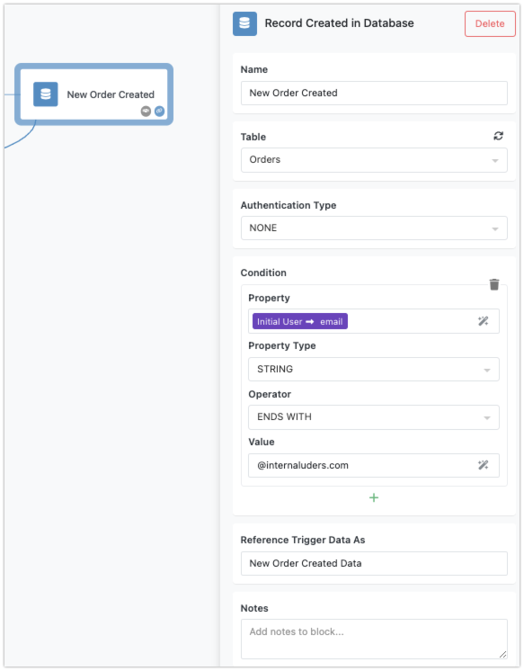
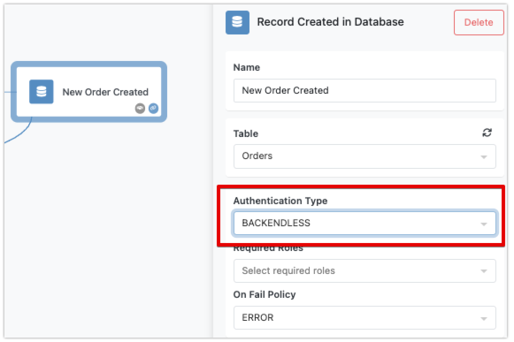
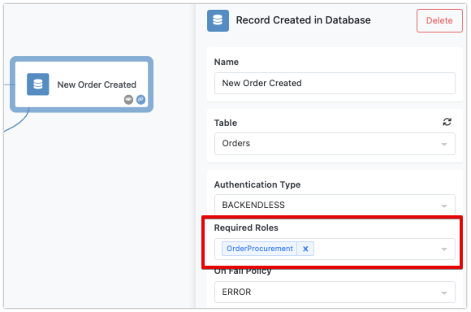
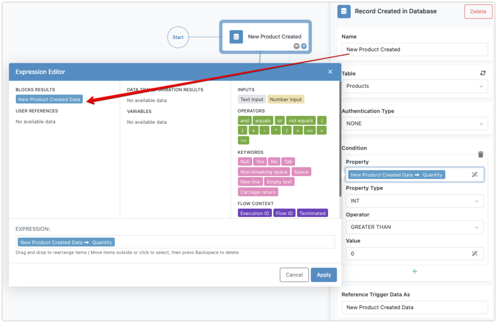
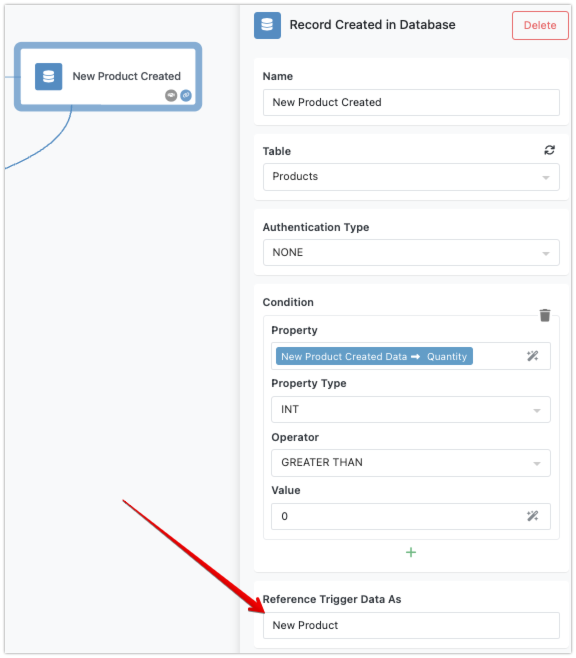
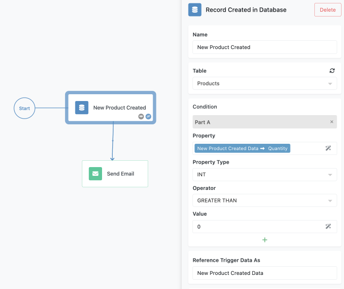

The "Record Created in Database" trigger in FlowRunner™ allows you to pause flow execution until a new record is saved in a specified database table. This is useful for automating actions that depend on new data entries. For instance, you might want to send an email notification whenever a new product is added to your inventory database.

## How the Trigger Works

When a new record is added to the specified database table, the trigger pauses the flow until this event occurs. The created record is then available as a key/value structure (an object) for all successor blocks in the flow, with the table's columns corresponding to the object's properties.

## Trigger Properties
The trigger properties include:

* **Name** - should be a meaningful name that represents what this trigger does. Follow the recommendations in the [Block Naming](../flow-editing/blocknaming.md) section of this guide for best practices.
* **Table** - a table in the Backendless Database where FlowRunner™ will monitor for newly created records.
* **Authentication Type** - specifies whether an authenticated user is required to activate the trigger.
* **Condition** - an optional condition associated with the trigger. When the trigger receives an activation event, the system checks the condition. If the condition is evaluated to `TRUE`, the flow execution proceeds, otherwise, the trigger's event is ignored.
* **Reference Trigger Data As** - this is a name assigned to the data that activated the trigger. The data is a key/value structure that contains the values for the record stored in the trigger's configured table.



## Required Authentication

You can configure the Record Created in Database trigger to require authentication, ensuring that a reference to an authenticated user is present in the trigger activation event. To enable this, select the trigger block and set the `Authentication Type` property to `BACKENDLESS`:



With the setting shown above, the trigger will activate only when the event has a valid user reference through the `user-token` HTTP header. Additionally, you can specify the security roles that the referenced user must have. This selection is made in the `Required Roles` drop-down list:



The `On Fail Policy` setting allows you to define how the trigger activation request should be handled if there is no authenticated user or if the user does not belong to the specified roles:


If the policy is set to `ERROR`, the trigger will issue the following error for events that fail the authentication or role check. The error must be handled to avoid flow execution interruptions. For more details, see the [Error Handling](../flow-editing/error-handling.md) section of this guide.

```json
{
    "code": 1000,
    "message": "Unable to execute the callback. User is missing required security role(s)"
}
```

If the policy is set to `IGNORE`, the trigger activation request will be completed successfully, but the trigger will not be activated if the user reference is missing or the user does not have the required roles.

By using these authentication settings, you can ensure that your workflows are secure and only triggered by authorized users.

## Accessing Event Data
The data from the event that activated the trigger is available through the [Expression Editor](../flow-editing/expressioneditor.md). This data is structured in a key/value format, where the key names correspond to the column names of the respective database table. You can access this data to create a condition for the trigger or use it in any block that follows the trigger in the flow. By default, the name of the element containing trigger event data in the Expression Editor will use the name you assigned to the block followed by the word `Data`:


You can modify the name of the element that references the data using the `Reference Trigger Data As` field:<br>


## Example Configuration

Imagine a `Products` table with columns: `ProductName`, `Quantity`, and `Category`. 


You want to send an email notification only if the `Quantity` is greater than zero when a new record is added.

1. **Trigger Block**: Set up the "Record Created in Database" trigger to monitor the `Products` table.

2. **Condition**: Create a condition using the Expression Editor to check if `Quantity > 0`.

3. **Successor Blocks**: Add an email action block that uses properties of the created record (e.g., `ProductName`, `Quantity`) to compose and send the notification.



The "Record Created in Database" trigger helps automate workflows based on new data entries. By pausing the flow until a new record is added and optionally checking conditions, you ensure that automated actions are timely and relevant. This trigger seamlessly integrates real-time data changes into your business processes.