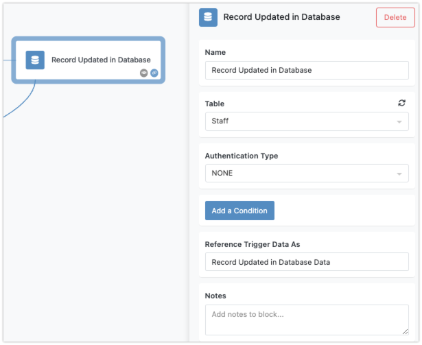
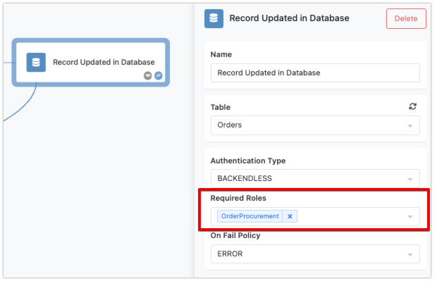
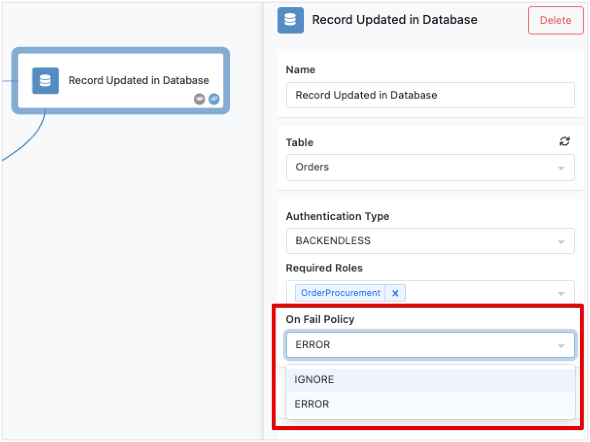
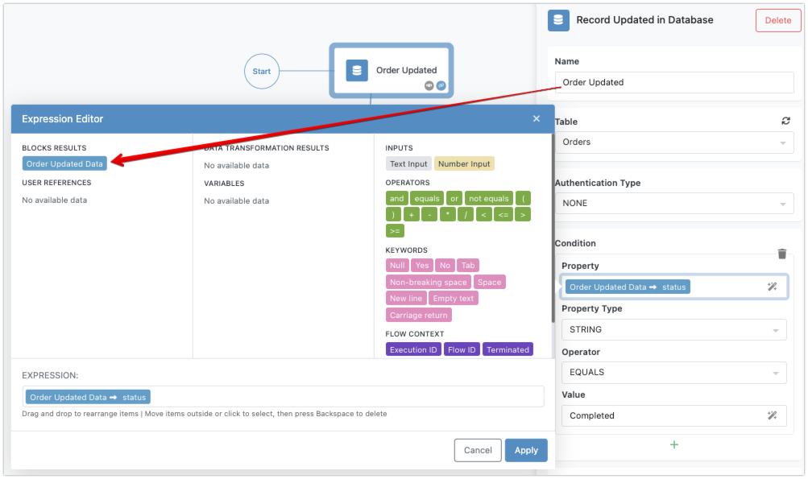
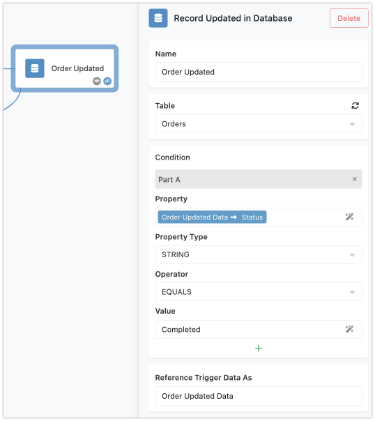

The "Record Updated in Database" trigger in FlowRunner™ allows you to pause flow execution until an existing record in a specified database table is updated. This is particularly useful for automating actions that should occur in response to changes in your data. When the trigger is activated, the updated record is made accessible to successor blocks through the Expression Editor.

## How the Trigger Works

When an existing record in the specified database table is updated, this trigger pauses the flow until that update occurs. The updated record is then available as a key/value structure (an object) for all successor blocks in the flow. The structure of the "result" object matches the columns of the table, making it easy to work with the updated data.

## Trigger Properties
The trigger properties include:

* **Name** - should be a meaningful name that represents what this trigger does. Follow the recommendations in the [Block Naming](../flow-editing/blocknaming.md) section of this guide for best practices.
* **Table** - a table in the Backendless Database where FlowRunner™ will monitor for updated records.
* **Authentication Type** - specifies whether an authenticated user is required to activate the trigger.
* **Condition** - an optional condition associated with the trigger.  When the trigger is activated, FlowRunner™ evaluates the condition. If the condition evaluates to `TRUE`, the flow continues its execution. If the condition evaluates to `FALSE`, the trigger activation is ignored. For more information about conditions, see the [Conditional Logic](../flow-editing/conditions.md) section of this guide. 
* **Reference Trigger Data As** - this is a name assigned to the data that activated the trigger. The data is a key/value structure that contains the values for the record updated in the trigger's configured table.



## Required Authentication

You can configure the Record Updated in Database trigger to require authentication, ensuring that a reference to an authenticated user is present in the trigger activation event. To enable this, select the trigger block and set the `Authentication Type` property to `BACKENDLESS`:


With the setting shown above, the trigger will activate only when the event has a valid user reference through the `user-token` HTTP header. Additionally, you can specify the security roles that the referenced user must have. This selection is made in the `Required Roles` drop-down list:



The `On Fail Policy` setting allows you to define how the trigger activation request should be handled if there is no authenticated user or if the user does not belong to the specified roles:



If the policy is set to `ERROR`, the trigger will issue the following error for events that fail the authentication or role check. The error must be handled to avoid flow execution interruptions. For more details, see the [Error Handling](../flow-editing/error-handling.md) section of this guide.

```json
{
    "code": 1000,
    "message": "Unable to execute the callback. User is missing required security role(s)"
}
```

If the policy is set to `IGNORE`, the trigger activation request will be completed successfully, but the trigger will not be activated if the user reference is missing or the user does not have the required roles.

By using these authentication settings, you can ensure that your workflows are secure and only triggered by authorized users.

## Accessing Event Data
The data from the event that activated the trigger is available through the [Expression Editor](../flow-editing/expressioneditor.md). This data is structured in a key/value format, where the key names correspond to the column names of the respective database table. You can access this data to create a condition for the trigger or use it in any block that follows the trigger in the flow. By default, the name of the element containing trigger event data in the Expression Editor will use the name you assigned to the block followed by the word `Data`:


You can modify the name of the element that references the data using the `Reference Trigger Data As` field:<br>


## Example Configuration

Imagine you have an `Orders` table with columns: `OrderID`, `Customer`, `Status`, and `TotalAmount`. You want to perform specific actions only when the `Status` of an order is updated to `Completed`.

1. **Trigger Block**: Set up the "Record Updated in Database" trigger to monitor the `Orders` table.

2. **Condition**: Create a condition using the Expression Editor to check if `Status` equals `Completed`.

3. **Successor Blocks**: Add actions that should follow this update, such as sending a confirmation email to the customer or updating inventory.



The "Record Updated in Database" trigger is a powerful tool for automating workflows based on updates to your data. By pausing the flow until a record is updated and optionally checking conditions, you can ensure that your automated actions are both timely and relevant. This trigger helps you integrate real-time data changes into your business processes effectively.