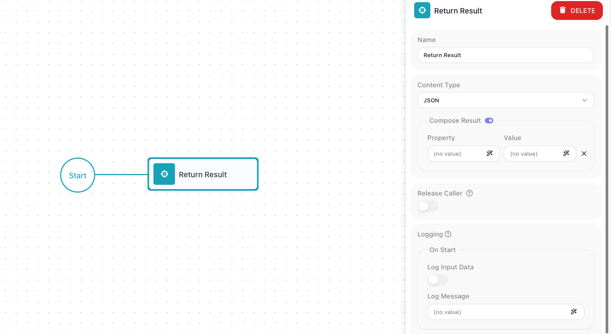

<!-- GENERATED FILE - do not edit. Source: block-knowledge/return-result.yaml. Regenerate: make refgen -->
# Return Result

This block builds the object a flow hands back to whatever started it, and ends that path of the flow. You list the properties you want to send back, give each one a value, and that object becomes the flow's output.

## How it works

Think of it as the answer a flow gives back to its caller. You build that answer in the block's Compose Result list: each row is one property of the returned object, a name paired with an expression for its value, so you assemble the exact shape you want to send back - say { token, expiresAt } - from values the flow worked out along the way. When a path of the flow reaches this block, it composes that object and stops there: this block is terminal, so any blocks wired after it on the same path do not run. The composed object is what a [Call Flow](call-flow.md){.fr-block} block waiting on this flow, or a [SubFlow](subflow.md){.fr-block} block running it, reads back as its result.

## When to use it

Reach for it at the end of any flow that another flow runs and reads back from - a flow invoked by a <span class="fr-block">Call Flow</span> block, or the steps inside a <span class="fr-block">SubFlow</span> block. Those callers only get back what a <span class="fr-block">Return Result</span> hands them, so this is how you decide what they see: the new record's id, a token, a status object, rather than the flow's whole internal workings. A flow with no <span class="fr-block">Return Result</span> still runs to completion, but it gives its caller nothing structured to read, so add this block whenever the caller needs an answer.

## Example

Suppose you build a <span class="fr-block">SubFlow</span> named Issue Token that authenticates against a service and gets back an access token and how long it stays valid. Earlier steps in that subflow have already landed those two values - the token sits in a Data Bucket variable named accessToken, and the expiry in expiresAt. You want the parent flow that runs this subflow to read both back, and nothing else.

Add a <span class="fr-block">Return Result</span> block at the end of the subflow. Leave Content Type on JSON, then add two rows to Compose Result - one property per row, each a name paired with an expression for its value:

```text
Content Type: JSON

Compose Result:
  token       =  {{Data Buckets:Auth - accessToken->}}
  expiresAt   =  {{Data Buckets:Auth - expiresAt->}}
```

When the subflow runs and a path reaches this block, it composes { "token": "...", "expiresAt": "..." } and ends there. Back in the parent flow, the <span class="fr-block">SubFlow</span> block's result is that object, so the next step can read the token through it and use it on a later call. Anything the subflow did to obtain the token stays inside the subflow - the caller sees only the two properties you chose to return.



## Configuration

| Field | Description |
| --- | --- |
| Content Type | The format of the returned data. The default is JSON, which composes the object from the rows below. |
| Compose Result | The properties of the returned object. Each row is a property name paired with an expression that supplies its value. Together the rows make up the object the caller reads back. |

**Common settings** (available on most blocks):

| Field | Description |
| --- | --- |
| Name | A label for this block on the canvas. |
| Logging | What to log to the Logging panel while the flow is LIVE, both on start and on completion. |
| Notes | Freeform notes for documenting the block; they do not affect execution. |

## Things to watch for

- This block is terminal: it ends the path of the flow that reaches it. Any block wired after it on that same path does not run, so put it last and do not expect later steps on that branch to execute.
- If a flow has more than one <span class="fr-block">Return Result</span> block - for example one on each branch of a [Condition](condition.md){.fr-block} - the caller does not get a single plain object. Instead it gets back a structure that holds the result from the first <span class="fr-block">Return Result</span> a run reaches, plus a list of every <span class="fr-block">Return Result</span> that ran, each tagged with the name of the block it came from, and an overall status. When you need the caller to read a simple object directly, keep to a single <span class="fr-block">Return Result</span> on the path it will take.

## Related

- [Call Flow](call-flow.md)
- [SubFlow](subflow.md)
- [Condition](condition.md)
