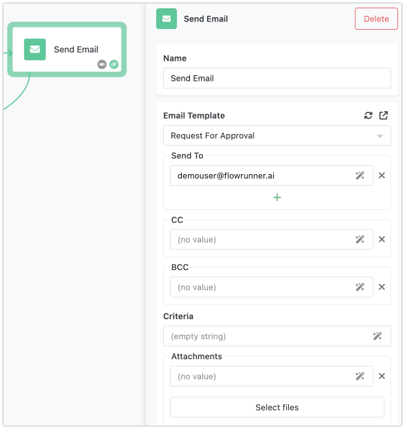
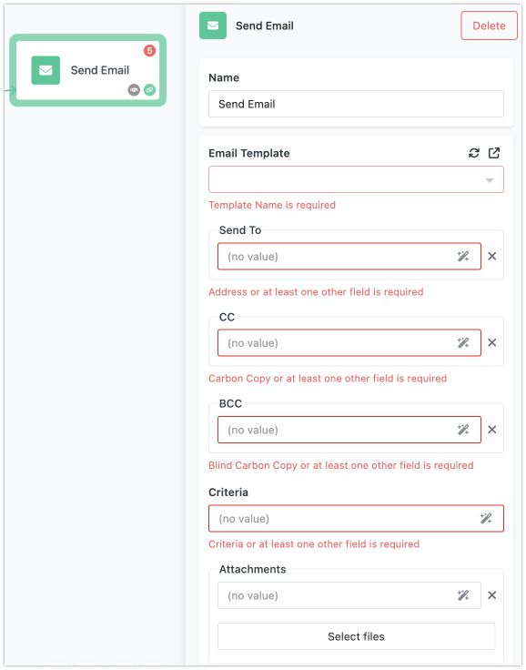
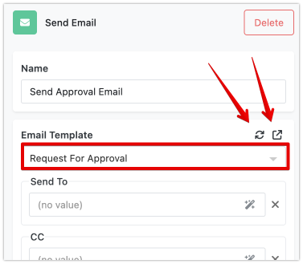
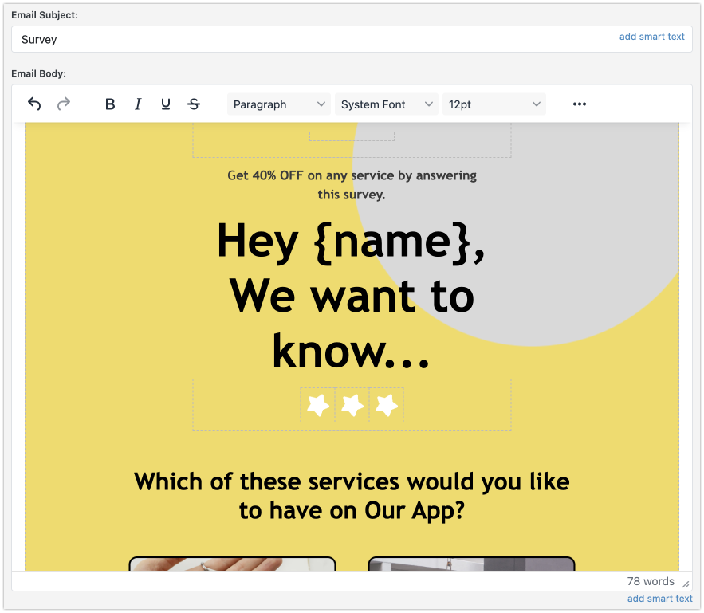

The "Send Email" action block in FlowRunner is a versatile tool designed to automate the process of sending emails. This block can be configured to send emails using a predefined template and can target specific recipients either explicitly or based on query from your Backendless database.

!!! note
    Sending customized emails requires that you configure an email provider in Backendless. You can choose from a variety of pre-configured options (you will need to create an account with a provider) or [configure a custom SMTP server provider](https://backendless.com/docs/rest/email_settings.html).

## Send Email Properties

The Send Email action block includes the following configuration properties:

1. **Email Template**: A template to use. The template defines the static content and visual presentation of the email. Backendless templates can include substitution variables and "smart text" with dynamic values injected from the database.

2. **Send To**: Zero or more email addresses where the email will be sent.

3. **CC**: Zero or more email addresses for "Carbon Copy (CC)" email delivery.

4. **BCC**: Zero or more email addresses for "Blind Carbon Copy (BCC)" email delivery.

5. **Criteria**: A query in the format of the Backendless where clause against the Users database table. FlowRunner will use the email addresses from the records identified by the query.

6. **Attachments**: Zero or more references to files to attach to the email message.

At least one of the fields must be set. Otherwise, you will see the following block input validation errors:

## Email Templates

The "Send Email" block uses a selected email template to define the content of the email body. This template can be in plain text or HTML format, allowing for visually appealing and well-structured emails. Templates can also include template variables and smart substitution tags to dynamically insert data into the email content. For more information about Backendless Templates, see the [Email Templates](https://backendless.com/docs/rest/email_templates.html) section of the Backendless Developer Guide. To select a template, use the **Email Template** drop-down list. If you need to quickly navigate to the Email Template Management interface, use the icon on the right. The refresh icon will update the list of available templates.

If the selected template has any [dynamic text](https://backendless.com/docs/rest/email_templates.html#dynamic-text) variables, they will appear under the template selection drop-down list. You can assign values for the variables using the [Expression Editor](../flow-editing/expressioneditor.md). This allows for injecting any data available in the flow into the sent emails.
Below is an example of an Email Template with a dynamic text variable called `{name}`:

When the template is selected in a "Send Email" block, the `name` variable can be configured with data from the flow:

## Specifying Recipients

You have several options for specifying recipients for your email:

- **Explicit Recipients**: You can manually enter email addresses in the "Send To", "CC", and "BCC" fields. This is useful when you know the specific email addresses of your recipients.
- **Implicit Recipients via Criteria**: You can also set a query in the "Criteria" field, which FlowRunner executes against the "Users" data table in Backendless. The email will be sent to the email addresses from the database records that match the criteria query. This allows you to target recipients dynamically based on specific conditions or attributes in your database.

## Adding Attachments

The "Send Email" block allows you to add one or more file attachments to your email. You can specify these attachments using the **Attachments**"** property. This feature is helpful for including documents, images, or other files in your email communications.

## Using the Expression Editor

All fields in the "Send Email" block, including the **Send To**, **CC**, **BCC**, **Criteria**, and **Attachments** fields, are integrated with the [Expression Editor](../flow-editing/expressioneditor.md). The Expression Editor makes it easy to link data from other blocks in your flow to these fields. This ensures a seamless flow of information, allowing you to dynamically generate recipient lists, email content, and attachments based on the data processed within your flow.

## Example

Imagine you need to send a monthly newsletter to all users who have subscribed to your service. You could configure the "Send Email" block as follows:

1. **Template Selection**: Choose an HTML template for your newsletter, including variables for the user's name and subscription details.
2. **Criteria**: Set a query in the "Criteria" field to select all users who have subscribed to your newsletter.
3. **Attachments**: Attach a monthly report or promotional material to the email using the "Attachments" property.
4. **Configure Schedule**: Set up a [schedule](../flow-management/scheduledflows.md) to run your flow once a month.

By configuring the "Send Email" block in this way, you can automate the process of sending personalized newsletters to your subscribers, ensuring that each email is tailored to the recipient's details and preferences.

In summary, the "Send Email" action block is a powerful component in FlowRunner that allows you to automate email sending with rich content, dynamic recipient lists, and attachments. Its integration with the Expression Editor ensures that your email communications are data-driven and seamlessly connected to your workflow.