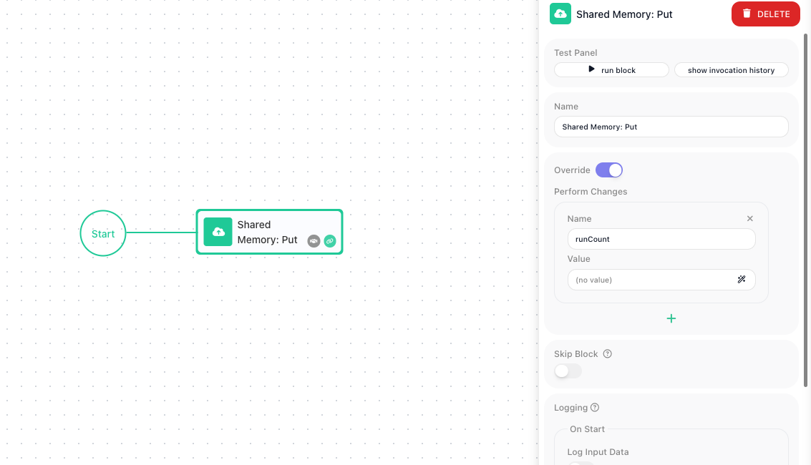

<!-- GENERATED FILE - do not edit. Source: block-knowledge/shared-memory-put.yaml. Regenerate: make refgen -->
# Shared Memory: Put

This block saves one or more values into Shared Memory, the flow's own key/value store. You name each value and supply what to store, and the value is kept under that name for later runs of the flow to read.

## How it works

You give the block a set of name-and-value pairs, and it writes each one into Shared Memory under its name. What makes this stick is that Shared Memory belongs to the flow and holds onto what you save between runs: a value one run writes is still there for the next run to read, where a Data Bucket variable would have been wiped clean when the run ended. The value you store can be a fixed value you type or an expression worked out at run time, so you can save the result of earlier steps. Writing to a name that already holds a value updates it in place; writing to a new name creates it.

## When to use it

Reach for it when a piece of state has to outlive a single run of the flow - a running counter, a cursor marking how far you got last time, a token you want to reuse next run. A Data Bucket variable resets every run and cannot carry anything forward, so it is the wrong tool for state that has to persist; Shared Memory is the store that remembers. In practice you pair this with a matching [Shared Memory: Read](shared-memory-read.md){.fr-block} at the top of the flow: the Read pulls the saved value in, the flow works with it, and this block writes the updated value back, so the two together carry state forward run after run.

## Example

Suppose you want a flow to number each run it makes - run 1, run 2, run 3 - even though each run starts fresh and remembers nothing on its own. The trick is to keep the count in Shared Memory under a name like `runCount`, read it at the start of every run, add one, and write the new total back with this block.

Early in the flow a Shared Memory: Read block reads `runCount`, with its **Default Value** set to `0` so the very first run (when nothing has been saved yet) gets a clean starting point. The flow adds one to whatever it read, and at the end a Shared Memory: Put block writes the new total back. In the Put block's **Perform Changes** list you add one entry: the name is `runCount`, and the value is the expression that adds one to the count the Read returned.

On the first run, the Read returns the Default Value `0`, the flow works out `1`, and this block writes `1` to `runCount`, replacing the old value in place. The next run reads `1`, works out `2`, and writes `2`; the run after that reads `2` and writes `3`. The number climbs run after run because Shared Memory holds onto it between runs, which a Data Bucket variable could never do.

## Configuration

| Field | Description |
| --- | --- |
| Perform Changes | The list of values to save. Each entry has a name (the key it is stored under in Shared Memory) and a value, which can be a fixed value you type or an expression. Add a row for each value you want to write in one go. |
| Override | When on, writing to a name that already holds a value replaces it with the new value. Confirm the off behavior in-product before documenting it. |

**Common settings** (available on most blocks):

| Field | Description |
| --- | --- |
| Name | A label for this block on the canvas. |
| Reference Result Data As | The alias used to reference this block's result in later blocks. |
| Logging | What to log to the Logging panel while the flow is LIVE, both on start and on completion. |
| Notes | Freeform notes for documenting the block; they do not affect execution. |

## Things to watch for

- Shared Memory keeps what you save between runs of the flow, unlike a Data Bucket variable, which resets every run. That is the whole point of using it, but it also means a value lingers until something overwrites or clears it.
- This block does not hand back a result you can reference in later blocks - it writes to the store rather than producing a value. To use what you saved, read it back with a Shared Memory: Read block.
- Writing to a name that already holds a value updates it. If you mean to add to a value rather than replace it - bump a counter, append to a list - read the current value first, work out the new one, and write that back; the block does not combine the new value with the old one for you.

## Related

- [Shared Memory: Read](shared-memory-read.md)
- [Shared Memory: Delete](shared-memory-delete.md)
