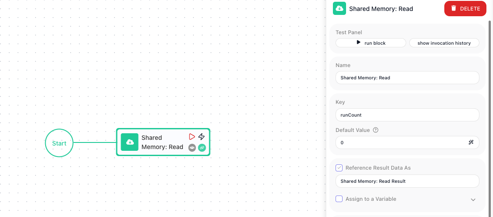

<!-- GENERATED FILE - do not edit. Source: block-knowledge/shared-memory-read.yaml. Regenerate: make refgen -->
# Shared Memory: Read

This block looks up one value in Shared Memory by its key and hands it back as the block's result. Shared Memory is a key/value store that belongs to the flow and keeps what you save in it.

## How it works

You give the block a key, and it returns whatever value is stored under that key. The thing that makes Shared Memory different from a Data Bucket variable is that it survives between runs: a value one run of the flow saves is still there for the next run to read. When the key has never been written yet, the block returns the **Default Value** you set instead of nothing, so the very first read still gives you something usable.

## When to use it

Reach for it when a piece of state has to outlive a single run of the flow - a running counter, a cursor marking how far you got last time, the last value you saw. A Data Bucket variable resets every run, so it cannot remember anything from one run to the next; Shared Memory is the store that does. Pair this Read with a matching [Shared Memory: Put](shared-memory-put.md){.fr-block} to write the value back, and the two together let a flow carry state forward run after run.

## Example

Suppose you want a flow to number each run it makes - run 1, run 2, run 3 - even though each run starts fresh and remembers nothing on its own. Keep the count in Shared Memory under the key `runCount`.

Drop a Shared Memory: Read block at the top of the flow. Set its **Key** to `runCount`, and set its **Default Value** to `0` so the first run (when nothing has been saved yet) reads a clean starting point instead of an empty value. The flow then adds one to whatever it read and writes the new count back with a Shared Memory: Put block aimed at the same key, so each run leaves the next run a higher number.

On the very first run, no value has been stored under `runCount`, so the Read block returns the Default Value, `0`. The flow adds one to it (an expression of the read value plus 1) and the Shared Memory: Put block writes the result back to `runCount`, so the store now holds `1`. The next run reads `1` and writes `2`, and the run after that reads `2` and writes `3`. The value climbs because Shared Memory holds onto it between runs, which a Data Bucket variable would not do.

## Configuration

| Field | Description |
| --- | --- |
| Key | Required. The shared-memory key to read. |
| Default Value | Value used when the key does not exist yet (first run). The return value if the value for the key has not yet been put |

**Common settings** (available on most blocks):

| Field | Description |
| --- | --- |
| Name | A label for this block on the canvas. |
| Reference Result Data As | The alias used to reference this block's result in later blocks. |
| Assign to a Variable | Optionally store the result in a Data Bucket variable too; you choose the bucket and the variable name. |
| Skip Block | When on, the block is skipped during execution and the value in Simulated Result is used as its output. |
| Logging | What to log to the Logging panel while the flow is LIVE, both on start and on completion. |
| Notes | Freeform notes for documenting the block; they do not affect execution. |

## Behavior

- Returns the stored value for the key, or the Default Value if absent.
- Optionally assigns the value to a Data Bucket variable.

## Things to watch for

- Shared Memory persists between runs of the flow, unlike a Data Bucket variable, which resets every run.
- First run (key not yet written) -> the block returns the Default Value as its result, and assigns it to the variable too if you set one.

## Related

- [Shared Memory: Put](shared-memory-put.md)
- [Shared Memory: Delete](shared-memory-delete.md)
- [Set Variables](set-variables.md)
- flow-memory-settings
