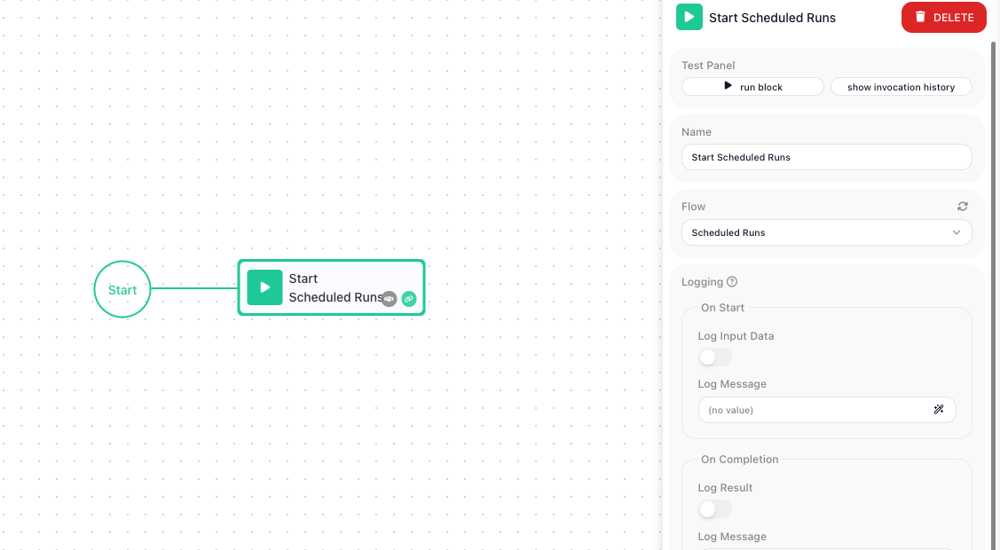

<!-- GENERATED FILE - do not edit. Source: block-knowledge/start-scheduled-runs.yaml. Regenerate: make refgen -->
# Start Scheduled Runs

This block turns a flow's schedule back on, so the platform resumes creating instances of that flow on its set schedule. You pick the target flow, and reaching this block restarts its scheduled runs.

## How it works

A flow's schedule has two separate parts: the schedule itself - how often the flow should run, defined once on the target flow - and whether that schedule is currently active. This block touches only the second part. It finds the schedule that already exists on the flow you pick and switches it back to active, so the platform starts creating a new instance each time the schedule comes due again. It does not set, change, or read the timing; if the target flow has no schedule at all, there is nothing for it to turn on.

## When to use it

Reach for it when one flow needs to switch another flow's scheduled runs back on without a person doing it by hand. A common shape is an operator flow that pauses a scheduled flow for a maintenance window with [Stop Scheduled Runs](stop-scheduled-runs.md){.fr-block}, waits, and then resumes it with this block - so the pause-and-resume happens automatically on its own timer. It is the programmatic equivalent of toggling the schedule on yourself, which is the better choice when a person is right there and only needs to do it once.

## Example

Suppose you run a flow called Nightly Report Export on a schedule - it runs every night and emails a report. During a database migration you need it to stay quiet for an hour, then pick its schedule back up on its own. You build a small operator flow to do that.

The operator flow does three things in sequence. First a <span class="fr-block">Stop Scheduled Runs</span> block, pointed at Nightly Report Export, halts its scheduled runs so no report goes out during the migration. Next a [Wait](wait.md){.fr-block} block holds for the length of the maintenance window. Finally a <span class="fr-block">Start Scheduled Runs</span> block, pointed at the same Nightly Report Export flow, turns its schedule back on:

```text
Stop Scheduled Runs   -> Flow: Nightly Report Export   (schedule paused)
Wait                  -> 1 hour
Start Scheduled Runs  -> Flow: Nightly Report Export   (schedule resumed)
```

The payoff: from the moment the <span class="fr-block">Start Scheduled Runs</span> block runs, Nightly Report Export is scheduled again, and the next nightly run creates an instance as normal. The schedule's timing was never changed - it was only switched off and back on. You can confirm it resumed by watching the Instances tab on Nightly Report Export for the next scheduled run to appear.



## Configuration

| Field | Description |
| --- | --- |
| Flow | Required. The flow whose scheduled runs you want to turn back on. Note that this dropdown currently lists every flow in the workspace, not only the ones that already have a schedule, so pick the target flow carefully. |

**Common settings** (available on most blocks):

| Field | Description |
| --- | --- |
| Name | A label for this block on the canvas. |
| Reference Result Data As | The alias used to reference this block's result in later blocks. |
| Assign to a Variable | Optionally store the result in a Data Bucket variable too; you choose the bucket and the variable name. |
| Logging | What to log to the Logging panel while the flow is LIVE, both on start and on completion. |
| Notes | Freeform notes for documenting the block; they do not affect execution. |

## Things to watch for

- The target flow has to already have a schedule defined on it. This block only turns an existing schedule back on - it does not create one, so if the flow was never scheduled there is nothing here to start.
- Defining a flow's schedule and turning that schedule on or off are two different things. The schedule (how often the flow runs) is set up separately on the flow itself; this block controls whether that schedule is active. Use it to resume scheduled runs, not to set their timing.
- The Flow dropdown currently lists every flow in the workspace, including flows that have no schedule at all. Selecting an unscheduled flow does not start anything, so make sure the flow you choose is one that actually has a schedule.

## Related

- [Stop Scheduled Runs](stop-scheduled-runs.md)
- [Flow Scheduling (Configure Flow Schedule)](flow-scheduling-concept.md)
- [Call Flow](call-flow.md)
