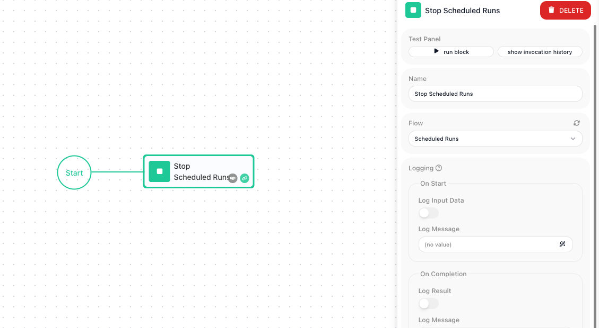

<!-- GENERATED FILE - do not edit. Source: block-knowledge/stop-scheduled-runs.yaml. Regenerate: make refgen -->
<!-- doclint: allow-unlinked: Stop Scheduled Runs -->
# Stop Scheduled Runs

Pause another flow's schedule from inside a flow - its scheduled runs stop firing, but the schedule's definition is kept intact for a later resume. That lets a flow quiet a scheduled workload on its own (around a maintenance job, or the moment an error rate climbs too high) instead of waiting for a person to flip the switch.

## How it works

When a flow has a schedule, the platform starts a new run of it on a set rhythm - every
30 minutes, every night at 2am, and so on. This block, which lives in the Actions group of
the block palette, reaches over to one of those flows, named in its <span class="fr-control">Flow</span> field, and
switches that rhythm off. The schedule definition stays in place untouched - its frequency,
its start and end dates, its policies - so nothing is lost; only its on/off switch is
flipped to off. No more runs of that flow are launched on the clock until something turns the
schedule back on, which is what its counterpart [Start Scheduled Runs](start-scheduled-runs.md){.fr-block} does.

The block does hand back a result, but it is only an acknowledgement that the pause went
through - there is no schedule data or status to read out of it, so in practice nothing
downstream needs to consume it.

## When to use it

Reach for it when one flow needs to pause another flow's scheduled runs on its own, without a person opening that flow and toggling its schedule by hand. The common case is a quiet window: before a maintenance job runs, a flow stops the scheduled work that would collide with it, does the maintenance, then turns the schedule back on with <span class="fr-block">Start Scheduled Runs</span>. It also fits a condition-driven halt - stop a flow's scheduled runs the moment some limit is reached or an error rate climbs too high. Doing this from a flow is cleaner than relying on someone to remember to flip the switch at the right moment.

## Example

Suppose you have a flow called Email Sender that the platform runs on a schedule every 30 minutes to send a batch of queued emails. Tonight you need to migrate the email provider, and you do not want a scheduled batch firing in the middle of it. You build a short maintenance flow to handle the pause and resume around that work.

The maintenance flow opens with a <span class="fr-block">Stop Scheduled Runs</span> block. In its <span class="fr-control">Flow</span> field you pick Email Sender - the flow whose schedule you want to pause. When this flow runs, that one line is enough to switch Email Sender's schedule off, so no new batch is launched on the clock from this point on.

After it, a [Wait](wait.md){.fr-block} block holds for the length of the migration, and then a <span class="fr-block">Start Scheduled Runs</span> block - also pointed at Email Sender - turns the schedule back on. Laid out, the maintenance flow does three things in sequence:

```text
1. Stop Scheduled Runs    Flow: Email Sender    (schedule paused)
2. Wait                   60 seconds            (migration window)
3. Start Scheduled Runs   Flow: Email Sender    (schedule resumed)
```

The payoff: throughout the wait, Email Sender launches no scheduled batches, so the migration runs clean. Its schedule was never deleted - every detail of its every-30-minutes setup is still there - so the <span class="fr-block">Start Scheduled Runs</span> block at the end brings it straight back to life, and the next batch goes out on the regular rhythm.



## Configuration

| Field | Description |
| --- | --- |
| Flow | Required. The flow whose schedule you want to pause. The dropdown offers the flows that have a schedule; when no flow in the workspace has one it is disabled, with a tooltip saying so. |

**Common settings** (available on most blocks):

| Field | Description |
| --- | --- |
| Name | A label for this block on the canvas. |
| Reference Result Data As | The alias used to reference this block's result in later blocks. |
| Assign to a Variable | Optionally store the result in a Data Bucket variable too; you choose the bucket and the variable name. |
| Logging | What to log to the Logging panel while the flow is LIVE, both on start and on completion. |
| Notes | Freeform notes for documenting the block; they do not affect execution. |

## Things to watch for

- This block pauses a schedule; it does not delete one. The flow's schedule - its frequency, its dates, its policies - is left fully defined, only switched off. Its counterpart <span class="fr-block">Start Scheduled Runs</span> flips that same switch back on. To remove a schedule outright, you open the flow's <span class="fr-control">Configure Flow Schedule</span> popup and use <span class="fr-control">REMOVE SCHEDULING</span> there - that deletes the schedule definition, which this block never does.
- Picking a flow that has no schedule has nothing to switch off. Make sure the flow you choose actually runs on a schedule.
- This block acts on the target flow's real schedule on the platform. When you are testing, point it at a throwaway flow rather than a production one, so you do not pause scheduled work that other people depend on.

## Related

- [Start Scheduled Runs](start-scheduled-runs.md)
- [Flow Scheduling](flow-scheduling-concept.md)
- [Call Flow](call-flow.md)
