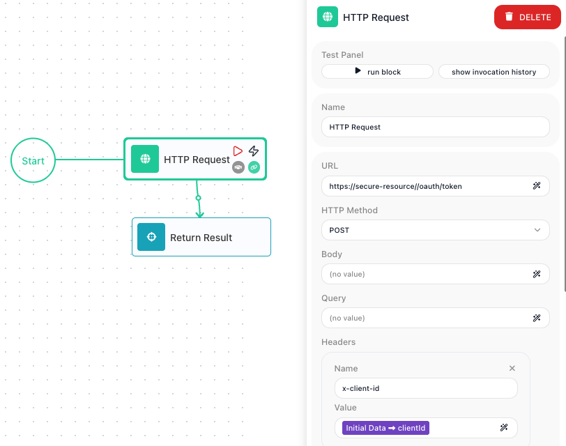

<!-- GENERATED FILE - do not edit. Source: block-knowledge/subflow.yaml. Regenerate: make refgen -->
<!-- doclint: allow-unlinked: SubFlow -->
# SubFlow

Build a sequence of steps once, then drop it into your flow as a single step everywhere you need it. You hand each placement the values it should work with and read back what it produces, and a fix made in one spot updates every placement at once.

## How it works

Think of a subflow as a named, self-contained mini-flow that lives inside your flow. The <span class="fr-block">SubFlow</span>
block is a placement of it: when the flow reaches the block, that mini-flow runs as one unit on
the values you pass in, and whatever its [Return Result](return-result.md){.fr-block} block hands back becomes this block's result.

You hand the subflow those values through its <span class="fr-control">Initial Params</span> - a list of named inputs you set on
the <span class="fr-block">SubFlow</span> block. Each name becomes a field in the subflow's Initial Data, so inside the subflow
its steps read that value the same way a flow reads its trigger's payload, as
<span class="fr-expr">Initial Data → name</span>. The name on the <span class="fr-control">Initial Params</span> row and the name the subflow reads back
are the same name.

The same definition can be placed in many spots, and every placement runs that one definition.
Because the steps live in the one shared definition, editing them updates every placement at once -
you edit in one place, and it changes everywhere it runs.

## When to use it

Reach for it when the same handful of steps shows up in more than one spot in a flow and you do not want to rebuild or copy them each time - refreshing an access token before two different calls, or formatting a record the same way in several branches. Keeping that work as one subflow means a change lands everywhere it runs, instead of being fixed in one place and forgotten in another. The trade-off against a [Call Flow](call-flow.md){.fr-block} block is reach: a subflow stays inside this one flow, so if the same logic also needs to run from other flows, build it as its own flow and use a <span class="fr-block">Call Flow</span> block instead.

## Creating and editing a subflow

You create a subflow from the <span class="fr-control">Subflows list</span> in the <span class="fr-control">blocks panel</span>: click its <span class="fr-control">add button</span> and the <span class="fr-control">New SubFlow</span> dialog opens. Give the subflow a name and, under <span class="fr-control">Input Parameter Names</span>, declare each input it takes - this is where its arguments are defined. Use the <span class="fr-control">plus</span> to add a row per input. These names are exactly what the subflow reads later from its Initial Data.

A brand-new subflow is empty. To build what it actually does, drag it from the <span class="fr-control">Subflows list</span> - the Subflows category of the <span class="fr-control">blocks panel</span>, where every subflow you create appears - into your flow, then step into it: select the <span class="fr-block">SubFlow</span> block and click <span class="fr-control">Expand</span>, build the steps inside, and use <span class="fr-control">Return</span> at the top-left to come back out. The steps you add there are the subflow's logic, shared by every placement of it.

To change a subflow's input parameters after it exists, click the <span class="fr-control">edit icon</span> on the subflow in the <span class="fr-control">Subflows list</span> - that reopens its parameter list so you can add or rename inputs.


## Example

Suppose a flow makes two calls to a service that expects a fresh access token on each call, and the token expires quickly. Rather than build the get-a-token steps twice, you build them once as a subflow named Get New Token. Inside it, an [HTTP Request](http-request.md){.fr-block} authenticates and a <span class="fr-block">Return Result</span> block hands back the token it obtained:

```text
Inside the Get New Token subflow:
  HTTP Request    POST /oauth/token, sending {{Initial Data->clientId}} as the x-client-id header
  Return Result   hands back { token: <the access token from the response> }
```

That <span class="fr-expr">Initial Data → clientId</span> is the subflow reading its input: the value arrives as Initial Data, exactly as a trigger's payload would, so the steps inside reference it by name. The screenshot below shows it in place - inside the Get New Token subflow, the <span class="fr-block">HTTP Request</span> block is selected, and its x-client-id header carries that bound <span class="fr-expr">Initial Data → clientId</span> reference:



Now place a <span class="fr-block">SubFlow</span> block before the first call and fill in its <span class="fr-control">Initial Params</span>. You add one row named clientId - the same name the subflow reads from its Initial Data - and give it an expression that supplies the value from this flow:

```text
SubFlow:  Get New Token

Initial Params:
  clientId  <-  {{Data Buckets:Default - Client ID->}}
```


When the flow reaches the block, the Get New Token steps run as one unit and their <span class="fr-block">Return Result</span> hands back an object like `{ "token": "ey..." }`. That object becomes this block's result, and you read it downstream through the alias set in <span class="fr-control">Reference Result Data As</span> - here, <span class="fr-expr">Get New Token Result</span>. In the Expression Editor you pick that alias under Block Data and drill into the token field, which binds as <span class="fr-expr">Get New Token Result → token</span>; the first call then sends that reference as its bearer token. Place a second <span class="fr-block">SubFlow</span> block - again pointing at Get New Token - before the second call, and it produces a fresh token the same way, read through its own result alias. Because both placements run the one definition, the day the token endpoint changes you edit Get New Token once and both calls pick up the fix.

## Configuration

| Field | Description |
| --- | --- |
| Initial Params | The values handed to the subflow to start, as named rows. Each row's name becomes a field in the subflow's Initial Data, read inside as <span class="fr-expr">Initial Data → name</span>, and the value is an expression that supplies it from this flow. (Which subflow the block runs is set when you add it, by dragging that subflow from the <span class="fr-control">Subflows list</span> - there is no picker in this panel.) |

**Common settings** (available on most blocks):

| Field | Description |
| --- | --- |
| Name | A label for this block on the canvas. |
| Reference Result Data As | The alias used to reference this block's result in later blocks. |
| Notes | Freeform notes for documenting the block; they do not affect execution. |

## Things to watch for

- A subflow cannot contain another <span class="fr-block">SubFlow</span> block - you cannot place a subflow inside a subflow.
- The subflow only hands a result back if its steps reach a <span class="fr-block">Return Result</span> block. Without one, this block runs the steps but gives the rest of the flow nothing structured to read.
- Editing a subflow's steps changes every placement of it in the flow, since they all run the one definition. A fix in one place is a fix everywhere - which is the point, but means a change is never local to a single placement.

## Related

- [Call Flow](call-flow.md)
- [Return Result](return-result.md)
