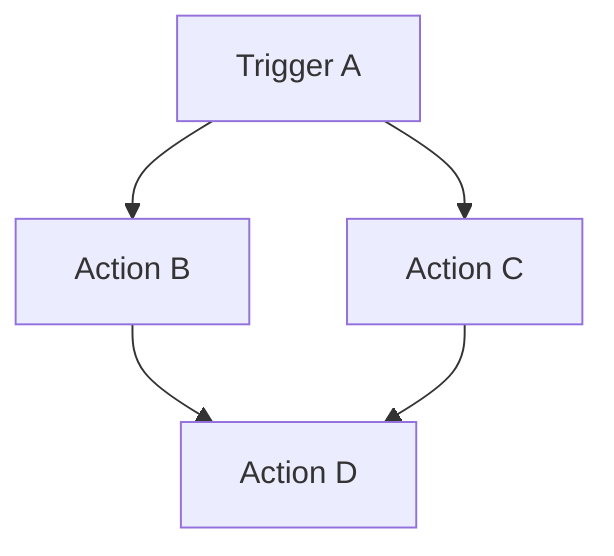
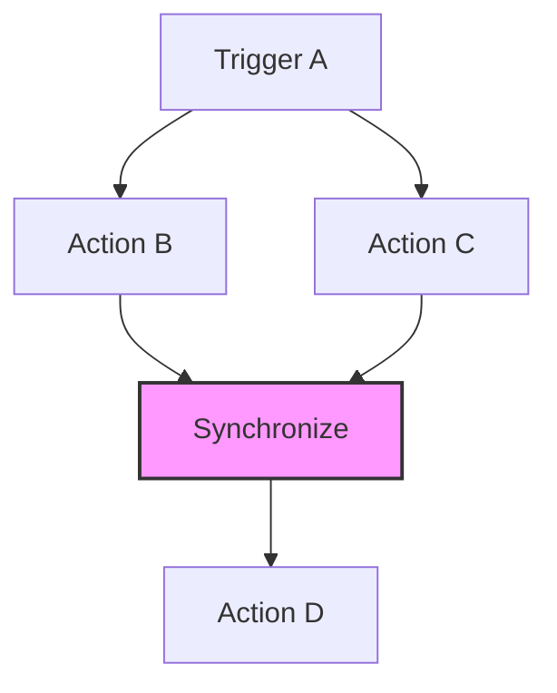
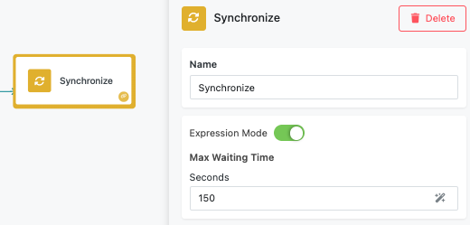
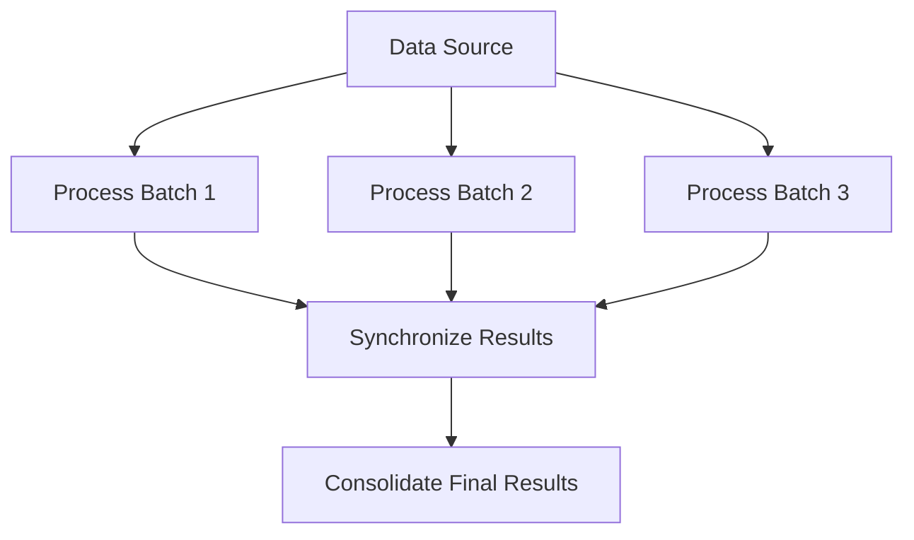
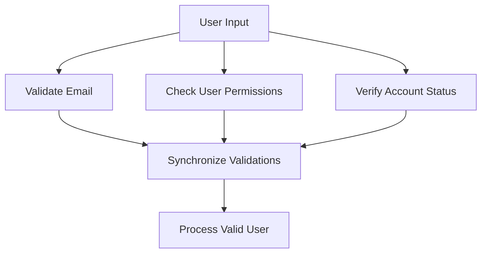

# Synchronize Block

The Synchronize block is an advanced FlowRunner™ component that merges parallel execution branches back into a single execution path. This block is essential for complex workflows where you need to split processing into parallel branches and then consolidate the results or continue with unified execution after parallel operations complete.

Understanding the Synchronize block requires knowledge of how FlowRunner™ handles branched execution. When a single block connects to multiple successor blocks, FlowRunner™ automatically creates separate execution branches that run independently and in parallel. The Synchronize block provides a controlled way to merge these parallel branches back together.

Common use cases include consolidating results from parallel data processing operations, ensuring all validation checks complete before proceeding, coordinating multiple API calls that must all finish before continuing, merging parallel approval workflows, and implementing join patterns in complex business process flows.

## Understanding Parallel Execution in FlowRunner

FlowRunner™ automatically creates parallel execution branches whenever a block has multiple successors. Each branch runs independently, which can lead to downstream blocks being executed multiple times if they receive input from multiple parallel branches.

### Basic Parallel Execution Example

Consider this flow structure:

In this scenario:

- **Trigger A** creates two parallel branches leading to **Action B** and **Action C**
- Both **Action B** and **Action C** execute simultaneously in separate branches
- **Action D** executes **twice** - once for each incoming branch
- Each execution of **Action D** operates independently with its own context and data

This parallel execution model provides powerful capabilities for concurrent processing, but sometimes you need to merge branches back into a single execution path.

### Synchronized Execution with Synchronize Block

The Synchronize block solves the multiple execution challenge by waiting for all incoming branches to arrive before allowing a single consolidated execution to continue:

With the Synchronize block:

- **Action B** and **Action C** still execute in parallel
- The **Synchronize block** waits for both branches to complete
- **Action D** executes only **once** after synchronization completes
- The flow continues with a single execution branch containing consolidated context

## Block Configuration

The Synchronize block provides flexible timing control to accommodate different synchronization scenarios.

### Max Waiting Time Configuration

The Max Waiting Time parameter determines how long the Synchronize block will wait for all incoming branches to arrive. This parameter has two configuration modes to accommodate different timing needs.

#### Static Time Configuration

In static mode, you specify a fixed duration using individual time units (see the screenshot above).

Time Unit Options:

- **Days**: For long-running processes or batch operations
- **Hours**: For extended processing workflows
- **Minutes**: For standard synchronization scenarios
- **Seconds**: For quick parallel operations

#### Dynamic Time Configuration (Expression Editor)

In dynamic mode, you can specify the wait time in seconds using the Expression Editor, allowing for variable timing based on workflow context:

!!! example "Dynamic Timing Examples"

    - `${ProcessingTime.estimated}`: Use calculated processing time estimates
    - `${Configuration.timeoutSeconds}`: Reference configuration variables
    - `${APIResponse.expectedDuration}`: Base timing on external service estimates
    - `300`: Static 5-minute timeout using expression syntax

### Timeout Behavior

When the Max Waiting Time expires before all branches arrive:

!!! warning "Timeout Handling"

    - The Synchronize block stops waiting and continues execution
    - Only branches that arrived before timeout are included in the synchronized context
    - Late-arriving branches are effectively dropped from the execution flow
    - Consider error handling downstream to detect incomplete synchronization

## Implementation Patterns

### Parallel Data Processing

Use the Synchronize block to merge results from parallel data processing operations:

!!! note "Alternative Approach: Actions Group"

    For simpler parallel execution scenarios, consider using an [**Actions Group**](./actions-group.md) block with transition mode set to **"On Completion"**. This ensures the outgoing transition happens only when all enclosed actions complete their execution, providing a more streamlined alternative to explicit Synchronize blocks.

### Multiple API Validation

Coordinate multiple validation API calls before proceeding:

!!! note "Alternative Approach: Action Group"

    Multiple validation calls can also be handled using an **Action Group** with "On Completion" transition mode, which automatically waits for all validations to finish before proceeding.

## Best Practices

!!! tip "Synchronization Design Strategy"

    - **Plan Branch Timing**: Consider the expected duration of each parallel branch
    - **Set Appropriate Timeouts**: Balance between waiting for slow branches and maintaining flow responsiveness
    - **Handle Incomplete Synchronization**: Design downstream logic to handle cases where not all branches complete
    - **Monitor Performance**: Track synchronization patterns to optimize timing parameters

!!! warning "Common Pitfalls"

    - **Overly Short Timeouts**: May cause premature synchronization with missing data
    - **No Timeout Strategy**: Indefinite waiting can hang workflows
    - **Complex Branch Dependencies**: Avoid circular dependencies in parallel branches
    - **Resource Contention**: Be mindful of parallel branches competing for limited resources

!!! note "Performance Considerations"

    - **Memory Usage**: Synchronize blocks hold branch data until synchronization completes
    - **Execution Time**: Total flow time includes the longest parallel branch plus synchronization time
    - **Resource Planning**: Account for peak resource usage during parallel execution phases
    - **Error Propagation**: Design error handling for both individual branches and synchronization failures
