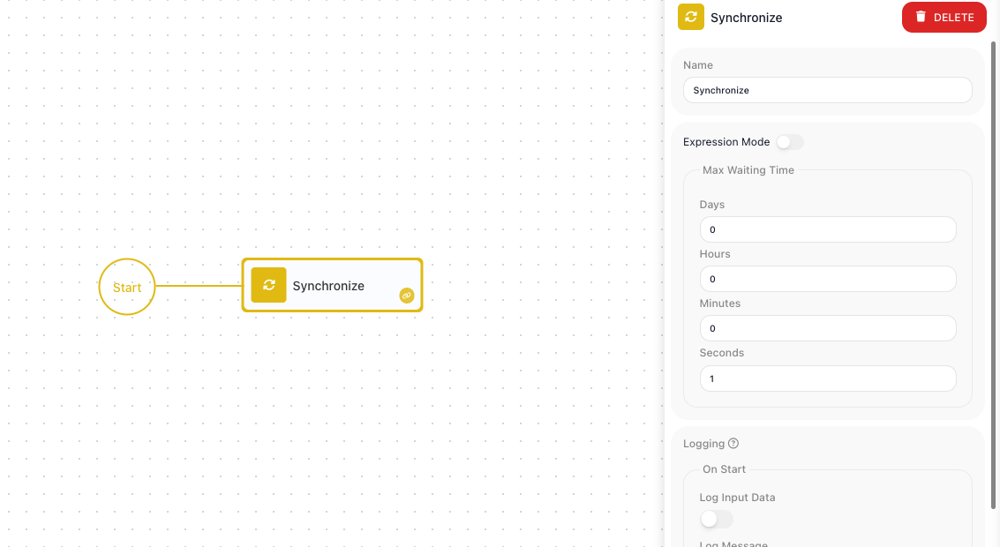

<!-- GENERATED FILE - do not edit. Source: block-knowledge/synchronize.yaml. Regenerate: make refgen -->
# Synchronize

This block waits for several parallel branches of your flow to finish, then continues down a single path once they have all arrived.

## How it works

Think of it as a meeting point. When a flow splits into branches that run side by side, each branch runs at its own pace and finishes whenever its work is done. You wire every one of those branches into this block, and it holds the flow there until the last branch shows up. Only then does it release the single path that leads onward, so anything downstream can count on all of that parallel work being complete. You also set a Max Waiting Time, a cap on how long it will hold for the stragglers; if that time runs out first, it stops waiting and continues anyway.

## When to use it

Reach for it whenever you fan out into branches that run at the same time and a later step needs all of their results together. A common shape is calling two or three sub-flows in parallel - so their work overlaps instead of running one after another - and then needing every one of them done before you move on. Without this block, the path that finishes first would race ahead on its own; with it, the flow waits for the whole group as a unit. The trade-off is the wait itself: the flow moves at the speed of the slowest branch, and the Max Waiting Time is your safeguard against a branch that hangs.

## Example

Suppose a flow registers a new customer account, and three pieces of setup can happen at the same time because none of them depends on the others. You fan the flow out into three parallel branches, each a [Call Flow](call-flow.md){.fr-block} block that runs a sub-flow: one creates the funding method, one creates ancillary products, and one records the entity involvement. They start together and each finishes when its own work is done.

The next step builds a welcome summary that needs all three results, so it must not run until every branch is finished. Wire all three <span class="fr-block">Call Flow</span> branches into a <span class="fr-block">Synchronize</span> block, and set its Max Waiting Time to 60 seconds - long enough for the slowest sub-flow on a normal run, short enough that a stuck branch will not hold the flow forever:

```text
Branch A: Call "Create Funding Method" Flow      finishes at ~8s
Branch B: Call "Create Ancillary Products" Flow  finishes at ~22s
Branch C: Call "Create Entity Involvement" Flow  finishes at ~14s
```

The <span class="fr-block">Synchronize</span> block holds the flow until the last branch arrives. Branch A finishes first at about 8 seconds and waits; Branch C arrives at about 14 seconds and also waits; Branch B is the slowest at about 22 seconds. The moment Branch B lands, all three have arrived, the 60-second cap was never reached, and the flow releases onto its single downstream path to build the welcome summary - now safe to read all three results.

Had Branch B instead hung past 60 seconds, the Max Waiting Time would have fired: the flow would have continued at the 60-second mark without that branch, and its result would not be available downstream. That is the behavior the cap is there to give you - a guarantee the flow eventually moves on rather than waiting forever.



## Configuration

| Field | Description |
| --- | --- |
| Max Waiting Time | How long to wait for all branches to arrive before giving up and continuing anyway. With Expression Mode off you fill in plain Days, Hours, Minutes, and Seconds fields; with it on you supply an expression that works out to a number of seconds, so the cap can be computed at run time. |

**Common settings** (available on most blocks):

| Field | Description |
| --- | --- |
| Name | A label for this block on the canvas. |
| Logging | What to log to the Logging panel while the flow is LIVE, both on start and on completion. |
| Notes | Freeform notes for documenting the block; they do not affect execution. |

## Things to watch for

- This block only does something when more than one branch feeds into it. If a single path reaches it, there is nothing to wait for and the flow passes straight through.
- If the Max Waiting Time runs out before every branch arrives, the flow continues without the missing branches, and any result they would have produced is not available to later steps. Set the cap high enough to cover the slowest branch on a normal run.

## Related

- [Actions Group](actions-group.md)
- [Call Flow](call-flow.md)
- [Wait](wait.md)
