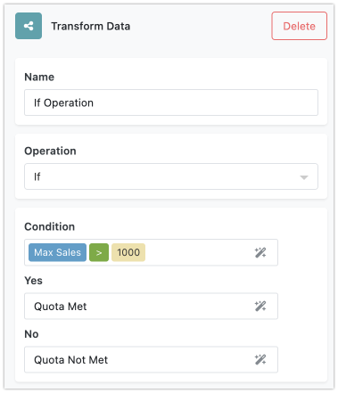

The "Transform Data" block is a versatile tool that offers various data transformation operations. Each operation has unique behavior based on how it transforms data. These operations are grouped according to the data type they work with. Below are tables detailing each operation within its respective category.

## Logic Operations
Logic operations in FlowRunner provide essential tools for making decisions within your flows. These operations allow you to evaluate conditions in preparation for more advanced flow control decisions based on specific criteria. By incorporating logic operations, you can create more dynamic and responsive workflows that adapt to various situations.

There are four main logic operations in FlowRunner:

1. **If**: This operation checks a condition and returns one of two values based on whether the condition is true or false.
2. **Equals**: This operation compares two values to determine if they are equal.
3. **Switch**: This operation evaluates a value against a list of cases and returns a corresponding result for the first matching case.
4. **Is Empty**: This operation checks if a value is empty and returns one of two specified values based on the result.

These logic operations work at a fundamental level, helping you to implement basic decision-making processes within your flows. They are versatile and can be used in a wide range of scenarios to ensure your automation behaves as expected under different conditions.

The details of each operation are described below.

| Operation | Description | Arguments |
|-----------|-------------|-----------|
| :fontawesome-solid-share-nodes: If | Returns "Yes" if the condition is satisfied, otherwise returns "No".    | - Condition   - Yes   - No |
| :fontawesome-solid-equals: Equal | Compares two values to check if they are equal. Returns `true` if the values are equal or `false` otherwise.   | - Compare value   - With |
| :fontawesome-solid-sitemap: Switch | Evaluates a value against a list and returns the result corresponding to the first matching value.    | - Value or Expression to Evaluate   - Pairs of "For the Case Of" and "Return Value"   - Default |
| :fontawesome-solid-code-branch: If Empty | Returns the first value if the input is not empty, otherwise returns the second value.   | - Evaluate Value or Expression   - When Empty, Return |

## Object Operations
In programming, an "object" is a way to organize and store data. Think of an object as a collection of related information, much like a real-world object that has various characteristics. These characteristics are stored as key/value pairs within the object.

- **Key**: This is the name of a property or attribute in the object. It serves as a label to identify the data.
- **Value**: This is the data or information associated with the key. It can be any type of data, such as a number, text, or even another object.

!!! note
     Elsewhere in this guide we use the term "key/value structure" to refer to objects.

Each key in an object maps to a value, and this mapping is unique. This means you can easily retrieve the value by using its corresponding key.

Let's look at a simple example of an object representing a person. Here are the keys and values in a tabular format:

| Key          | Value            |
|--------------|------------------|
| `firstName`    | James            |
| `lastName`     | Bond             |
| `age`          | 45               |
| `occupation`   | Spy              |
| `email`        | jamesbond@mi6.co.uk |

In this example, the object has keys like `firstName`,`lastName`, `age`, `occupation` and `email`. Each key is associated with a specific value. To retrieve values from an object, you use the key names. For instance, if you want to find out the person's first name, you look up the value associated with the `firstName` key.

Here's how you can retrieve the values using their keys:

- To get the first name: `firstName` -> **James**
- To get the last name: `lastName` -> **Bond**
- To get the age: `age` -> **45**
- To get the occupation: `occupation` -> **Spy**
- To get the email: `email` -> **jamesbond@mi6.co.uk**

By using the key names, you can easily access and manipulate the data within the object. This makes objects a powerful and flexible way to handle complex data in programming. The operations listed below work with objects. You can retrieve a value associated with a specific key, or "transform" an object by omitting or selecting specific properties.

| Operation | Description | Arguments |
|-----------|-------------|-----------|
| :fontawesome-solid-file-arrow-up: Get | Retrieves the value of a specified property from an object or array. Use dot notation for nested key/value structures (objects).    | - Object   - Property Name |
| :fontawesome-solid-filter-circle-xmark: Omit | Omits specified keys from an object and returns the remaining properties.    | - Object   - Property Name(s) |
| :fontawesome-solid-filter: Pick | Picks only the specified keys from an object.    | - Object   - Property Name(s) |

## Array/List Operations
In programming, an "array" is a way to organize and store a collection of items. Think of an array as a list where you can keep multiple pieces of related information in one place. Each item in an array has a specific position, known as an index, which helps you access and manage the items easily. Arrays can contain data of different types, such as numbers, strings, objects or even other arrays.

Let's look at a simple example of an array representing a list of fruits:

`"Apple"`, `"Banana"`, `"Cherry"`, `"Date"`, `"Elderberry"`

In this array, each fruit is an item, and each item has an index:

| Index | Item       |
|-------|------------|
| 0     | Apple      |
| 1     | Banana     |
| 2     | Cherry     |
| 3     | Date       |
| 4     | Elderberry |

Here are some common operations you can perform on arrays:

* **Get Length** - The length of an array is the number of items it contains. You can easily find out how many items are in an array by checking its length.
* **Get First Item** - You can retrieve the first item in an array by accessing the item at index 0.
* **Sort** - Sorting an array means arranging its items in a specific order, such as alphabetically or numerically.

Let's see these operations in action with our fruit array:

| Operation        | Result                           |
|------------------|----------------------------------|
| Get Length       | 5                                |
| Get First Item   | Apple                            |
| Sort             | Apple, Banana, Cherry, Date, Elderberry |

Arrays are a powerful way to manage collections of related items in programming. Below is a list of array operations supported by FlowRunner. By using these operations you can efficiently organize and manipulate your data.

| Operation | Description | Arguments |
|-----------|-------------|-----------|
| :fontawesome-solid-bars: Create Array | Creates an array from the provided elements. | - Element |
| :fontawesome-solid-font: Convert List To String | Concatenates all items of an array into a string, using the specified separator between each item. | - Array   - Separator |
| :fontawesome-solid-ruler-horizontal: Get List Length | Returns the number of items in an array. | - Array |
| :fontawesome-solid-minimize: Merge Lists | Merges two or more arrays into one. | - Array   - Array |
| :fontawesome-solid-circle-question: If List Contains | Checks if an array contains a specified value. | - Array   - Value |
| :fontawesome-solid-square-minus: Remove From List | Removes specified values from an array. Effective only on arrays of primitive text or numbers. | - Array   - Value |
| :fontawesome-solid-square-plus: Add To List | Adds specified values to an array and returns the updated array. | - Array   - Value |
| :fontawesome-solid-caret-right: Get First List Item | Returns the first element of an array. | - Array |
| :fontawesome-solid-caret-left: Get Last List Item | Returns the last element of an array. | - Array |
| :fontawesome-solid-circle-question: Reverse List | Reverses the order of elements in an array and returns the reversed array. | - Array |
| :fontawesome-solid-backward: Shuffle List | Randomly reorders the elements of an array. | - Array |
| :fontawesome-solid-layer-group: Flatten List | Concatenates all sub-array elements into a single array. The "key" argument specifies which properties to flatten. | - Array   - Key |
| :fontawesome-solid-fingerprint: Distinct List | Removes duplicate values from an array. Use the "key" argument to specify properties in complex objects. | - Array   - Key |
| :fontawesome-solid-scissors: Slice List | Returns a new array containing only selected items. The "start" position is inclusive, "end" is exclusive. The first element has the position of `0`. | - Array   - Start   - End |
| :fontawesome-solid-arrow-up-short-wide: Sort List | Sorts the values of an array. Use the "key" argument to specify properties in complex objects. | - Array   - Order   - Key |
| :fontawesome-solid-list-ul: Object Keys To List | Returns an array containing the properties of a given object. | - Object |

## Date Operations

| Operation | Description | Arguments |
|-----------|-------------|-----------|
| :fontawesome-solid-clock: Now | Returns the current Unix timestamp in milliseconds since January 1, 1970 GMT. | No arguments |
| :fontawesome-solid-stopwatch: Set Seconds | Sets the seconds in a date to a specified value. Accepts numbers from 0 to 59. | - Date/Time   - Seconds (0-59) |
| :fontawesome-solid-stopwatch: Get Seconds | Returns the seconds from a specified date. | - Date/Time |
| :fontawesome-solid-stopwatch: Add Seconds | Adds a specified number of seconds to a date. To subtract, enter a negative number. | - Date/Time   - Seconds (0-59) |
| :fontawesome-solid-hourglass-start: Set Minutes | Sets the minutes in a date to a specified value. Accepts numbers from 0 to 59. | - Date/Time   - Minutes (0-59) |
| :fontawesome-solid-hourglass-start: Get Minutes | Returns the minutes from a specified date. | - Date/Time |
| :fontawesome-solid-hourglass-start: Add Minutes | Adds a specified number of minutes to a date. To subtract, enter a negative number. | - Date/Time   - Minutes (0-59) |
| :fontawesome-solid-clock: Set Hour | Sets the hour in a date to a specified value. Accepts numbers from 0 to 23. | - Date/Time   - Hour (0-23) |
| :fontawesome-solid-clock: Get Hour | Returns the hours from a specified date. | - Date/Time |
| :fontawesome-solid-clock: Add Hours | Adds a specified number of hours to a date. To subtract, enter a negative number. | - Date/Time   - Hours |
| :fontawesome-solid-calendar-day: Set Day of Month | Sets the day of the month in a date to a specified value. Accepts numbers from 1 to 31. | - Date   - Day (1-31) |
| :fontawesome-solid-calendar-day: Get Day of Month | Returns the day of the month from a specified date. | - Date |
| :fontawesome-solid-calendar-day: Set Day of Year | Sets the day of the year in a date to a specified value. Accepts numbers from 1 to 365. | - Date   - Day (1-365) |
| :fontawesome-solid-calendar-day: Get Day of Year | Returns the day of the year from a specified date. | - Date |
| :fontawesome-solid-calendar-week: Get Day of Week as Number | Returns the day of the week as a number from a specified date. | - Date |
| :fontawesome-solid-calendar-plus: Add Days | Adds a specified number of days to a date. To subtract days, enter a negative number. | - Date   - Days |
| :fontawesome-solid-calendar-days: Set Month | Sets the month in a date to a specified value. Accepts numbers from 1 to 12. | - Date   - Month (1-12) |
| :fontawesome-solid-calendar-days: Get Month | Returns the month from a specified date. | - Date |
| :fontawesome-solid-calendar-days: Add Months | Adds a specified number of months to a date. To subtract months, enter a negative number. | - Date   - Months |
| :fontawesome-solid-calendar-days: Set Year | Sets the year in a date to a specified value. | - Date   - Year |
| :fontawesome-solid-calendar-days: Get Year | Returns the year from a specified date. | - Date |
| :fontawesome-solid-calendar-days: Add Years | Adds a specified number of years to a date. To subtract years, enter a negative number. | - Date   - Years |
| :fontawesome-solid-arrow-right-arrow-left: Parse Date | Parses a string and returns a date. | - Date   - Format |
| :fontawesome-solid-arrow-right-arrow-left: Format Date | Formats a date according to specified criteria. | - Date   - Format |

## Math Operations

| Operation | Description | Arguments |
|-----------|-------------|-----------|
| :fontawesome-solid-minus: Subtract | Subtracts one number from another. | - Minuend   - Subtrahend |
| :fontawesome-solid-divide: Divide | Divides one number by another. | - Dividend   - Divisor |
| :fontawesome-solid-xmark: Multiply | Multiplies two numbers together. | - Multiplier   - Multiplicand |
| :fontawesome-solid-maximize: Max | Returns the largest number in a specified array or among individually entered numbers. | - Number/Numbers   - Number/Numbers |
| :fontawesome-solid-minimize: Min | Returns the smallest number in a specified array or among individually entered numbers. | - Number/Numbers   - Number/Numbers |
| :fontawesome-solid-plus: Sum | Returns the sum of values in a specified array or among individually entered numbers. | - Number/Numbers   - Number/Numbers |
| :fontawesome-solid-arrow-up: Round Up | Rounds a number up to the nearest integer. | - Number |
| :fontawesome-solid-arrow-down: Round Down | Rounds a number down to the nearest integer. | - Number |
| :fontawesome-solid-arrows-up-down: Round with Fraction | Rounds a number to the nearest integer. | - Number |
| :fontawesome-solid-arrow-trend-up: Average | Returns the average of the values in a specified array or among individually entered numbers. | - Number/Numbers   - Number/Numbers |
| :fontawesome-solid-arrow-right-arrow-left: Parse Number | Parses a string and returns a number. | - Number |
| :fontawesome-solid-arrow-right-arrow-left: Format Number | Formats a number according to specified criteria. | - Number   - Decimal Points   - Decimal Separator   - Thousands Separator |
| :fontawesome-solid-superscript: Pi | Returns the constant π. | No arguments |
| :fontawesome-solid-shuffle: Random | Returns a random number between 0 and 1. | No arguments |

## Text Operations

| Operation | Description | Arguments |
|-----------|-------------|-----------|
| :fontawesome-solid-font: Lower | Converts all characters in a text string to lowercase. | - Text |
| :fontawesome-solid-text-height: Upper | Converts all characters in a text string to uppercase. | - Text |
| :fontawesome-solid-text-width: Trim | Removes whitespace from the start and end of a text string. | - Text |
| :fontawesome-solid-text-height: Capitalize | Converts the first character of a text string to uppercase. | - Text |
| :fontawesome-solid-text-height: Start Case | Capitalizes the first letter of each word in a text string. | - Text |
| :fontawesome-solid-ruler-horizontal: Length | Returns the length of a text string. | - Text |
| :fontawesome-solid-font: Contains | Checks if a text string contains a specified substring. | - Text   - Search String |
| :fontawesome-solid-font: Substring | Returns a portion of a text string between specified start and end positions. | - Text   - Start   - End |
| :fontawesome-solid-retweet: Replace | Replaces occurrences of a specified substring within a text string with another substring. | - Text   - Search String   - Replacement string |
| :fontawesome-solid-magnifying-glass: Index Of | Returns the position of the first occurrence of a specified substring within a text string. | - Text   - Substring   - Start |
| :fontawesome-solid-divide: Split | Splits a text string into an array of substrings based on a specified separator. | - Text   - Separator   - Keep Empty String |
| :fontawesome-solid-fingerprint: Unique Identifier | Generates a RFC 4122 version 4 compliant unique identifier. | No arguments |
| :fontawesome-solid-font: Decode URL | Decodes a URL-encoded text string. | - Text |
| :fontawesome-solid-font: Encode URL | Encodes a text string to a URL-safe format. | - Text |
| :fontawesome-solid-font: Text To Binary | Converts a text string to a binary format. | - Bytes |
| :fontawesome-solid-font: Binary To Text | Converts binary data to a text string. | - Bytes |
| :fontawesome-solid-font: To String | Converts any value to a text string. | - Value |
| :fontawesome-solid-barcode: md5 decode | Calculates the MD5 hash of a text string. | - Text |
| :fontawesome-solid-barcode: md5 encode | Generates a text string from a given MD5 hash. | - MD5 |
| :fontawesome-solid-barcode: ascii | Removes non-ASCII characters from a text string. | - Text   - Remove Diacritics |
| :fontawesome-solid-barcode: base64 decode | Decodes a Base64-encoded text string. | - Text |
| :fontawesome-solid-barcode: base64 encode | Encodes a text string in Base64 format. | - Base64 |
| :fontawesome-solid-file-code: Remove HTML tags | Removes HTML tags from a text string. | - Text |
| :fontawesome-solid-file-code: Escape HTML Tags | Escapes HTML tags within a text string. | - Text |