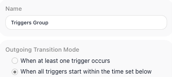
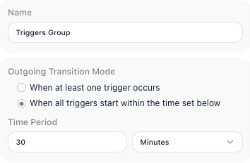
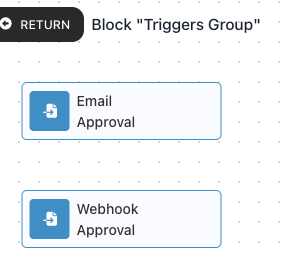

<!-- GENERATED FILE - do not edit. Source: block-knowledge/triggers-group.yaml. Regenerate: make refgen -->
<!-- doclint: allow-unlinked: Triggers Group -->
# Triggers Group

This block lets you hold several triggers together and start the flow on whichever one fires first, or hold the flow back until a whole set of them has fired within a time window you set. One trigger on its own can only react to one kind of event; a Triggers Group lets a single point in the flow wait on several at once and choose how their arrivals release it.

## How it works

A Triggers Group is a block container for triggers. Instead of a single trigger starting the
flow on its own, you place two or more triggers inside the group, and the group decides when the
flow moves on based on which of them have fired. The triggers inside have no order and none is
the "main" one - the group watches them all and waits.

How it waits is set by the group's own Outgoing Transition Mode, a setting on the Triggers
Group block. In the "When at least one trigger occurs" mode the group lets the flow continue the
moment the first of its triggers receives an event, and the rest are no longer waited on - the
triggers race, and the winner releases the flow. In the "When all triggers start within the time
set below" mode the group holds the flow back until every trigger inside it has fired, and
continues only if they all do so inside a timeframe you set.

## When to use it

Reach for it when more than one inbound event could, or should, move your flow forward, and a single trigger cannot express that. The "When at least one trigger occurs" mode suits a race - you are waiting on whichever of several events shows up first, like an approval that might arrive by email or by a webhook, and you act on the first one. The "When all triggers start within the time set below" mode suits a rendezvous - you need several events to have all happened close together before you proceed, like waiting for both a payment confirmation and a shipping confirmation within an hour. If only one event ever matters, a single trigger on its own is the simpler choice; the group earns its place once the decision spans several triggers at once.

## Waiting for a set of triggers (the rendezvous mode)

The rendezvous mode is the one with a timeframe. With Outgoing Transition Mode set to
"When all triggers start within the time set below", the group stops racing: instead of
releasing the flow on the first arrival, it holds the flow back until every trigger inside it
has fired - and continues only if they all fire inside a window you set.

You set that window in the Time Period, as a number and a unit - the unit can be Seconds,
Minutes, Hours, or Days - so 30 and Minutes, say, or 1 and Hours. The window is the whole
condition: every trigger in the group has to fire inside it. If
the window passes with even one trigger still waiting, the all-fire condition is not met and
the flow does not move on.

## Example

Suppose a run pauses partway through and should resume as soon as approval comes in, but approval might arrive two different ways - a manager clicking a link in an email, or an upstream system posting to a webhook. Put two [External Callback](external-callback.md){.fr-block} triggers inside a Triggers Group: one whose Callback URL the email link points at, and one whose Callback URL the upstream system posts to.

Set the group's Outgoing Transition Mode to the "When at least one trigger occurs" mode. Now whichever event arrives first - the click or the post - releases the flow, and the second is no longer waited on. The flow continues without you having to wire up branching logic to watch both paths yourself, and without caring which channel the approval came through.

## Configuration

| Field | Description |
| --- | --- |
| Outgoing Transition Mode | Required. How the group decides to continue. One choice continues as soon as any single trigger inside it fires; the other continues only after every trigger has fired within the time window you set below. |
| Time Period | The length of the time window for the "When all triggers start within the time set below" mode, given as a number and a unit (for example 30 and Minutes). Every trigger must fire inside this window for the group to continue. It does not apply to the "When at least one trigger occurs" mode. |

## Things to watch for

- The triggers in the group have no order and no priority - the group reacts to whichever of them fire, not to a particular one.
- If you choose the 'When all triggers start within the time set below' mode, you have to set a time window. Without one there is no defined period for the triggers to all fire inside.
- The group itself does not produce a combined result for later steps to read. Each trigger inside it still exposes its own data under its own alias, so read those individually.

## Related

- [Actions Group](actions-group.md)
- [External Callback](external-callback.md)
