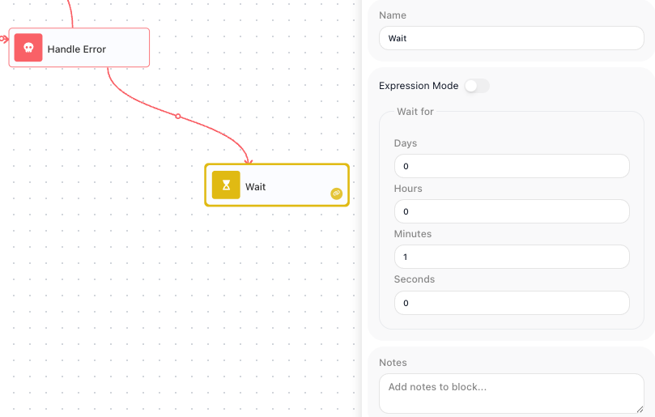

<!-- GENERATED FILE - do not edit. Source: block-knowledge/wait.yaml. Regenerate: make refgen -->
<!-- doclint: allow-unlinked: Wait -->
# Wait

This block pauses for a set amount of time before the flow carries on. The path of the flow that reaches it waits out the delay and then continues to the next step.

## How it works

Think of it as a held breath on one branch of the flow. When the flow reaches this block, that branch pauses for the duration you set and the rest of the flow carries on; only this branch is waiting. A flow can split into several paths, or branches, and any parallel branch keeps moving while this one is held. Once the duration is up, the paused branch picks up exactly where it left off and continues to its next step. You set the duration two ways: with Expression Mode off you fill the Days, Hours, Minutes, and Seconds fields directly; with it on you author a value in the Expression Editor that must resolve to a number of seconds.

## When to use it

Reach for it whenever a step should not happen immediately. The most common case is backing off before a retry: after a call fails, you pause so the thing you are calling has a moment to recover before you try again. It also paces work that would otherwise run too fast - spacing out repeated calls so you stay under a rate limit (the cap on how often a service will accept calls before it starts rejecting them), or holding for a stretch before a follow-up step. It is a single block for the job, rather than rigging up timing logic out of other blocks.

## Example

Suppose an [HTTP Request](http-request.md){.fr-block} block calls a payment provider, and that provider sometimes returns an error when it is briefly busy. You want to give it one more try, but not the instant it failed. In our flow a [Handle Error](handle-error.md){.fr-block} block is wired off the failing call - that gives a separate branch that only runs when the request fails - and on that branch a Wait sits before the same HTTP Request runs again.

On that branch the Wait is set to one minute. Expression Mode is off, and under Wait for the Minutes field is 1 while the rest are 0:

Now when the call fails, the error path reaches the Wait, the branch pauses for 60 seconds, and only then does it run the same HTTP Request again.

## Configuration

| Field | Description |
| --- | --- |
| Expression Mode | Off = simple Days/Hours/Minutes/Seconds; On = an expression that works out to a number of seconds. |
| Days/Hours/Minutes/Seconds (delay) | The pause duration (at least one non-zero in simple mode). |

**Common settings** (available on most blocks):

| Field | Description |
| --- | --- |
| Name | A label for this block on the canvas. |
| Notes | Freeform notes for documenting the block; they do not affect execution. |

## Behavior

- Suspends the branch for the duration you set, then continues.
- Common pattern: a Handle Error path leads into a Wait (backoff), which then retries the failed step.

## Things to watch for

- In Expression Mode the expression has to work out to a number of seconds, not minutes or hours - to wait five minutes it must produce 300.

## Related

- [Handle Error](handle-error.md)
- [Synchronize](synchronize.md)
