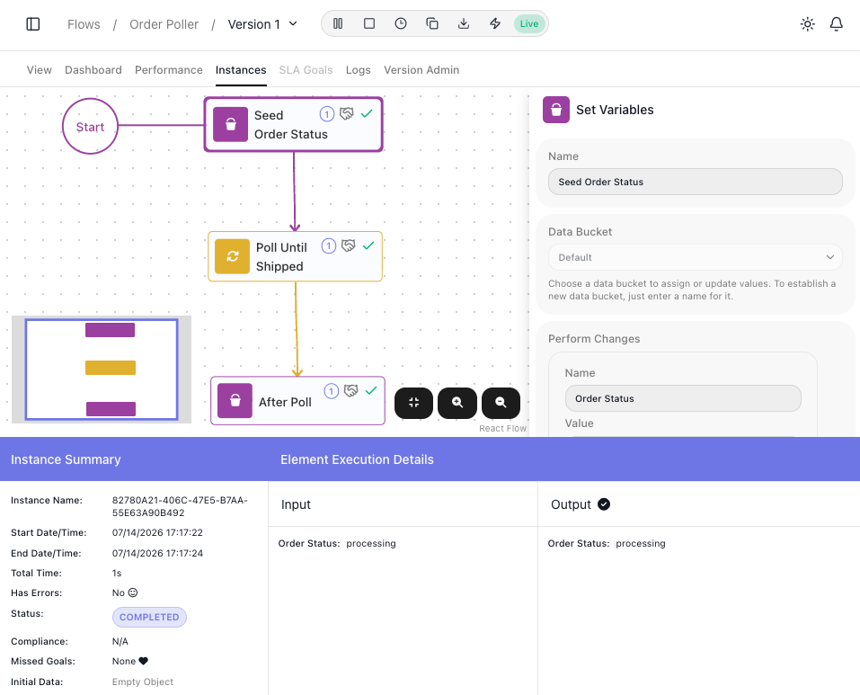
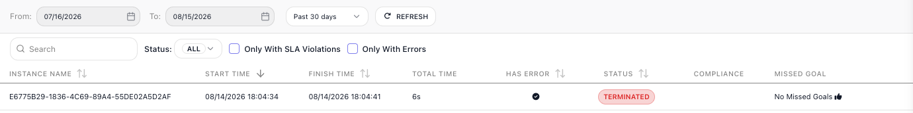
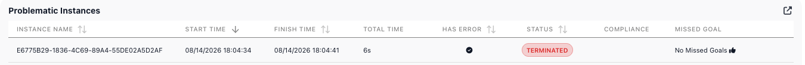

# Inspecting a Single Run

The [monitoring views](monitoring.md) describe a **FlowRunner™** flow in aggregate; this page is about one run: what did *this* run do with *this* data? Opening a run answers that block by block - what each one received, what it produced, and where things went wrong - whether you are chasing a failure or just confirming a run handled its data the way you meant.

## Opening a run

The ((Instances)) tab lists the flow's runs, each with its start and finish time, duration, error flag, and status, with filters above the list to narrow it.[^1] Open one and the flow is redrawn as that run took it: every block it executed carries a tick, and two panels carry the detail:

- ((Instance Summary)) - the run's facts: how long it took, whether it errored, which SLA goals it missed, and the **Initial Data** it started from.
- Select any block and ((Element Execution Details)) shows the **Input** it received and the **Output** it produced. That is how you follow a value from the data that arrived, watch each block reshape it, and pin the step where a wrong result first appears.

The example the shots follow is a flow that polls an order until it ships.

## Stepping through a loop's passes

A [Repeat](../reference/repeat.md){.fr-block} or [List Iterator](../reference/list-iterator.md){.fr-block} runs the same inner steps many times, and a bug usually lives in one pass. Hover the loop block and click the expand icon that appears on it. The loop's inner blocks are drawn with their own markers: a tick on each block the pass executed, a not-executed marker on any branch it skipped. The ((Iteration #)) field then walks the run pass by pass - jump to the one iteration of forty where a value went wrong and inspect every block on that pass. ((RETURN)), at the top left, steps back out to the whole flow.

## Checking a block's retry attempts

Retry attempts show you whether a [Retry Policy](../reference/http-request.md#retrying-a-failed-call) is doing its job. Retries need a call that fails, so this section follows a second flow - one whose [HTTP Request](../reference/http-request.md){.fr-block} calls an endpoint that answers `503`. When the block's policy fired during a run, its ((Element Execution Details)) grows a second tab, ((Retry attempts)), with one entry per failed attempt that triggered another try; the final attempt's outcome, success or failure, stays on the ((Data)) tab, so a policy that exhausted three attempts shows two entries here. Each entry carries:

- the attempt number, and when it ran,
- what it failed on, and the response the service actually sent,
- how long the run waited before the next try.

A couple of `503`s followed by a success is a transient fault the policy absorbed; every attempt failing the same way means the retries are being spent on an error that will never pass.

## Finding the step that failed

A failed run arrives flagged everywhere you might look for it. In the ((Instances)) list, its row is marked **TERMINATED** with its **Has Error** column filled - and the ((Only With Errors)) filter above the list finds such runs fast.

The same run lands in the [Dashboard's](monitoring.md#dashboard-the-flow-at-a-glance) Problematic Instances shortlist, where clicking the row opens it:

Open it and the trail continues: the ((Instance Summary)) reads **Has Errors: Yes**, and on the redrawn flow the block that broke carries a warning marker where the others carry ticks. Select it and its **Output** holds what the failure returned - for the retried call above, the `503` status the service kept answering with. From a run marked in the list, you are two clicks from the exact step that failed and what it answered.

<!-- Split out of run/monitoring.md 2026-08-15 per Mark's decision (page = one reader question; monitoring keeps the health views, this page owns the single-run drill-down). All content verified 2026-07-15 + re-driven 2026-08-14 - the full drive log lives in monitoring.md's comments and PLATFORM-REVIEW-LEDGER.md (Run & Monitor -> Monitoring & Analytics).
SINGLE RUN: executed path ticked; Instance Summary (timing, Has Errors, Missed Goals, Initial Data); Element Execution Details Input/Output per selected block.
LOOPS (re-driven 2026-08-14): expand icon (fa-expand) is HOVER-revealed on the loop block (captured hovered in monitoring-instance-detail.png); RETURN button top-left renders uppercase (DOM "Return" + text-transform); untaken Yes-branch Break carries an explicit not-executed (slash) marker. The "blocks on paths not taken stay unmarked" claim for the TOP level was removed as unverified (the poller's top level is linear).
RETRIES (FR-2958, "Retry Demo" run E6775B29: postman-echo/status/503, 5XX policy, max 3, fixed 2s): "Retry attempts (N)" tab beside "Data"; one card per FAILED attempt that TRIGGERED a retry (3 failed attempts -> tab shows 2; the final attempt's outcome stays on Data). Cards: #n, 503 badge, timestamp, "Response:" body, "Waited 2s before next attempt". Retry Policy is HTTP-Request-only in this release (FR-2958 v1) - prose scoped accordingly. Network-error card variant and 503-then-success rendering not yet observed - prose stays within the driven evidence; follow-ups parked.
ERRORS (verified live on E6775B29): Instances row TERMINATED + filled Has Error column (circled check icon); list filters Status ALL + "Only With SLA Violations" + "Only With Errors"; Problematic Instances populated + row click OPENED the run; failing block carries lucide-triangle-alert on the canvas where clean blocks carry lucide-check. Output phrasing scoped to the verified HTTP case. Handled-error row presentation (COMPLETED + Has Error?) not driven - prose scoped to outright failures.
DEMO-DATA FIX (Mark approved 2026-08-15): Order Poller's Re-fetch Order re-pointed at an order-shaped response + relaunch with an Initial Data payload; monitoring-instance-detail.png and monitoring-loop-iteration.png recaptured accordingly. -->

[^1]: How far back the list reaches is set by the workspace billing plan's audit-trail retention. [Billing](../manage/billing.md) covers the plans.

## Related

- [Monitoring & Analytics](monitoring.md) - the flow in aggregate: Dashboard, Performance, and Logs
- [Running Flows](running-flows.md) - taking a flow live, and the run list this page opens from
- [Handling Errors](../build/flow-control/error-handling.md) - designing the recovery paths a failed run points you toward
- [Flows and Instances](../learn/concepts/flows-and-instances.md) - the flow-and-run model behind every run here
