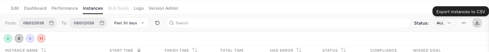

# Inspecting a Single Run

The [monitoring views](monitoring.md) describe a **FlowRunner™** flow in aggregate; this page is about one run: what did *this* run do with *this* data? Opening a run answers that block by block - what each one received, what it produced, and where things went wrong - whether you are chasing a failure or just confirming a run handled its data the way you meant.

## Opening a run

The ((Instances)) tab lists the flow's runs, each with its start and finish time, duration, error flag, and status, with filters above the list to narrow it.[^1] Open one and the flow is redrawn as that run took it: every block it executed carries a tick, and two panels carry the detail:

- ((Instance Summary)) - the run's facts: how long it took, whether it errored, which SLA goals it missed, and the **Initial Data** it started from.
- Select any block and ((Element Execution Details)) shows the **Input** it received and the **Output** it produced. That is how you follow a value from the data that arrived, watch each block reshape it, and pin the step where a wrong result first appears.

The example the shots follow is a flow that polls an order until it ships.

## Finding the run you want

A row of coloured circles sits above the list, one per state, in this order: **Running**, **Pending**,
**Completed**, **Terminated**. Each shows only a number, and hovering names it - "Terminated - 11
instances". Read them to answer "is anything stuck or dying right now?" without going through the table.

Clicking a circle filters the list to that state, and clicking it again clears the filter. The
((Status)) dropdown above sets the same filter, and the two always agree - filter by one and the other
follows.

The counts follow the rest of the filter context - the date window, the search, and the two checkboxes
behind the ((...)) control, ((Only With SLA Violations)) and ((Only With Errors)). The status filter
itself does not narrow them, because the circles are the status overview.

## Runs older than your plan shows

The list only reaches back as far as the workspace billing plan's execution log visibility[^1]. Runs
beyond that are kept, not deleted, and the page tells you how many it is holding back with a notice above
the table and a link to the billing plan that would show them. Opening one of those runs directly - from
an email, a bookmark, a link a colleague sent - shows *This instance is outside your plan's history* in
place of the analytics, with when it started, the window the plan shows, an upgrade button naming the
next plan up, and a way back to the list. A run that no longer exists shows *Instance not found* instead.

<!-- FR-3349 / FR-3437 (release 1.1.1.0). SOURCE-DERIVED from the tickets' implementer answers (Sergey
     Androsov, 2026-08-25), NOT driven: on dev the Documentation Flows workspace held no run older than its
     7-day window that could be opened directly (the Instances list never links one), so neither the
     hidden-count notice nor the outside-history screen was seen. The "Past 24 hours" period preset WAS
     driven 2026-09-17 (Current hour / Today / Past 24 hours / Past 7 days / Past 30 days).
     PROD 2026-09-17 (app.flowrunner.ai, Documentation Flows, Cart Summary): the instances/find response
     carries { hiddenItemsCount, items } (0 / 0 here); opening the removed 2026-08-25 run by URL shows the
     "Instance not found / This instance does not exist, or it has already been removed." screen with
     BACK TO INSTANCES - so that half of the sentence is DRIVEN; the outside-history half is not. -->

## Taking the list away as CSV

The download icon beside the filters - its tooltip reads ((Export instances to CSV)) - writes a CSV of
**everything matching the current filters**, not just the page you are looking at. Set the filters you
want first, then export: what the list is showing, including every page it would take you through, is
what the file holds.

One row per run, with a column for the instance name, the execution id, the flow name and version, the
status, the start and finish times, the total time in milliseconds, the error flag and handled-error
detail, and the SLA compliance and missed goals. The execution id is kept as its own column even when a
run has a friendly name, so an exported row still lines up with the API and with a support conversation.

The export runs on the server rather than in the page, so a large result does not block you - you can
keep working or leave the screen. The finished file is delivered by a link sent to the address on your
account.

## Stepping through a loop's passes

A [Repeat](../reference/repeat.md){.fr-block} or [List Iterator](../reference/list-iterator.md){.fr-block} runs the same inner steps many times, and a bug usually lives in one pass. Hover the loop block and click the expand icon that appears on it. The loop's inner blocks are drawn with their own markers: a tick on each block the pass executed, a not-executed marker on any branch it skipped. The ((Iteration #)) field then walks the run pass by pass - jump to the one iteration of forty where a value went wrong and inspect every block on that pass. ((RETURN)), at the top left, steps back out to the whole flow.

## Checking a block's retry attempts

Retry attempts show you whether a [Retry Policy](../reference/http-request.md#retrying-a-failed-call) is doing its job. Retries need a call that fails, so this section follows a second flow - one whose [HTTP Request](../reference/http-request.md){.fr-block} calls an endpoint that answers `503`. When the block's policy fired during a run, its ((Element Execution Details)) grows a second tab, ((Retry attempts)), with one entry per failed attempt that triggered another try; the final attempt's outcome, success or failure, stays on the ((Data)) tab, so a policy that exhausted three attempts shows two entries here. Each entry carries:

- the attempt number, and when it ran,
- what it failed on, and the response the service actually sent,
- how long the run waited before the next try.

A couple of `503`s followed by a success is a transient fault the policy absorbed; every attempt failing the same way means the retries are being spent on an error that will never pass.

## Finding the step that failed

A failed run arrives flagged everywhere you might look for it. In the ((Instances)) list, its row is marked **TERMINATED** with its **Has Error** column filled - and the ((Only With Errors)) filter above the list finds such runs fast.

The same run lands in the [Dashboard's](monitoring.md#dashboard-the-flow-at-a-glance) Problematic Instances shortlist, where clicking the row opens it:

Open it and the trail continues: the ((Instance Summary)) reads **Has Errors: Yes**, and on the redrawn flow the block that broke carries a warning marker where the others carry ticks. Select it and its **Output** holds what the failure returned - for the retried call above, the `503` status the service kept answering with. From a run marked in the list, you are two clicks from the exact step that failed and what it answered.

<!-- Split out of run/monitoring.md 2026-08-15 per Mark's decision (page = one reader question; monitoring keeps the health views, this page owns the single-run drill-down). All content verified 2026-07-15 + re-driven 2026-08-14 - the full drive log lives in monitoring.md's comments and PLATFORM-REVIEW-LEDGER.md (Run & Monitor -> Monitoring & Analytics).
SINGLE RUN: executed path ticked; Instance Summary (timing, Has Errors, Missed Goals, Initial Data); Element Execution Details Input/Output per selected block.
LOOPS (re-driven 2026-08-14): expand icon (fa-expand) is HOVER-revealed on the loop block (captured hovered in monitoring-instance-detail.png); RETURN button top-left renders uppercase (DOM "Return" + text-transform); untaken Yes-branch Break carries an explicit not-executed (slash) marker. The "blocks on paths not taken stay unmarked" claim for the TOP level was removed as unverified (the poller's top level is linear).
RETRIES (FR-2958, "Retry Demo" run E6775B29: postman-echo/status/503, 5XX policy, max 3, fixed 2s): "Retry attempts (N)" tab beside "Data"; one card per FAILED attempt that TRIGGERED a retry (3 failed attempts -> tab shows 2; the final attempt's outcome stays on Data). Cards: #n, 503 badge, timestamp, "Response:" body, "Waited 2s before next attempt". Retry Policy is HTTP-Request-only in this release (FR-2958 v1) - prose scoped accordingly. Network-error card variant and 503-then-success rendering not yet observed - prose stays within the driven evidence; follow-ups parked.
ERRORS (verified live on E6775B29): Instances row TERMINATED + filled Has Error column (circled check icon); list filters Status ALL + "Only With SLA Violations" + "Only With Errors"; Problematic Instances populated + row click OPENED the run; failing block carries lucide-triangle-alert on the canvas where clean blocks carry lucide-check. Output phrasing scoped to the verified HTTP case. Handled-error row presentation (COMPLETED + Has Error?) not driven - prose scoped to outright failures.
DEMO-DATA FIX (Mark approved 2026-08-15): Order Poller's Re-fetch Order re-pointed at an order-shaped response + relaunch with an Initial Data payload; monitoring-instance-detail.png and monitoring-loop-iteration.png recaptured accordingly. -->

[^1]: How far back the list reaches is the workspace billing plan's **execution log visibility**: 24 hours on Free and Starter, 7 days on Growth, 30 on Professional, 90 on Business. Older runs are kept, not deleted; moving up a plan brings them back into view. [Billing](../manage/billing.md) covers the plans.

<!-- FR-3394 / FR-3395 DRIVEN 2026-08-31, Documentation Flows on dev.flowrunner.ai, TD Sandbox v1
     Instances tab, 11 real instances from that day's API drives.
     FR-3395 count circles: FOUR, in this on-screen order - Running, Pending, Completed, Terminated.
     They carry only a number; the label comes from the aria-label/tooltip, verbatim
     "Terminated - 11 instances". Clicking the Terminated circle set the Status dropdown to TERMINATED
     and the table to 11 rows; clicking it again returned the dropdown to ALL - so circle and dropdown
     are one filter, driven both ways. The two checkboxes the counts also follow (Only With SLA
     Violations / Only With Errors) live behind the "..." control beside Status - opened and read.
     FR-3394 export: the control is a DOWNLOAD ICON, not a labelled "Export" button as the ticket
     describes; its tooltip reads "Export instances to CSV" (pictured). Clicking it fires
     POST /api/app/{ws}/automation/flow/{flowId}/version/{versionId}/analytics/instances/export/csv
     and the server answers 200 - verified twice in the network log.
     NOT OBSERVED, REPORTED TO MARK: the ticket promises a confirmation message on click and TWO
     notification-panel entries (export started / file ready). Neither appeared - no toast was caught
     and the notification panel's count stayed at 23 across both exports, with no export entry in it.
     The emailed link could not be checked from here. The page therefore describes the filter-scoped
     CSV and the server-side delivery, and does NOT claim the notification-panel messages.
     COLUMN LIST is carried from the ticket, not driven - no CSV file was opened.
     SHOT CAVEAT: all 11 rows are TERMINATED because TD Sandbox's Get Order block fails (28105), so
     the circles read 0/0/0/11 rather than a mix. A mixed-status shot needs a demo flow that completes;
     flagged to Mark as a follow-up, not silently accepted. -->

## Related

- [Monitoring & Analytics](monitoring.md) - the flow in aggregate: Dashboard, Performance, and Logs
- [Running Flows](running-flows.md) - taking a flow live, and the run list this page opens from
- [Handling Errors](../build/flow-control/error-handling.md) - designing the recovery paths a failed run points you toward
- [Flows and Instances](../learn/concepts/flows-and-instances.md) - the flow-and-run model behind every run here
