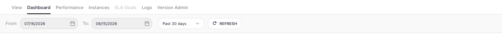
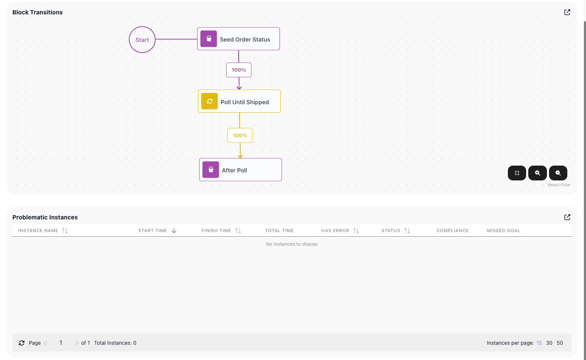
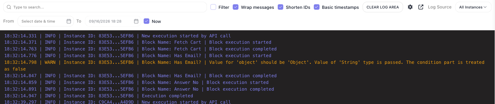
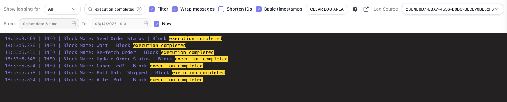

# Monitoring & Analytics

A live **FlowRunner™** flow runs on its own - monitoring is how you know it is doing what you built it for, and where to look the moment it isn't. Three of the tabs across the top of an opened flow answer the health questions:

- ((Dashboard)) - what is going on with the flow, and is anything wrong?
- ((Performance)) - which step is slow, or starting to fail?
- ((Logs)) - what happened, step by step, on a run you need to trace?

The fourth question - what did one particular run do with its data? - has its own page: [Inspecting a Single Run](inspecting-a-run.md), reached by opening a run from the ((Instances)) tab. The rest of the row belongs to other work: ((View)) and ((Version Admin)) to reading and administering the version, ((SLA Goals)) to the targets covered with [SLA goals](../platform/sla-goals.md). The ((Dashboard)), ((Performance)), and ((Instances)) tabs each carry the same ((From)) / ((To)) date window - with presets like **Past 30 days** - that sets the range their numbers cover, and ((REFRESH)) beside it re-reads them, so you can watch a number move. The views read from the flow's run history.[^1]

## Dashboard - the flow at a glance

Open the ((Dashboard)) to take in the whole flow at once and catch trouble before you go digging. The headline numbers answer "is anything wrong?":

- **Completion Rate** and **Error Rate** - are runs succeeding? A rising Error Rate is your cue to open the ((Logs)) or the failing runs.
- **Active Instances** - how many runs are in flight. A count that keeps climbing means runs are starting faster than they finish, and a backlog is building.
- **Total Runs** - the volume over the range, so you can watch load rise or fall.
- **SLA Compliance** - whether runs are hitting the time targets you set as [SLA goals](../platform/sla-goals.md).[^2]

Below the numbers is where you make sense of what the flow is doing. The example the shots follow is a flow that polls an order until it ships:

- **Run history** charts *when* the flow actually ran, as a heatmap of daily activity with its own year picker, so it reaches further back than the date window above. A quiet stretch that should have been busy points at a schedule that stopped; a burst points at a caller firing far more often than it should. Click a day to list its runs - each with its time, what started it, and how it ended - so an odd-looking day is one click from the runs behind it.
- **Versions** - when a flow has more than one version, the Versions list lets you tick which versions the Run history includes, to read a new version's behavior on its own or next to the old one.
- What starts the runs - the chart beside the day's list splits the runs by source: Scheduled Runs, API, Trigger Event, or Other Execution. This is how you tell a steady scheduled job from an API flood, or notice a trigger firing when nothing should be triggering it.

Two more panels sit below:

- **Block Transitions** - which paths the runs actually took, as a percentage on the connections between blocks, drawn onto the flow diagram. A branch that never fires, or one that fires far more often than you expected, stands out against the diagram.
- **Problematic Instances** - the shortlist worth your attention: the runs that errored or missed an SLA goal, each row opening the run when clicked. An empty list is the state you want - it means every run in range finished clean. When a run does land here, [Inspecting a Single Run](inspecting-a-run.md#finding-the-step-that-failed) covers tracing it to the step that failed.

## Performance - where the time goes

When a flow feels slow, ((Performance)) tells you which step to blame. It times every block across the runs in range - **Average**, **Min**, and **Max** time spent in that step - beside its **Error Rate** and **Compliance Status**. Sort by average time to bring the bottleneck to the top, or by error rate to surface a step that is quietly failing. One reading note: a loop block like [Repeat](../reference/repeat.md){.fr-block} appears with its inner blocks nested beneath it, and the loop's own time covers all its passes - so when a loop tops the sort, open its nested rows to find the step actually costing the time. And a block whose max time towers over its average is one that stalls on some runs and not others - intermittent slowness that averages alone would hide.

## Logs - the play-by-play

When you need the actual sequence of events, the ((Logs)) tab is the raw record: every run, and every block within it, timestamped as it starts and completes, tagged with how the run began. It is where you reconstruct a specific run or pin down the moment one went wrong.

The controls above the stream narrow it to what you are tracing. The ((Log Source)) picker scopes the stream to a single run - and once one is picked, a ((Show logging for)) picker appears to narrow further to one block's lines. Type a term into the search box and tick ((Filter)) to keep only the lines whose message matches it, highlighted where they match. Three more controls matter for tracing:

- ((From)) / ((To)) - scope the stream to a time window.
- ((CLEAR LOG AREA)) - empty the pane, so you watch only what arrives next.
- ((Basic timestamps)) - trade the full date on each line for a compact clock time.
- ((Shorten IDs)) - show each run's Instance ID as its first and last characters (`83E53...5EFB6`) so the
  lines stay scannable. Untick it when you need to copy or compare the whole id. A run that was given a
  name shows the name instead, and the toggle leaves that alone. The choice is remembered by your browser.
- ((Wrap messages)) - wrap a long line rather than letting it run off the edge, which is what keeps a
  WARN about a discarded value readable in full.

<!-- verified in-product 2026-07-15 (Documentation Flows, "Order Poller" v1, 3 real COMPLETED activations; status chip cropped out; sidebar/footer excluded; no personal data - instance UUIDs/timestamps only). Dashboard cards: SLA Compliance / Completion Rate / Error Rate / Total Runs / Active Instances. Run history: calendar heatmap; the Versions list has a per-version checkbox controlling which versions the Run history includes ("Across N selected version"); CLICKING an active day drills in -> a "<date> Flow Activations" list of that day's runs (time, source e.g. API, status COMPLETED) + the execution-source breakdown for it (here 100% API). Execution sources = Scheduled Runs / API / Trigger Event / Other. Block Transitions = per-path % on the flow diagram. Problematic Instances = errored/SLA-missed runs. Performance: per-element AVERAGE/MIN/MAX TIME IN STEP + ERROR RATE + COMPLIANCE, sortable. Corrections applied 2026-07-15 per Mark's 2/10 review: teach value not narrate; "workspace billing plan"; dropped the gratuitous flow-naming lede + filler cross-refs. History-retention-by-plan and SLA-on-Business/Enterprise are product-owner facts (Mark). -->
<!-- RE-DRIVEN 2026-08-14 (post release 1.0.13; Order Poller's July runs had aged out of run history, so 5 fresh LIVE API activations were launched to repopulate; all shots recaptured at full width, nav rail collapsed):
TABS + RANGE: tab row (View / Dashboard / Performance / Instances / SLA Goals / Logs / Version Admin - seven tabs; the lede scopes its frame and routes the rest) + the shared From/To window with "Past 30 days" preset + REFRESH captured in-frame in monitoring-dashboard.png; the same From/To bar re-observed on Performance and Instances (Logs has its own From/To row). REFRESH re-reads the view (clicked; no auto-refresh observed - worded as "re-reads them"). Run-history heatmap has an independent YEAR picker (2026) - prose separates the two ranges. The source chart carries NO on-screen heading; its axis labels (Scheduled Runs / API / Trigger Event / Other Execution) are verbatim - the prose lead-in is deliberately plain, not bolded as a label.
DASHBOARD PANELS: Block Transitions % badges appear on the connections BETWEEN BLOCKS (the Start connection carries none - prose + alt phrased accordingly). Problematic Instances: verified POPULATED on the retry flow's dashboard (errored run E6775B29 listed; clicking the row OPENED the run); the Order Poller panel is legitimately empty (healthy flow) - the shot teaches the empty state.
PERFORMANCE: recaptured same-day, full width, sorted by AVERAGE TIME IN STEP DESCENDING (arrow visible) - Poll Until Shipped (1s) tops the table with its inner blocks (Wait 1s / Re-fetch Order / Cancelled? / Update Order Status) NESTED beneath it, then the top-level blocks; the loop-container row's time (1s avg) covers the loop body (inner sum ≈ 1.05s per pass) - basis for the "loop tops the sort" reading note. 7 rows all whole; headers verbatim ELEMENT NAME / AVERAGE TIME IN STEP / MIN TIME IN STEP / MAX TIME IN STEP / ERROR RATE / COMPLIANCE STATUS / COMPLIANCE CONDITIONS.
LOGS: re-verified with the fresh runs. Search+Filter keeps lines whose MESSAGE matches, with the match HIGHLIGHTED (monitoring-logs-narrowed.png); an execution id or block name as the term matches nothing (the filter reads the message segment only) - "filter to a single run" via search removed. Log Source picker (label "All Instances" until picked) scopes to one run: per-line "Execution Name:" prefix drops and the "Show logging for" picker appears (options All + each block name - a BLOCK filter, not severity; no severity/error filter exists on this tab). CLEAR LOG AREA clicked: empties the pane. Basic timestamps: ON = HH:MM:SS.mmm, OFF = full date string. Shorten IDs: visible in the shots but NOT documented - toggling produced NO visible change on these lines (full UUIDs both ways). MARK'S CALL 2026-08-15: it is a BUG; Mark files it in Jira himself; docs stay silent on the control until the fix lands. Now-tailing and Wrap-messages effects not separately exercised - prose names only verified controls.
NOT re-driven: Active Instances beyond value 0 (prose stays label-level; the climbing-count sentence is arithmetic, not a product claim). Whether the Logs tab's horizon follows the same audit-trail retention as the other tabs was not verified - footnote 1 scopes to the three verified views.
SHORTEN IDS (FR-3402, release 1.1.1.0) DRIVEN 2026-09-17 on dev, Documentation Flows, "Release Probe 1.1.1" Logs tab: ticked by default; on -> "Instance ID: 83E53...5EFB6"; off -> the full UUID on every line; re-ticked and still ticked after navigating away. Wrap messages: ticked, the WARN line wraps (monitoring-logs-toggles.png). The named-run exception is the ticket's own statement (no named run driven).
PAGE SPLIT: Mark decided 2026-08-15 - the single-run drill-down moved to run/inspecting-a-run.md; this page keeps the health views. Intro shot monitoring-tab-row.png is a crop of the same monitoring-dashboard.png capture (tab row + From/To + Past 30 days + REFRESH), placed where the lede names those controls. -->

[^1]: How far back the history reaches - and with it the Dashboard, Performance, and Instances views - is the workspace billing plan's **execution log visibility**: 24 hours on Free and Starter, 7 days on Growth, 30 on Professional, 90 on Business. Older runs are kept, not deleted; moving up a plan brings them back into view. [Billing](../manage/billing.md) covers the plans.
[^2]: SLA tracking carries real data on the Business and Enterprise plans, where [SLA goals](../platform/sla-goals.md) live.

## Related

- [Inspecting a Single Run](inspecting-a-run.md) - opening one run to see what it did with its data
- [Running Flows](running-flows.md) - taking a flow live, and the run list these views draw on
- [SLA Goals](../platform/sla-goals.md) - the time targets that SLA Compliance measures against
- [Flows and Instances](../learn/concepts/flows-and-instances.md) - the flow-and-run model behind every number here
- [Billing](../manage/billing.md) - what the runs behind these numbers cost, and how far back the history reaches
