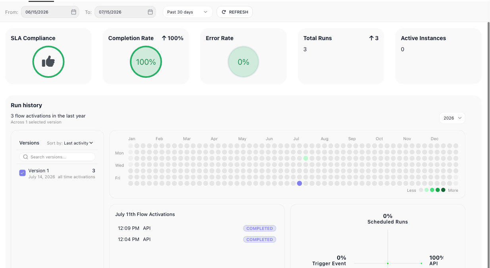
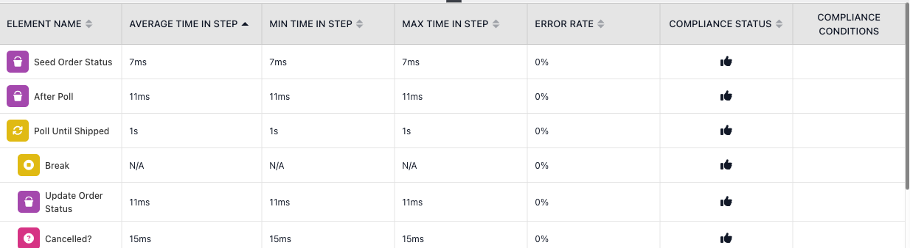
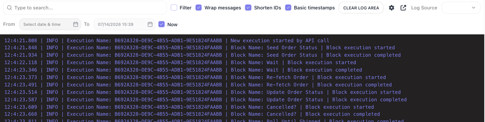
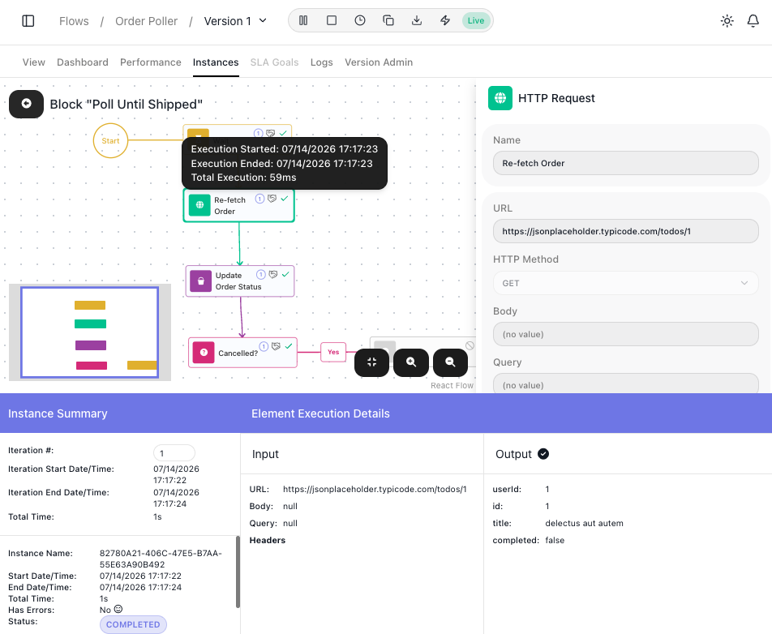

# Monitoring & Analytics

A live flow runs on its own - monitoring is how you know it is doing what you built it for, and where to look the moment it isn't. Four views answer four questions: the **Dashboard** - what is going on with the flow, and is anything wrong? **Performance** - which step is slow, or starting to fail? **Logs** - what happened, step by step, on a run you need to trace? And opening a single **Instance** - what did that one run do with its data? How far back any of them can look is set by your **workspace billing plan** - the history reaches only as far as the plan's audit-trail retention.

## Dashboard - the flow at a glance

Open the ((Dashboard)) to take in the whole flow at once and catch trouble before you go digging. The headline numbers answer "is anything wrong?":

- **Completion Rate** and **Error Rate** - are runs succeeding? A rising Error Rate is your cue to open the Logs or the failing runs.
- **Active Instances** - how many runs are in flight right now. A count that keeps climbing means runs are starting faster than they finish, and a backlog is building.
- **Total Runs** - the volume over the range, so you can watch load rise or fall.
- **SLA Compliance** - whether runs are hitting the time targets you set as [SLA goals](../platform/sla-goals.md). This carries real data on the Business and Enterprise plans, where SLA tracking lives.

Below the numbers is where you make sense of what the flow is doing:

- **Run history** charts *when* the flow actually ran, as a heatmap of daily activity. A quiet stretch that should have been busy points at a schedule that stopped; a burst points at a caller gone wild. Click a day to list its runs - each with its time, what started it, and how it ended - so an odd-looking day is one click from the runs behind it. When a flow has more than one version, the Versions list lets you tick which versions to include, to read a new version's behaviour on its own or next to the old one.

- **Execution sources** - what is starting your runs: a schedule, an API call, a trigger. This is how you tell a steady scheduled job from an API flood, or notice a trigger firing when nothing should be triggering it.
- **Block Transitions** - which paths the runs actually took, drawn onto the flow. A branch that never fires, or one that fires far more often than you expected, stands out against the diagram.
- **Problematic Instances** - the shortlist worth your attention: the runs that errored or missed an SLA goal, ready to open.

## Performance - where the time goes

When a flow feels slow, ((Performance)) tells you which step to blame. It times every block across the runs in range - **Average**, **Min**, and **Max** time spent in that step - beside its **Error Rate** and SLA **Compliance**. Sort by average time to bring the bottleneck to the top, or by error rate to surface a step that is quietly failing. A block whose max time towers over its average is one that stalls on certain inputs and not others - the kind of intermittent slowness that is hard to catch any other way.

## Logs - the play-by-play

When you need the actual sequence of events rather than the averages, the ((Logs)) tab is the raw record: every run, and every block within it, timestamped as it starts and completes, tagged with how the run began. It is where you reconstruct a specific run or pin down the moment one went wrong. Filter to a single run or to errors, and use the toggles to wrap long lines or drop the ids when you just want to read the flow of events.

## Reading a single run

The tabs above describe the flow in aggregate; to answer "what did *this* run do with *this* data", open a run from the ((Instances)) tab. The flow is redrawn as that run took it - every block it executed is ticked, so a wrong branch or a skipped step is obvious at sight - and two panels carry the detail:

- ((Instance Summary)) - the run's facts: how long it took, whether it errored, which SLA goals it missed, and the **Initial Data** it started from.
- Select any block and ((Element Execution Details)) shows the **Input** it received and the **Output** it produced. That is how you follow a value from the data that arrived, watch each block reshape it, and pin the step where a wrong result first appears.

**Loops.** A [Repeat](../reference/repeat.md){.fr-block} or [List Iterator](../reference/list-iterator.md){.fr-block} runs the same inner steps many times, and a bug usually lives in one pass. Its ((expand)) icon steps into the loop, and the ((Iteration #)) field walks the run pass by pass - so you can jump to the one iteration of forty where a value went wrong and inspect every block on that pass. ((RETURN)) steps back out.

**Errors.** A failed run flags the error in its Instance Summary, and the block that broke carries the message in its Output - so a run marked with an error in the list takes you, in a couple of clicks, to the exact step that failed and why.

<!-- verified in-product 2026-07-15 (Documentation Flows, "Order Poller" v1, 3 real COMPLETED activations; status chip cropped out; sidebar/footer excluded; no personal data - instance UUIDs/timestamps only). Dashboard cards: SLA Compliance / Completion Rate / Error Rate / Total Runs / Active Instances. Run history: calendar heatmap; the Versions list has a per-version checkbox controlling which versions the Run history includes ("Across N selected version"); CLICKING an active day drills in -> a "<date> Flow Activations" list of that day's runs (time, source e.g. API, status COMPLETED) + the execution-source breakdown for it (here 100% API). Execution sources = Scheduled Runs / API / Trigger Event / Other. Block Transitions = per-path % on the flow diagram. Problematic Instances = errored/SLA-missed runs. Performance: per-element AVERAGE/MIN/MAX TIME IN STEP + ERROR RATE + COMPLIANCE, sortable. Logs: timestamped per-run/per-block INFO stream + Filter/Wrap/Shorten IDs/Basic timestamps/Log Source/From-To. Single run: executed path ticked; Instance Summary (timing, Has Errors, Missed Goals, Initial Data); Element Execution Details Input/Output per selected block; loop drill-down via the block's fa-expand icon -> inner blocks + "Iteration #" navigator + per-pass I/O + RETURN. Corrections applied 2026-07-15 per Mark's 2/10 review: teach value not narrate; "workspace billing plan"; dropped the gratuitous flow-naming lede + filler cross-refs. NOT captured: an errored instance (Order Poller has none) - errors described from the verified Has Errors flag + Testing block-error behaviour. History-retention-by-plan and SLA-on-Business/Enterprise are product-owner facts (Mark). -->

## Related

- [Running Flows](running-flows.md) - taking a flow live, and the run list these views draw on
- [SLA Goals](../platform/sla-goals.md) - the time targets that SLA Compliance measures against
- [Flows and Instances](../learn/concepts/flows-and-instances.md) - the flow-and-run model behind every number here
- [Billing](../manage/billing.md) - what the runs behind these numbers cost, and how far back the history reaches
