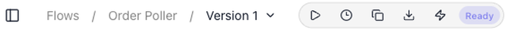
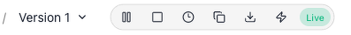
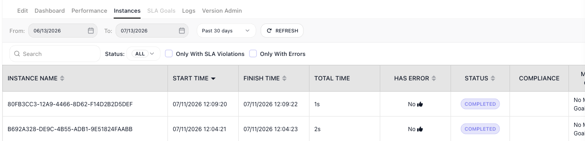
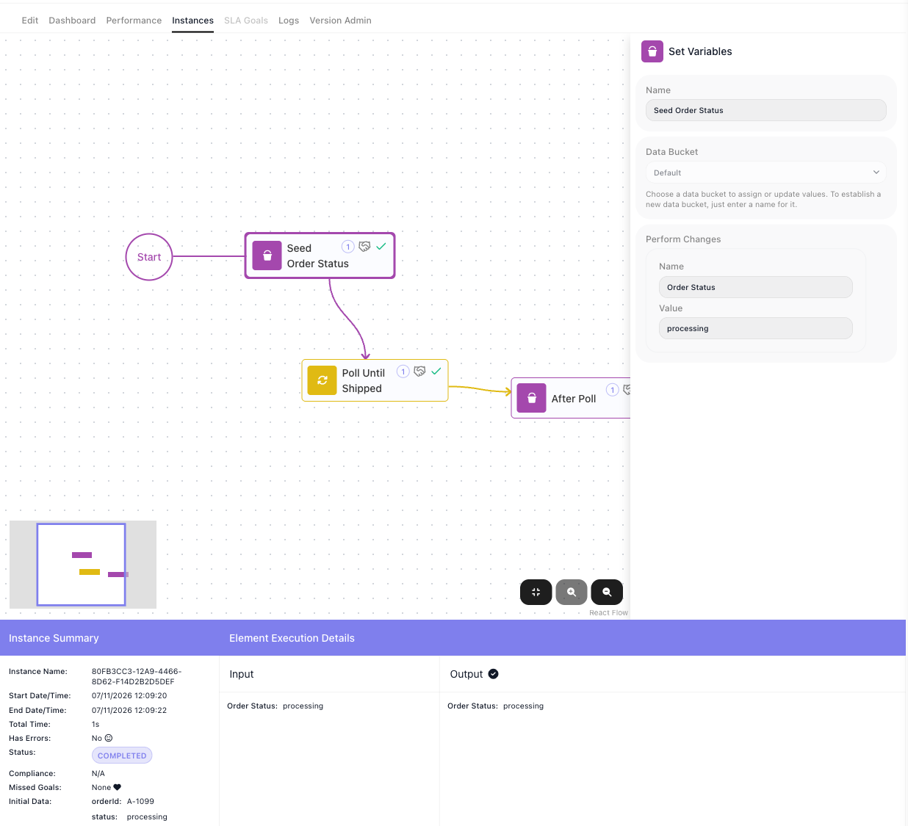
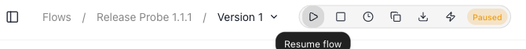

# Running Flows

A flow you have built and tested does nothing on its own. Running it means making one of its versions **LIVE** - from then on, each time something sets the flow off, FlowRunner™ starts a fresh **instance** and carries it out. This page covers taking a version live, what starts an instance, and watching the runs.

The example is an "Order Poller" flow: it takes an order id, records the order's status, polls until the order ships, and notes the result.

## Ready, then live

A flow keeps its work in **versions** - you build and test a draft version without touching whatever is running. When a draft passes validation, its status reads **Ready**: error-free and cleared to go live. You make it live from the toolbar at the top of the flow, where the version's status sits beside a row of controls. ((Start flow)) - the play button - puts the version live.

Only one version of a flow is live at a time, and the live version is the one that runs. While a version is not live - a draft, or one you have taken down - it produces nothing, so half-finished logic never touches real data.

Once the version is live its status reads **Live**, and the play button is replaced by ((pause)) and ((stop)).

## What starts an instance

A live flow does not run continuously. It produces one **instance** - one run - each time something sets it off:

- a trigger fires;
- a schedule comes due (see [Scheduling](../reference/flow-scheduling-concept.md));
- a form is submitted (see [Forms](../platform/forms.md));
- the [Call Flow](../reference/call-flow.md){.fr-block} API, or another flow, calls it;
- or you launch one by hand with **Run Instance** (see [Testing](testing.md)).

A flow can begin from any of these - it is not tied to a trigger. Each instance is independent: it carries its own data, gets its own execution id, and several can run at once without waiting on each other.
<!-- doclint: no-shot: conceptual list of the ways a run starts; no single screen depicts them -->

## Watching the runs

Every run a live flow produces is listed on the ((Instances)) tab: its name, when it started and finished, how long it took, whether it hit an error, and its status. Filter by date range or by status to find the runs you care about.

By default each run is listed by its **Instance ID** - the machine identifier shown above. To make a run easy to find, name it: an [Assign Instance Name](../reference/assign-instance-name.md){.fr-block} block, placed early in the flow, sets a readable name from the run's own data - an order id, a customer email - and from then on the run is listed by that name in place of the ID.

Open a run to see exactly what it did. The flow is drawn with the path that run took, each block ticked as it executed, and the panel below gives the whole picture: the ((Instance Summary)) - its timing, status, and the Initial Data it started with - and, block by block, the ((Input)) each step received and the ((Output)) it produced.

## Stopping and replacing a live flow

While a version is live, **stop** takes it out of LIVE and hands it back as an editable draft, so nothing new starts and you can work on it again. **pause** holds the live version without taking it down: its status becomes Paused, and while it is paused the version answers nothing - an API call to it is refused exactly as if no version were live. ((Resume flow)) takes the place of pause in the toolbar and puts the version back to LIVE.

To roll out a change, you do not edit the live version in place - you make a **new** version live instead. Clone the live version, change and test the copy, then Start flow on it: the copy becomes the LIVE version and the previous one steps aside, since only one is ever live. See [Flows](../manage/flows.md) for cloning and versions.

<!-- verified in-product 2026-07-13 (Documentation Flows): version status chip READY / LIVE. Verified going live on the safe, inert "Testing Demo" flow (no schedule/trigger, starts with an action, so going live does not auto-run): Start flow (tooltip-verified label) took status Ready -> Live and swapped in pause (lucide-pause) + stop (lucide-square); stop took it Live -> Ready and back to an editable /edit view. Restored Testing Demo to Ready (no net change). Instances tab (Order Poller, 2 real COMPLETED instances): columns Instance Name / Start Time / Finish Time / Total Time / Has Error / Status / Compliance / Missed Goal, with date-range + status filters (ALL / Only With SLA Violations / Only With Errors). Opening an instance shows the flow with each executed block check-marked, an Instance Summary (timing, status, Initial Data e.g. orderId A-1099), and per-block Input/Output. Toolbars cropped from Order Poller (Ready) and Order Approval (Live); no personal data (UUIDs + timestamps only; sidebar/footer excluded). Start paths + one-live-version + executionId + parallel cross-checked against learn/concepts/flows-and-instances.md and legacy content/flow-execution/overview.md. PAUSE SEMANTICS DRIVEN 2026-08-24 (Order Lookup, LIVE): pause -> status badge "On hold" and the toolbar's
     first icon becomes "Resume flow" (tooltip; full row Resume flow | Stop | Schedule | Clone | Export | Run
     Instance, so Run Instance is present in both states); while On hold the blocking Call Flow API answered
     400/28047 "Flow with name 'Order Lookup' and status 'LIVE' is not found" [SUPERSEDED by FR-3408,
     re-driven 2026-08-31: the code is now 28053 on BOTH Call Flow endpoints and the message reads "Flow with
     ID or name ..." - the page body cites no code, so nothing here needed changing]; Resume flow restored
     LIVE and the API returned 200 again. Shot running-flows-onhold-toolbar.png (breadcrumb + tooltip + badge, read
     back). -->

## Related

- [Testing](testing.md) - trying a flow before it goes live
- [Scheduling](../reference/flow-scheduling-concept.md) - running a live flow on a timetable
- [Flows](../manage/flows.md) - versions, cloning, and which one is live
- [Flows and Instances](../learn/concepts/flows-and-instances.md) - the flow-and-run model behind all of this
- [Billing](../manage/billing.md) - what a run costs against your allowance
<!-- RELEASE 1.1.1.0 (FR-3431), 2026-09-17, dev.flowrunner.ai: the paused badge now reads "Paused" (was "On hold"); toolbar recaptured on the throwaway flow Release Probe 1.1.1 with the Resume flow tooltip showing; pause via the MCP builder's pause_flow, stopped afterwards. -->
