# Testing

Much of what a flow does happens out of sight - it calls a service, reshapes a payload, runs a rule, and moves on. **Testing** is how you confirm a flow does what you intended before you rely on it. You run it against sample data and check, block by block, that each step received the right input and produced the right result. When a step is wrong, testing points you straight at which block failed and why, so you can fix it before a live run hits it.

This page follows one example flow that reviews an incoming order. It fetches the order from a partner's API, trims it down, reattaches the tidied lines, finds the most expensive item, and decides whether a manager needs to approve it - several different kinds of block, wired together.

## The Test Monitor

You test a flow in the [Flow Editor](../build/flow-editor.md): you run blocks right on the canvas. The **Test Monitor** panel across the bottom is where you enter the flow's test data and read the results. It has three tabs:

- **Flow Data** - the sample input you give the flow to stand in for the data it would receive for real.
- **Block Results** - what each block took in and gave back. Pick the block's tab to see its result.
- **Logging** - each block starting and finishing, and any error it hit.

You test on a draft version. A version that is LIVE opens on the **View** tab: its blocks have no run icons and
there is no Test Monitor. Its toolbar's ((Run Instance)) starts a real instance, which counts as an execution.
To test a LIVE flow step by step, clone the version and test the copy - see
[Change a flow that is already live](../build/flow-editor.md#change-a-flow-that-is-already-live).

## Give the flow its test data

When this flow runs for real, the call that starts it sends the id of the cart to fetch as its Initial Data. In a test nothing sends it, so you provide it yourself on the ((Flow Data)) tab: add a row, name it, and give it a value. The example needs a `cartId`.

A value that looks like a number, `true`/`false` or JSON has an ((A)) icon beside it, here and in the other test dialogs on this page. Green means the value is kept as text; dark means it is kept as the number, boolean or JSON you typed. Click the icon to switch, and match what the flow will receive for real.

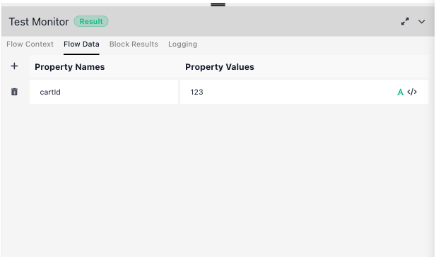

From here on, any block that reads {{Initial Data->cartId}} sees `123` when you test it.

## Run a block and read its result

Hover a block on the canvas to reveal a red play icon (tooltip: Run in test mode); the **Test Panel** at the top of the block's settings carries a matching ((run block)) button. Either one runs that single block against the current test data. The run is real: an action block performs its action, so Get Order really calls the partner's API.

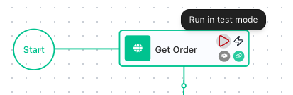

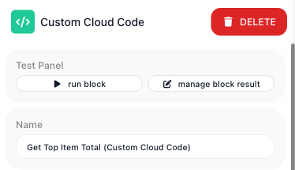

A run shows its outcome on the ((Block Results)) tab: the block's **Input** - the values it resolved - on the left, and its **Output** - what it produced - on the right. Run each block after the blocks that feed it, because a block reads the results they produced.

**Fetching the order.** Get Order is an [HTTP Request](../reference/http-request.md){.fr-block} block. It calls the partner's cart address, `https://dummyjson.com/carts/` followed by {{Initial Data->cartId}}, and its Output is the whole order the API returned - a nested object with a `products` array and the order totals.

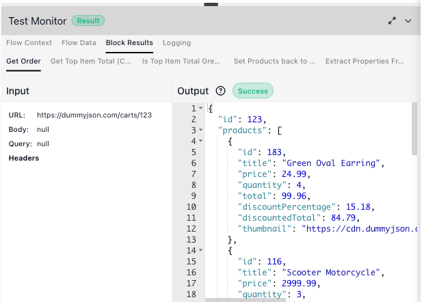

**Trimming it down.** Extract Properties From Product List is a [Transform Data](../reference/transform-data.md){.fr-block} block that keeps the few fields that matter. Its Input is the order's product list and the four property names to keep; its Output is a clean list of `{ title, quantity, price, total }`.

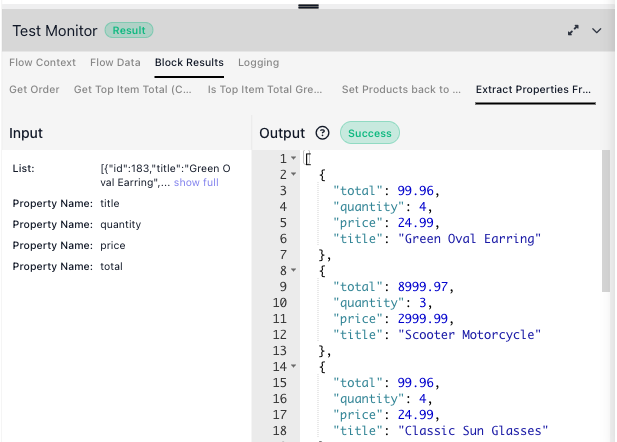

**Putting it back together.** That trim returns only the array of lines, without the order around it. Set Products back to Order is a second Transform Data step that writes the array onto the order's `products` property, so the order keeps its totals and carries the tidy line list forward. You can see it in the result: the Input is the order plus the trimmed array, and the Output is the order again, its `products` now the four-field lines.

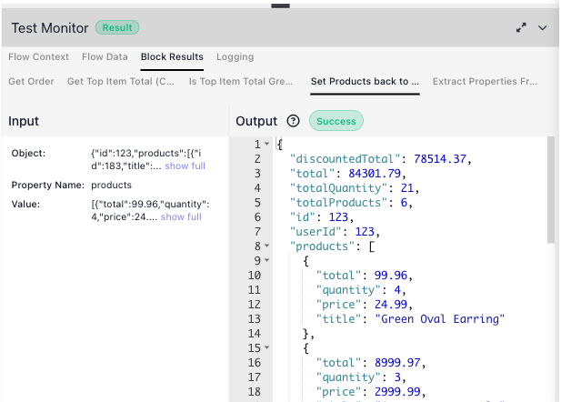

**Computing over it.** Get Top Item Total, a [Custom Cloud Code](../reference/custom-cloud-code.md){.fr-block} block, loops those lines to find the most expensive one. Its Input shows the arguments passed in and the code itself; its Output is what the code returned - `{ topItem, topItemTotal }`.

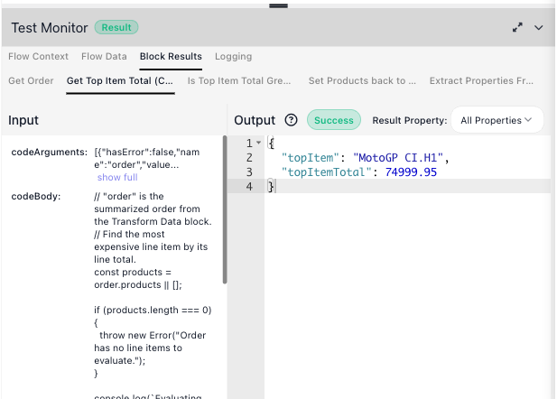

**Deciding.** The [Condition](../reference/condition.md){.fr-block} block, named Is Top Item Total Greater than 1000?, compares the most expensive item's total against a threshold. Its Input shows the two values - `74999.95` against `1000` - and its Output is the branch it takes, `conditionResult: true`.

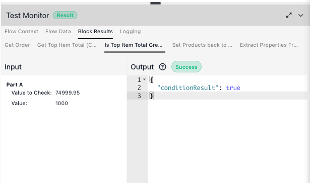

Change the `cartId` on the Flow Data tab and run the blocks again to send a different order through.

## Edit an Output to test a case

The Output of each result on the Block Results tab is editable. Change a value there, and a later block that
reads this block's result gets your version the next time you run it. That is how you test a case your sample
data does not cover, without touching the flow or the data source.

For example, what happens to an order whose priciest line comes to exactly 1000? Open Get Top Item Total's
result and change `topItemTotal` to `1000`:

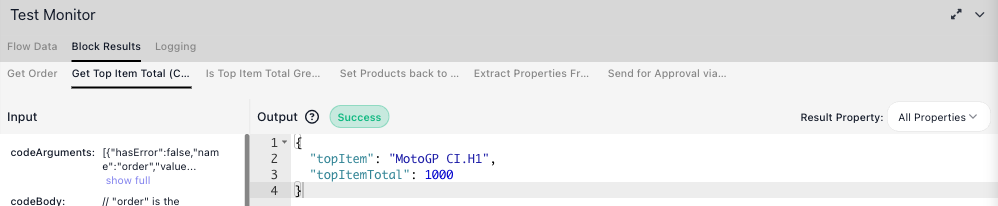

Run the Condition. It compares 1000 against 1000, which is not greater, so it takes the No branch:

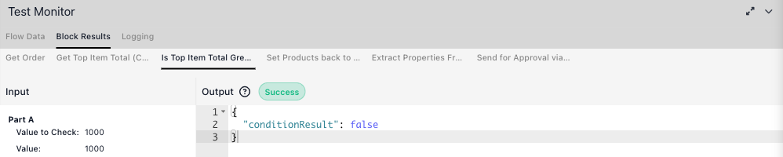

The edit is saved as you make it and is still there after a page reload, until the block runs again. It
reaches only blocks that read this block's result. Get Top Item Total, for one, reads the order from the flow's
`Cart` variable, so editing Set Products back to Order's Output does not change what it sees.

## Set a block's result without running it

Editing an Output needs a result to edit, so the block has to run first. Some blocks you cannot or should not
run in a test:

- a block that would send a real message or change real data
- a block that needs a connection you have not set up yet - its ((run block)) stays disabled
- a block whose earlier steps you have not built yet, or do not want to run again

((manage block result)), next to ((run block)) in the block's **Test Panel**, lets you type the result in
instead.

In the example, the sample cart's priciest item is far above 1000, so the Condition always takes the Yes
branch. To test the No branch, give Get Top Item Total a result by hand - a Desk Lamp at 450 - and run the
Condition on its own. Nothing before it has to run, so Get Order never calls the partner's API:

- Add a row per property with the ((+)). Switch to ((JSON Editor)) to type or paste the whole value as JSON;
  while the JSON is not valid, ((SAVE)) stays disabled and the dialog reads *Enter valid JSON to save.*
- Type `450`, then click the ((A)) beside it so it turns dark: the Condition compares numbers against 1000.
- The ((Populate from Instance)) selector (optional) fills the dialog from a real run of this version, which
  you can then edit. It lists runs from when a version was LIVE, so on a draft that has never been LIVE it
  stays empty, as it is here. For a block inside a loop, an ((Iteration)) picker chooses which pass to copy.
- For a block whose result is a list, such as Extract Properties From Product List, Form View shows one
  **Item** row per entry: ((+)) adds an entry and the bin removes one.

((SAVE)) records the value as the block's result, and every later block reads it as if the block had
produced it. Run the Condition and it reads `450` against `1000` and returns `conditionResult: false` - the
No branch:

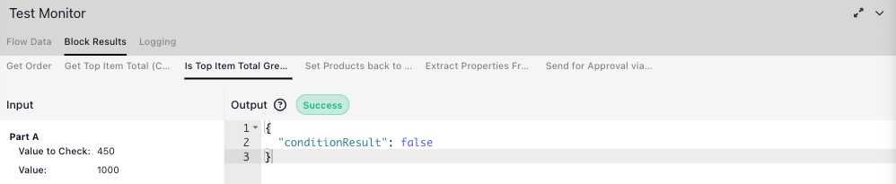

The saved result also gives the Expression Editor the block's fields to pick from, so you can wire later
blocks to a block that has never run:

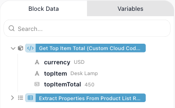

The value stays after a page reload, and Block Results always shows it as the block's Output. It is replaced
when you save a new one, or when the block runs again. It is test data only - a real run of the flow still
runs the block.

## Run an instance from a block

Running a block tests one step. To run the rest of the flow from a chosen point - no stopping between blocks -
use ((Run instance from this element)), the lightning icon beside a block's play icon. The run starts at that
block; the blocks before it do not run.

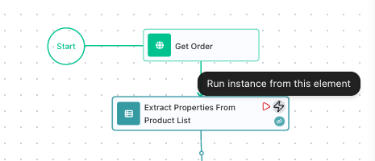

It opens the ((Launch Flow Instance)) dialog. The dialog lists the Initial Data the flow reads and, for a block
partway down the flow, the results of earlier blocks that the block reads, filled in from Block Results.
Launched from the Condition, it offers Get Top Item Total's `topItemTotal`, here set to 2000:

Change any value, or pick a previous instance in the **Previous Instance** selector to reuse the data from an
earlier run - including a real instance from when a version was LIVE, which is a quick way to reproduce a case
that actually happened. ((LAUNCH)) starts the run. Its results appear on the Block Results and Logging tabs,
and the canvas marks each block that ran.

A value you type into one of these rows is sent as the type it looks like: `123` arrives as a number, and the
((A)) beside it stays dark. The ((JSON Editor)) view shows exactly what will be sent.

Once this version is LIVE, the dialog also offers a GET URL and a cURL command that start an instance over
HTTP. An uninterrupted run of a LIVE version is a real instance and counts against your allowance; from a draft
version it is a test, and free.

## Find the block that failed

When a block cannot do its job, its Output on the Block Results tab shows an **Error** badge and the message.
Give the example a cart that does not exist - `cartId` 99999 on the Flow Data tab - and run Get Order:

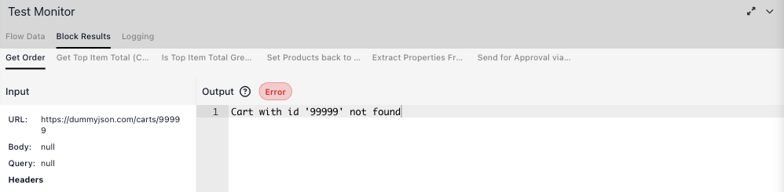

The Logging tab shows each block starting and finishing. For the block that failed it adds the error and the
line *Block has no error handler. Execution will be terminated.* - in a real run, that error stops the run
unless a [Handle Error](../reference/handle-error.md){.fr-block} block catches it - see
[Handling Errors](../build/flow-control/error-handling.md).

**Show logging for** narrows the list to one block, the search box finds a line, and ((CLEAR LOG AREA))
empties the log before your next test. With **Basic timestamps** cleared, each line carries the full date and
time zone.

## Testing does not cost an execution

Running blocks, and running an instance from a draft version, cost nothing - they do not count against your monthly allowance. An execution is spent only when a LIVE flow produces a real instance. See [Billing](../manage/billing.md) for what does and does not count.

<!-- verified in-product 2026-07-13 (Documentation Flows, Mark's "Testing Demo" flow, editable v1): pipeline = Get Order (HTTP GET dummyjson.com/carts/{{Initial Data->cartId}}) -> Extract Properties From Product List (Transform -> bare trimmed array) -> Set Products back to Order (Transform, Set Property Value: Object=order, Property Name=products, Value=trimmed array -> order with products replaced, totals intact) -> Get Top Item Total (Custom Cloud Code -> {topItem, topItemTotal}) -> Is Top Item Total Greater than 1000? (Condition, Value to Check = {{Custom Cloud Code Result->topItemTotal}} GREATER THAN 1000 -> conditionResult true) -> Send for Approval via Slack / Auto Approve. All block-result screenshots recaptured with current names. Flow Context tab = exactly Instance ID / Flow ID / Flow Version ID (corrected from an earlier wrong claim that it holds flow data). Each block has a play icon (Run Block) + a lightning icon; the lightning = "Run instance from this element" -> "Launch Flow Instance" dialog (Previous Instance selector to reuse a past instance's config incl. real LIVE instances; Initial Data; GET/cURL URL "Only available for flows with LIVE status"). API key + workspace id redacted (YOUR_API_KEY / YOUR_WORKSPACE_ID) in that screenshot. The Output is an editable Ace code editor (edit-then-successors-use-it confirmed by Mark; the field is editable in-product). Did NOT run Slack/Auto Approve (side effects) nor launch a full instance. Test runs free; Run Instance on LIVE billable. -->

<!-- RELEASE v.1.1.2, DRIVEN 2026-09-25 on PROD (app.flowrunner.ai), Documentation Flows, "Testing Demo" v1 (draft):
     - FR-3392 Manage Block Result: Test Panel shows "run block" + "manage block result" (DOM "Run Block" /
       "Manage Block Result", CSS lowercase). FR-3500: no Show Invocation History button anywhere.
       Dialog title "Manage Block Result", subtitle 'Set the result of " Get Top Item Total (Custom Cloud Code)"
       without running it in debug mode.' Saved topItemTotal 1500 (A clicked GREY -> JSON 1500) + topItem
       "Office Chair" -> Block Results: Input "Empty", Output Success {topItemTotal:1500, topItem:"Office Chair"};
       then Run Block on "Is Top Item Total Greater than 1000?" -> Value to Check 1500 / Value 1000 ->
       {"conditionResult": true}, no upstream block run. Reload: the saved result is still in Block Results.
       A icon tooltip: "Use data as string if selected (green)". A freshly typed number shows the A GREEN
       (saved as "1500"); clicking it turns grey (1500). This contradicts the developer's answer (numbers are
       inferred by default) - reported on FR-3392; the prose tells the reader to check the icon rather than
       asserting a default. Per-value </> tooltip "JSON Editor".
       Populate from Instance: "No options" on Testing Demo (never LIVE) even after a test run - it lists real
       runs only. Driven on Cart Summary (stopped for the drive, restarted after): options "2026-09-25 13:04
       (ExecutionID: …)", picking one filled every property; on "Priciest so far?" inside the Scan Products loop an
       "Iteration" picker appeared (Iteration 0-5). Return Result has no Test Panel (no result).
       NOT asserted: the dialog opens EMPTY each time, even with a saved result (the ticket's spec says it shows a
       preview) - reported on FR-3392, left out of the page.
     - FR-3461 Launch dialog: Initial Data cartId typed 123 -> A grey, JSON Editor {"initialData":{"cartId":123}};
       a launch with 5 sent {"initialData":{"cartId":5}} (run-new request body) and the run used it.
       testing-launch-instance.png recaptured (draft: no URL until LIVE).
     GATE FIX PASS, same day (concept-page-review wf_8ae98858, major-rework; verdict file on disk):
     - Example re-driven with topItemTotal 450 (typed -> A GREEN, clicked -> dark) + topItem "Desk Lamp": Save,
       then run block on the Condition -> Value to Check 450 / Value 1000 -> {"conditionResult": false} (No branch).
       testing-manage-block-result.png recaptured, testing-manage-condition-result.png new.
     - CORRECTED: after Save, Block Results shows the hand-set value as the OUTPUT but keeps the INPUT of the last
       real run (codeArguments / codeBody from the earlier launch) - "shows it with an empty Input" held only for a
       block that had never run. Prose now says only "shows it as the block's Output".
     - Picker: saved {"topItemTotal":450,"topItem":"Desk Lamp","currency":"USD"} via the JSON Editor; the
       Condition's Expression Editor > Block Data > Get Top Item Total (Custom Cloud Code) Result then listed
       currency USD / topItem Desk Lamp / topItemTotal 450 (testing-manage-picker.png). SAVE stayed enabled on
       valid JSON; invalid JSON not tried.
     - Replaced by a real run: the earlier full launch replaced the hand-set Office Chair/1500 with the real
       Samsung Galaxy Tab White / 1399.96 result (cart 5).
     - Flow Data tab: the cartId row carries the same A icon (tooltip "Use data as string if selected (green)");
       retyping 123 into a row already dark kept it dark. The 2026-07-13 testing-flow-data.png shows it green.
       Explained once there; the page does not assert a default.
     - Test Panel shot (testing-test-panel.png) and testing-flow-overview.png recaptured (minimap and view
       controls hidden, both branches in frame).
     SECOND PASS, same day (Mark: apply the gate's fixes), DRIVEN on prod Testing Demo:
     - The Test Monitor has THREE tabs (Flow Data / Block Results / Logging). The Flow Context tab is gone (not in
       the DOM before or after a run; the 07-13 shot predates FR-3180 "Rework Test monitor", v1.0.11).
       testing-flow-context.png retired; testing-editor.png (whole editor, Test Panel + docked panel) replaces it.
     - Edit an Output: Get Top Item Total's Output edited to topItemTotal 1000 (Ace editor, no save control) ->
       run block on the Condition -> Value to Check 1000 / Value 1000 -> conditionResult false. The edit
       survived a reload. Editing Set Products back to Order's Output (products []) did NOT reach Get Top Item
       Total: its `order` argument reads Data Buckets Default - Cart (Get Order and Set Products back to Order
       both assign to Cart), so it returned the variable's order (MotoGP CI.H1 / 74999.95).
     - Error: cartId 99999 -> run block on Get Order -> Output Error "Cart with id '99999' not found"; Logging
       shows started / Error during block execution {message} / "Block has no error handler. Execution will be
       terminated." / WARN line. The Cloud Code's console.log line did not appear in Logging. Logging controls:
       Show logging for (All + each block), search, Wrap messages, Shorten IDs, Basic timestamps (off -> "Fri Sep
       25 2026 13:13:27 GMT-0700 (Pacific Daylight Time)"), CLEAR LOG AREA (emptied the log), pop-out icon (not
       clicked). cartId restored to 123 and Get Order re-run (Success).
     - Launch from the Condition (lightning): the dialog adds an "Elements Results" table and a "Get Top Item
       Total (Custom Cloud Code) Result" table pre-filled with topItemTotal 2000 from Block Results; LAUNCH ->
       Logging shows ONLY the Condition (started/completed, 2000 vs 1000 -> true) then Send for Approval via
       Slack (Error: Slack Result Error "invalid_auth", no connection); no upstream block ran. After the launch
       the canvas marks each block (check / warning / ban on blocks not reached), the toolbar Run Instance turns
       into a disabled square and the Test Panel shows only manage block result; a page reload restored run
       block (not documented - no in-product control for it was found).
     - Slack block with no connection: run block DISABLED (type="warning"); the flow status reads Not Ready once
       the block is validated; the toolbar Run Instance tooltip reads "Run Instance is not available for flows
       with errors". An earlier full launch (13:18) failed on this block with "Service with legacy
       serviceId=SHARED###Slack###v1 does not exist"; the 15:33 launch failed with invalid_auth instead - not
       reproduced, not filed.
     - Manage Block Result on Extract Properties (list result): opens with Key/Value rows; JSON Editor
       [{"title":"Desk Lamp",...}] -> Form View shows an "Item" list (+ above, bin per row, A + code icons);
       invalid JSON -> SAVE disabled + "Enter valid JSON to save."; cancelled, nothing saved.
     - LIVE version (Cart Summary v1): opens on the View tab, no play/lightning icons on hover, no Test Panel, no
       Test Monitor; toolbar tooltips Pause / Stop / Clone / Run Instance (not clicked).
     Fixture state after this pass: Get Top Item Total's Output holds the edited {topItem MotoGP CI.H1,
     topItemTotal 2000} (the 450 Desk Lamp hand-set value was replaced by the edits); Flow Data cartId 123.
     OPEN: single-value result shape in Manage Block Result (no such block in the example); Slack / Send Email
     "sends for real" no longer stated; the pop-out log icon not clicked. -->

## Related

- [Billing](../manage/billing.md) - what counts as an execution, and what testing does not
- [Custom Cloud Code](../reference/custom-cloud-code.md) - the code block tested above
- [Running Flows](running-flows.md) - taking a flow live and running it for real
