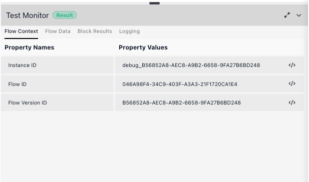
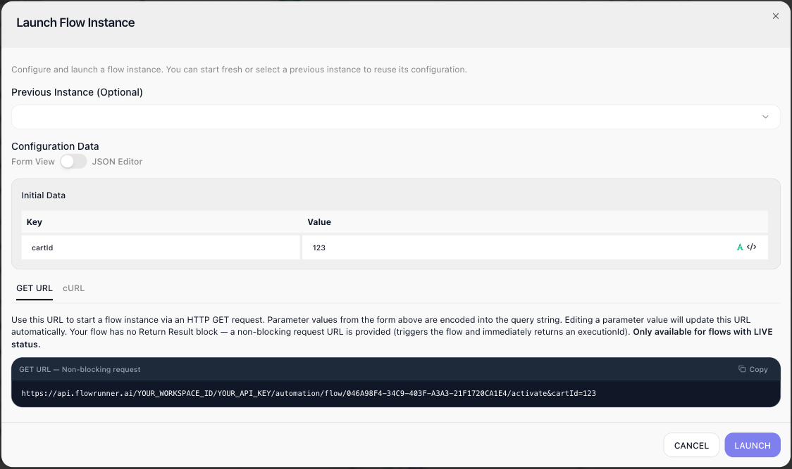

# Testing

Much of what a flow does happens out of sight - it calls a service, reshapes a payload, runs a rule, and moves on. **Testing** is how you confirm a flow does what you intended before you rely on it. You run it against sample data and check, block by block, that each step received the right input and produced the right result. When a step is wrong, testing points you straight at which block failed and why, so you fix it here rather than in a live run.

This page follows one example flow that reviews an incoming order. It fetches the order from a partner's API, trims it down, reattaches the tidied lines, finds the most expensive item, and decides whether a manager needs to approve it - several different kinds of block, one after another.

## The Test Monitor

You test a flow in the [Flow Editor](../build/flow-editor.md): you run blocks right on the canvas. The **Test Monitor** panel across the bottom is where you enter the flow's test data and read the results. It has four tabs:

- **Flow Data** - the sample input you give the flow to stand in for the data it would receive for real.
- **Block Results** - what each block took in and gave back.
- **Logging** - a running log of which blocks executed.
- **Flow Context** - the run's identifiers, and only those: its Instance ID, Flow ID, and Flow Version ID.

You test on an editable version of the flow. A version that is LIVE opens read-only, so make your test runs on a draft version.

## Give the flow its test data

A flow usually starts with some **Initial Data** - here, the id of the cart to fetch. In a test there is no trigger or API call to supply it, so you provide it yourself on the ((Flow Data)) tab: add a row, name it, and give it a value. The example needs a `cartId`.

From here on, any block that reads {{Initial Data->cartId}} sees `123` when you test it.

## Run a block and read its result

Each block on the canvas carries a red **play** icon, and its settings panel carries a matching ((Run Block)) button. Either one runs that single block against the current test data.

A run shows its outcome on the ((Block Results)) tab: the block's **Input** - the values it resolved - on the left, and its **Output** - what it produced - on the right. Run the blocks in order, top to bottom, because each block reads the results the ones before it produced.

Watch what that looks like as the order moves through the flow.

**Fetching the order.** ((Get Order)) is an [HTTP Request](../reference/http-request.md){.fr-block} block. It calls the partner's API at `https://dummyjson.com/carts/{{Initial Data->cartId}}`, and its Output is the whole order the API returned - a nested object with a `products` array and the order totals.

**Trimming it down.** ((Extract Properties From Product List)) is a [Transform Data](../reference/transform-data.md){.fr-block} block that keeps the few fields that matter. Its Input is the big response from the step before; its Output is a clean list of `{ title, quantity, price, total }`.

**Putting it back together.** That trim hands back a bare array - the tidy lines, cut loose from the order they came from. ((Set Products back to Order)) is a second Transform Data step that writes the array onto the order's `products` property, so the order keeps its totals and carries the tidy line list forward. You can see it in the result: the Input is the order plus the trimmed array, and the Output is the order again, its `products` now the four-field lines.

**Computing over it.** The [Get Top Item Total (Custom Cloud Code)](../reference/custom-cloud-code.md){.fr-block} block loops those lines to find the most expensive one. Its Input shows the arguments passed in and the code itself; its Output is what the code returned - `{ topItem, topItemTotal }`.

**Deciding.** The [Condition](../reference/condition.md){.fr-block} compares the most expensive item's total against a threshold. Its Input shows the two values - `74999.95` against `1000` - and its Output is the branch it takes, `conditionResult: true`.

Change the `cartId` on the Flow Data tab and run the blocks again to send a different order through - a smaller cart takes the condition's other branch.

## Edit an Output to test a case

Each result's Output is an editable field. Change a value there and every block after it reads your edited version instead of the original. It is how you test a case your sample data does not happen to cover - a very large order, a missing field, an empty list - without touching the flow or the data source. Set the value you want, run the later blocks again, and they respond to it.

## Run an instance from a block

Running a block tests one step. To run the flow straight through from a chosen point - no stopping between blocks - use ((Run instance from this element)), the lightning icon beside a block's play icon. It launches an uninterrupted execution starting at that block.

It opens the ((Launch Flow Instance)) dialog. Enter the ((Initial Data)) to start with, or pick a ((Previous Instance)) to reuse the data from an earlier run - including a real instance from when the flow was live, which is a quick way to reproduce a case that actually happened. ((LAUNCH)) starts the run.

The dialog also offers a GET or cURL URL that triggers the flow over HTTP, once the flow is LIVE. An uninterrupted run of a LIVE version is a real instance and counts against your allowance; from a draft version it is a test, and free.

## What testing shows you, and what to watch

- **Errors are surfaced, not hidden.** When a block cannot run - a value it needs is missing, or code throws - its Output shows an Error with the message, so you see the cause on the spot instead of in a failed live run.
- **A running timeline.** Logging lists each block as it executes, which is how you follow a longer test in order.
- **Testing an action really performs it.** A test run of an action block does the real thing: Get Order really calls the API, and testing a Slack or Send Email block really sends the message. Pure blocks - transforms, conditions, custom code - only compute, so they are always safe to repeat. Be deliberate when you test-run a block that reaches outside the flow.

## Testing does not cost an execution

Running blocks and stepping through a draft cost nothing - they do not count against your monthly allowance. An execution is spent only when a LIVE flow produces a real instance. See [Billing](../manage/billing.md) for what does and does not count.

<!-- verified in-product 2026-07-13 (Documentation Flows, Mark's "Testing Demo" flow, editable v1): pipeline = Get Order (HTTP GET dummyjson.com/carts/{{Initial Data->cartId}}) -> Extract Properties From Product List (Transform -> bare trimmed array) -> Set Products back to Order (Transform, Set Property Value: Object=order, Property Name=products, Value=trimmed array -> order with products replaced, totals intact) -> Get Top Item Total (Custom Cloud Code -> {topItem, topItemTotal}) -> Is Top Item Total Greater than 1000? (Condition, Value to Check = {{Custom Cloud Code Result->topItemTotal}} GREATER THAN 1000 -> conditionResult true) -> Send for Approval via Slack / Auto Approve. All block-result screenshots recaptured with current names. Flow Context tab = exactly Instance ID / Flow ID / Flow Version ID (corrected from an earlier wrong claim that it holds flow data). Each block has a play icon (Run Block) + a lightning icon; the lightning = "Run instance from this element" -> "Launch Flow Instance" dialog (Previous Instance selector to reuse a past instance's config incl. real LIVE instances; Initial Data; GET/cURL URL "Only available for flows with LIVE status"). API key + workspace id redacted (YOUR_API_KEY / YOUR_WORKSPACE_ID) in that screenshot. The Output is an editable Ace code editor (edit-then-successors-use-it confirmed by Mark; the field is editable in-product). Did NOT run Slack/Auto Approve (side effects) nor launch a full instance. Test runs free; Run Instance on LIVE billable. -->

## Related

- [Billing](../manage/billing.md) - what counts as an execution, and what testing does not
- [Custom Cloud Code](../reference/custom-cloud-code.md) - the code block tested above
- [Running Flows](running-flows.md) - taking a flow live and running it for real
