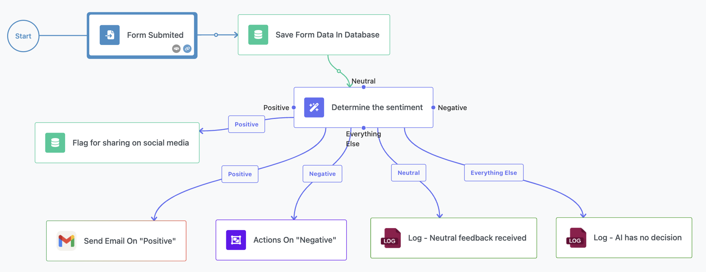
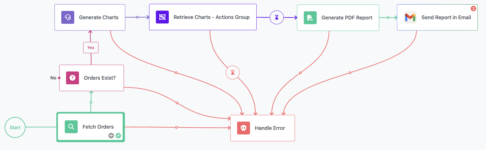

FlowRunner™ comes with a set of sample flows designed to help you learn and explore its capabilities. These flows demonstrate common use cases and techniques, offering practical examples of how to build and automate workflows effectively. Each flow is tailored to teach specific skills, from handling user inputs to leveraging AI and managing errors.  

The following tables provide a detailed overview of the included sample flows and highlight the features they demonstrate.  

---

## Sample Flows  
| **Flow Name**   | **Overview** | **Features Covered**    |
|----------------------------|-----------------------------|---|
| [Welcome Email Flow :material-open-in-new:](./welcome-email.md)       | Automatically initiates a flow to send a welcome email when a new user registers, ensuring personalized communication with each new user. | <ul><li>[User Registered Trigger](../reference/user-registered-trigger.md)</li><li>[Custom Action](../flow-editing/custom-actions.md)</li><li>[Conditions](../flow-editing/conditions.md)</li><li>Gmail integration</li></ul> |
| [Basic Approval Flow :material-open-in-new:](./basic-approval-flow.md)      | Implements a standard approval process where user-submitted requests are routed to an approver. Approved requests proceed, while denied ones loop back with feedback. | <ul><li>[AppLogic Trigger](../reference/applogic-trigger.md)</li><li>[Variables](../flow-editing/variables.md)<li>[Store data in database](../reference/save-record-action.md)</li><li>Gmail integration</li><li>[Triggers Group](../flow-editing/grouping-triggers.md)</li><li>[Value Router](../flow-editing/valuerouter.md)</li><li>[Error handling](../flow-editing/error-handling.md)</li></ul> |
| [Daily Reminder Email Flow :material-open-in-new:](./daily-reminder-email.md)  | Automates weekly checks for incomplete tasks and sends reminders, ensuring tasks stay on track and deadlines are met.                   | <ul><li>[Scheduled flows](../flow-management/scheduledflows.md)</li><li>[Database Data Retrieval](../reference/find-records-action.md)<li>[Loops](../flow-editing/loops.md)</li></ul> |
| [Customer Satisfaction Survey :material-open-in-new:](./customer-satisfaction-surver-flow.md)  | Processes survey form inputs, records responses, assigns satisfaction scores, and sends thank-you notes based on the results.            | <ul><li>[External Callback](../reference/external-callback-trigger.md) with Google Forms</li><li>[Conditions](../flow-editing/conditions.md)</li><li>[Assign Instance Name](../reference/assign-instance-name.md)</li><li>[Saving Data in DB](../reference/save-record-action.md)</li><li>Gmail integration</li></ul> |
| [AI-Driven Sentiment Analysis :material-open-in-new:](./ai-driven-sentiment-analysis.md)  | Analyzes sentiment in user feedback using AI and routes positive or negative feedback to the appropriate teams for follow-up.         | <ul><li>[AI Router](../reference/ai-router-action.md)</li><li>[External Callback](../reference/external-callback-trigger.md) with Google Forms</li><li>[Actions Group](../flow-editing/grouping-actions.md)</li><li>[Record Update in DB](../reference/record-updated-trigger.md)</li><li>Gmail integration</li></ul> |
| [AI-Powered Chatbot :material-open-in-new:](./ai-chatbot.md)       | Enables bidirectional communication between a user interface and AI, where user prompts are processed and responses are delivered back to the UI. | <ul><li>[Loop](../flow-editing/loops.md)</li><li>[AI Assistant](../reference/ai-assistant.md)</li><li>[App Logic Trigger](../reference/applogic-trigger.md)</li><li>[Bidirectional communication with UI](../flow-editing/communicate-with-ui.md)</li></ul> |
| [AI-Powered Daily Report  :material-open-in-new:](./ai-powered-daily-report.md)   | Generates and sends a daily summary report, combining AI document processing with PDF Generation and email automation.                     | <ul><li>[Scheduled flows](../flow-management/scheduledflows.md)</li><li>[AI Assistant](../reference/ai-assistant.md)</li><li>[PDF generation](../flow-editing/pdf-generator.md)</li><li>Gmail integration</li></ul> |
| [AI-Powered Data From Image Extraction :material-open-in-new:](./ai-powered-extraction-from-image.md)  | Handles file uploads by extracting data from images using AI and saving the results in a database for further processing.               | <ul><li>[App Logic Trigger](../reference/applogic-trigger.md)</li><li>[AI Assistant](../reference/ai-assistant.md)</li><li>File storage</li><li>[Save Data in DB](../reference/save-record-action.md)</li><li>[Communication with UI](../flow-editing/communicate-with-ui.md)</li></ul> |
| [Sample Error Handling :material-open-in-new:](./sample-error-handling.md)    | Runs tasks with error monitoring, sending notifications and logging error details whenever issues arise.                                | <ul><li>[External Callback](../reference/external-callback-trigger.md)</li><li>[Saving Data in DB](../reference/save-record-action.md)</li><li>[Update Data in DB](../reference/record-updated-trigger.md)</li><li>[Error Handler](../flow-editing/error-handling.md)</li><li>[Logging/Debugging](../flow-execution/debugging.md)</li></ul> |

## Features and Sample Flows  
These tables provide a comprehensive guide to the sample flows included in FlowRunner™, helping you quickly identify the flows and features most relevant to your needs. By exploring these examples, you can gain valuable insights into building effective and sophisticated workflows.  

| **Feature**                                         | **Sample Flows**                                                                                                                                                      |  
|-----------------------------------------------------|---------------------------------------------------------------------------------------------------------------------------------------------------------------------|  
| [Actions Group](../flow-editing/grouping-actions.md) | [AI-Driven Sentiment Analysis](./ai-driven-sentiment-analysis.md)                                                                                                |  
| [AI Assistant](../reference/ai-assistant.md)       | [AI-Powered Chatbot](./ai-chatbot.md) [AI-Powered Daily Report](./ai-powered-daily-report.md)                                                                 |  
| [AI Document Processing](../reference/ai-assistant.md) | [AI-Powered Data From Image](./ai-powered-extraction-from-image.md)                                                                                              |  
| [AI Router](../reference/ai-router-action.md)      | [AI-Driven Sentiment Analysis](./ai-driven-sentiment-analysis.md)                                                                                                |  
| [AppLogic Trigger](../reference/applogic-trigger.md)| [Basic Approval Flow](./basic-approval-flow.md) [AI-Powered Chatbot](./ai-chatbot.md)                                                                          |  
| [Assign Instance Name](../reference/assign-instance-name.md)| [Customer Satisfaction Survey](./customer-satisfaction-surver-flow.md)                                                                         |  
| [Bidirectional Communication with UI](../flow-editing/communicate-with-ui.md) | [AI-Powered Chatbot](./ai-chatbot.md) [AI-Powered Data From Image](./ai-powered-extraction-from-image.md)                 |  
| [Conditions](../flow-editing/conditions.md)         | [Welcome Email Flow](./welcome-email.md) [Customer Satisfaction Survey](./customer-satisfaction-surver-flow.md) [AI-Driven Sentiment Analysis](./ai-driven-sentiment-analysis.md)                  |  
| [Custom Action](../flow-editing/custom-actions.md)  | [Welcome Email Flow](./welcome-email.md)                                                                                                                         |  
| Gmail integration                                   | [Welcome Email Flow](./welcome-email.md) [Basic Approval Flow](./basic-approval-flow.md) [Customer Satisfaction Survey](./customer-satisfaction-surver-flow.md) [AI-Driven Sentiment Analysis](./ai-driven-sentiment-analysis.md) [AI-Powered Daily Report](./ai-powered-daily-report.md)  |  
| [Database Data Retrieval](../reference/find-records-action.md) | [Daily Reminder Email Flow](./daily-reminder-email.md)                                                                                                           |  
| [Error Handling](../flow-editing/error-handling.md) | [Basic Approval Flow](./basic-approval-flow.md) [Sample Error Handling](./sample-error-handling.md)                                                           |  
| [External Callback](../reference/external-callback-trigger.md) | [Customer Satisfaction Survey](./customer-satisfaction-surver-flow.md) [AI-Driven Sentiment Analysis](./ai-driven-sentiment-analysis.md) [Sample Error Handling](./sample-error-handling.md)      |  
| [Logging/Debugging](../flow-execution/debugging.md)                                  | [Sample Error Handling](./sample-error-handling.md)                                                                                                              |  
| [Loops](../flow-editing/loops.md)                                              | [Daily Reminder Email Flow](./daily-reminder-email.md) [AI-Powered Chatbot](./ai-chatbot.md)                                                                  |  
| [PDF Generation](../flow-editing/pdf-generator.md) | [AI-Powered Daily Report](./ai-powered-daily-report.md)                                                                                                          |  
| [Record Update in DB](../reference/record-updated-trigger.md)| [AI-Driven Sentiment Analysis](./ai-driven-sentiment-analysis.md) [Sample Error Handling](./sample-error-handling.md)                                         |  
| [Scheduled Flows](../flow-management/scheduledflows.md) | [Daily Reminder Email Flow](./daily-reminder-email.md) [AI-Powered Daily Report](./ai-powered-daily-report.md)                                                |  
| [Store Data in Database](../reference/save-record-action.md) | [Basic Approval Flow](./basic-approval-flow.md) [Customer Satisfaction Survey](./customer-satisfaction-surver-flow.md) [Sample Error Handling](./sample-error-handling.md)                         |  
| [Triggers Group](../flow-editing/grouping-triggers.md) | [Basic Approval Flow](./basic-approval-flow.md)                                                                                                                  |  
| [User Registered Trigger](../reference/user-registered-trigger.md) | [Welcome Email Flow](./welcome-email.md)                                                                                                                         |  
| [Value Router](../flow-editing/valuerouter.md)      | [Basic Approval Flow](./basic-approval-flow.md)                                                                                                                  |  
| [Variables](../flow-editing/variables.md)           | [Basic Approval Flow](./basic-approval-flow.md)                                                                                                                  |  
