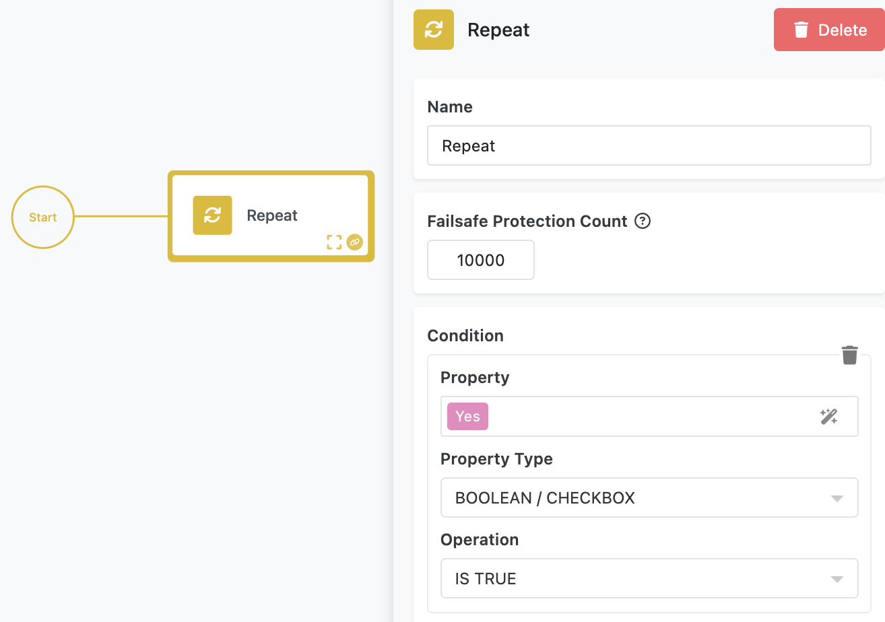

The **AI Chatbot Flow** demonstrates how to create a dynamic, interactive chatbot experience by combining FlowRunner™ with a custom user interface. This solution highlights essential FlowRunner™ concepts such as looping, integrating AI assistants, bidirectional communication between UI and flow, and using the **Call Flow** API.  

This chatbot is designed to be highly adaptable; by training an AI assistant on specific domains, you can create specialized chatbots without modifying the flow’s core logic or UI. Let’s break down the backend (the flow) and the frontend (the UI) to understand how this solution works.  

<iframe style="width: 100%; aspect-ratio: 16 / 9;" src="https://www.youtube.com/embed/wZcyYSF4K10?si=RKK9u9VDd_rdeyrx" title="YouTube video player" frameborder="0" allow="accelerometer; autoplay; clipboard-write; encrypted-media; gyroscope; picture-in-picture; web-share" referrerpolicy="strict-origin-when-cross-origin" allowfullscreen></iframe>

## Flow Highlights  

This flow and UI combination introduces several essential concepts in FlowRunner™ and Backendless:  

- **Flow Loops with Repeat Block**: Learn how to handle repetitive tasks, like processing sequential user inputs, using the [**Repeat** block](../flow-editing/loops.md).  
- **Flow-to-UI Communication**: Discover how to send flow-generated data back to the UI in real time, ensuring seamless interactions.  
- **AI Integration**: Explore how to integrate [AI assistants](../reference/ai-assistant.md) into your flows to build intelligent, context-aware chatbots.  
- **Session Isolation with Execution ID**: Understand how `executionId` is used to isolate sessions, enabling multiple concurrent chatbot interactions without interference.  
- **Using Call Flow API**: Gain experience with the [**Call Flow** API](../flow-execution/overview.md#callflow-commandapi) to dynamically create flow instances from the UI.  

## Backend: The Flow  

### The Repeat Block  
The flow provides the backend logic that powers the chatbot. At the highest level, the flow uses a **Repeat** block to process messages in a loop. This structure ensures the chatbot can handle multiple back-and-forth exchanges between the user and the AI in the same session.  

The **Repeat** block contains the logic for handling a single interaction between the user and the AI. 

### App Logic Trigger
Repeat's loop iteration starts with an **App Logic Trigger** block, which waits for a new message to be submitted by the user. The trigger provides the `message` property, which contains the user’s input.  

### AI Assistant
The user’s message is passed to the **AI Chatbot** block as the **Message to Assistant** parameter. The block, which uses an AI assistant which can be trained for specific chatbot interactions, generates a response. The **AI Chatbot Result** element contains the response data in its `decision` property. This value represents the AI’s reply to the user’s input.  

### Send Data to UI
The flow uses the **Send Data to UI** block to deliver the AI’s response back to the user.  

   - The `Data` parameter is set to the `decision` property from the AI result.  
   - The `SessionId` parameter is set to the flow’s `Execution ID`, ensuring the response is sent to the correct user session.  This architecture ensures that each chatbot session remains isolated, even when multiple users interact with the system simultaneously.  

## Frontend: The UI  

The custom UI page provides the user interface for interacting with the chatbot. It initializes the flow instance, manages real-time communication, and handles user input.  

### Starting Flow

When the UI page loads, it uses the [**Call Flow** API](../flow-execution/overview.md#callflow-commandapi) to create a new flow instance. This process assigns a unique identifier, `executionId`, to the flow instance. The identifier is returned in the API's response and then stored in the **Page Data** using the **Assign Object Properties** block.  

### Receiving Messages from Flow

The page creates a real-time (RT) listener tied to a messaging channel named after the assigned `executionId` value. This ensures that the UI only receives messages from the specific flow instance associated with the session. When a new message is received, the UI updates the chat display by adding the message to a list and re-rendering the view using data-binding.  

### Sending Messages from User  

The **Send** button’s `On Click` event contains the logic for sending user messages to the flow.  When the user clicks **Send**, the `sendMessage` function triggers the **Run App Logic Trigger** Codeless block.

Notice the **Run App Logic Trigger** block operates in **Activate Specific** mode, ensuring the correct flow instance is activated. It uses the `executionId` stored in the **Page Data** (which is the result of the `Call Flow` API call) to target the corresponding chatbot session.  

The `Body` parameter contains the user’s message, which is sent to the flow for processing.  

---

By studying and experimenting with the **AI Chatbot Flow**, you’ll develop a deeper understanding of building responsive, real-time, and intelligent applications with FlowRunner™ and Backendless.  