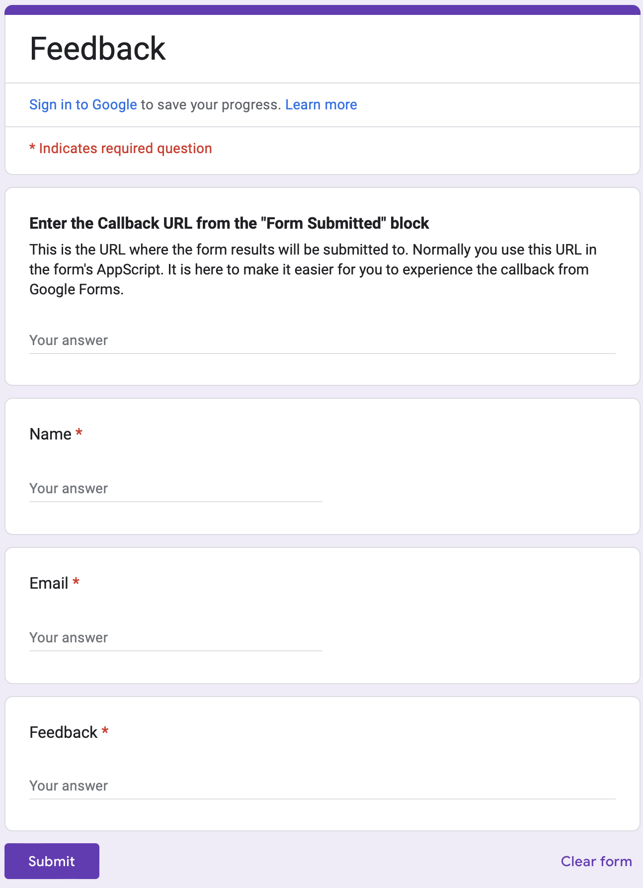
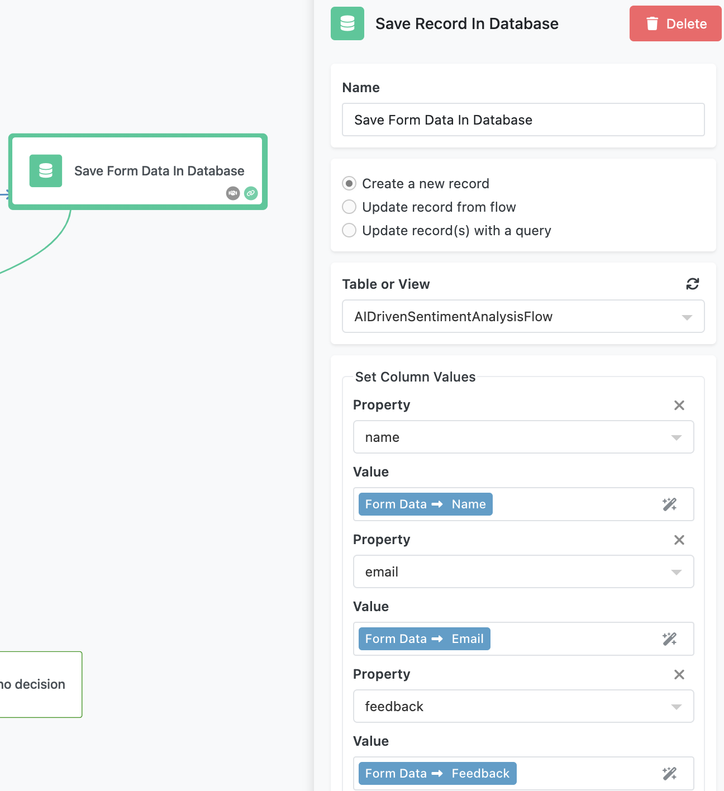

The **AI-Driven Sentiment Analysis Flow** showcases how FlowRunner™ leverages AI to evaluate user feedback and route decisions dynamically. By integrating a Google Form, a database, and AI Router functionality, this flow provides a hands-on example of building intelligent workflows that respond to user input.  

<iframe style="width: 100%; aspect-ratio: 16 / 9;" src="https://www.youtube.com/embed/52mESBLCfJA?si=ohXNGHmub3lbvZ4I" title="YouTube video player" frameborder="0" allow="accelerometer; autoplay; clipboard-write; encrypted-media; gyroscope; picture-in-picture; web-share" referrerpolicy="strict-origin-when-cross-origin" allowfullscreen></iframe>

## About the Flow

This flow begins when a user submits a Google Form containing their name, email, and feedback. The flow saves the form data in a database and uses the [AI Router block](../reference/ai-router-action.md) to analyze the sentiment of the feedback. Based on the sentiment - **Positive**, **Negative**, **Neutral**, or **Everything Else** - the flow branches into separate paths, each demonstrating different actions and logic.  

For example:  

- Positive feedback can be flagged for sharing on social media.  
- Negative feedback triggers a sequence of actions grouped in an Actions Group block.  
- Neutral feedback results in a follow-up email.  
- If the AI cannot determine the sentiment, the flow logs the result for further analysis.  

## How the Flow Works  

### Receiving Form Data  

The flow begins with the **Form Submitted** block, which receives data from the [Google Form](https://forms.gle/JdfnXYt19qYxEFkW9). For demo purposes, the form collects: **CallbackURL**, **Name** , **Email** , **Feedback**  



!!! note "Note on the Callback URL Field"
    The form includes a field for the **Callback URL**. This field is present to make the form reusable and to simplify the setup process. By including it directly in the form, you can quickly connect the form to the flow without additional steps.

    To configure this, copy the **Callback URL** from the **Form Submitted** block in the flow and paste it into the **Callback URL** field in the form. A script in the form uses this value to send the form data to the flow upon submission.

    If you’re creating your own form, check the section at the end of this chapter for detailed instructions. You’ll see how the Callback URL is incorporated into the form’s submission script.

The form data is then saved in a database table to enable future analysis. Each submission creates a new record in the `AIDrivenSentimentAnalysisFlow` table, mapping the form fields to corresponding columns.  



!!! note "Note on the Database Table"**"
    Every FlowRunner™ workspace includes a database by default. To view the database structure for this flow, click the **QUICK ACCESS** button in the top-left corner of the interface and navigate to **Backendless Database**. Select the `AIDrivenSentimentAnalysisFlow` table to explore its contents.

    The **DATA BROWSER** tab displays the table's data, while the **SCHEMA** tab shows its structure and fields.

### Analyzing Feedback Sentiment  

The **AI Router** block evaluates the sentiment of the feedback provided in the form. The block is configured with three main decision outcomes:  

- **Positive**  
- **Negative**  
- **Neutral**  

It also includes an "Everything Else" outcome, used when the AI cannot confidently classify the feedback.  


The **AI Router** block uses the following prompt:  

```
The "Feedback" field contains user feedback. Determine the sentiment of the feedback.  
```  

The **Feedback** field is passed to the block as **Decision Data**, which the AI analyzes to determine the appropriate sentiment.  

### Branching Logic  

The AI processes the feedback value and chooses one of the provided expected decisions. If none of the decisions apply, the resulting branch will follow the **Everything Else** route. Based on the determined sentiment, the flow follows different branches:  

**Positive** Feedback:  
  One branch updates the database record to indicate the feedback is suitable for social media. This is done by setting the `shareFeedback` column to `true`.  The other branch sends an email to the user thanking them for the positive feedback.

**Negative** Feedback:  
  The negative branch demonstrates the use of an **Actions Group**. Inside the group, several actions are performed sequentially. Specifically, the actions include logging the received form data in [FlowLogger](../flow-execution/debugging.md) and sending an email to "customer service".
  
**Neutral** Feedback:  
  The flow logs the form data in FlowLogger. 

**Everything Else**:  
  If the AI cannot determine the sentiment, the flow logs the result for analysis. This ensures no feedback is overlooked.  

## Preparing the Flow  

To configure and test the flow, follow these steps:  

1. **Set Up Gmail Integration**:  
   Open the **Send Email** block (standalone and inside the Actions Group). Click the **Login** button to perform an OAuth login with your Google account. This enables the flow to send emails using your account.  

2. **Configure FlowLogger**:  
   Open any of the **Log** blocks in the flow and click **Configure**. Enter the session code from [FlowLogger](https://logger.flowrunner.ai) to capture log messages in real time.  

3. **Connect the Google Form**:  
   Copy the **Callback URL** from the **Form Submitted** block in the Flow Editor. Paste this URL into the [Google Form](https://forms.gle/JdfnXYt19qYxEFkW9) to ensure submissions are sent to your flow.  

## Running the Flow  

Once the configuration is complete, start the flow by clicking the **Start Flow** button. Open the [Google Form](https://forms.gle/JdfnXYt19qYxEFkW9), fill it out and submit. The flow will automatically process the data and execute actions based on the sentiment analysis.  

- Positive feedback will be flagged in the database or routed to other actions.  
- Negative feedback will trigger additional steps in the Actions Group.  
- Neutral and Indeterminate feedback will be logged for review.  

Monitor the flow’s execution in FlowLogger to observe how decisions are made and actions are executed.  

## Set Up Your Own Google Form  

1. **Create the Form**  
   Navigate to [Google Forms](https://forms.google.com) and create a new form. Add the following fields:  

    - **Name** (Short Answer)  
    - **Email** (Short Answer)  
    - **Satisfaction** (Linear Scale, 1 to 10, labeled "Dissatisfied" to "Highly Satisfied")  
    - **Feedback** (Paragraph)  

2. **Access the Script Editor**  
   In the form, click the three-dot menu in the top-right corner, then select **Script Editor**.  

3. **Add a Script to Submit Data to FlowRunner™**  
   Replace any default code in the Apps Script editor with the following script:  

     ``` { .js .copy }
     function onFormSubmit(e) { 
      var url = "YOUR_EXTERNAL_CALLBACK_URL_HERE"; // Replace with your target URL 
      var formResponse = e.response; // Extract answers from the form response 
      var itemResponses = formResponse.getItemResponses(); 
      var data = {}; 
      for (var i = 0; i < itemResponses.length; i++) { 
          var itemResponse = itemResponses[i]; 
          data[itemResponse.getItem().getTitle()] = itemResponse.getResponse(); 
      } 
      // Send data as POST request 
      var options = { 
          method: "post", 
          contentType: "application/json", 
          payload: JSON.stringify(data) 
      }; 
      UrlFetchApp.fetch(url, options); 
     }
     ```  

      Replace `YOUR_EXTERNAL_CALLBACK_URL_HERE` with the Callback URL copied from the **Form Submitted** block.  

4. **Set Up the Trigger**  
   In the Script Editor:  

    - Open the **Triggers** menu (clock icon or via Extensions > Apps Script > Triggers).  
    - Add a new trigger for the `onFormSubmit` function.  
    - Set the event type to **On form submit** and save.  

5. **Grant Permissions**  
   When saving the trigger, Google will prompt you to authorize the script. Review the permissions, select your Google account, and allow the required access.  

    Once completed, your custom form is ready to submit data to the flow.  

## Key Concepts Demonstrated  

This flow highlights several important FlowRunner™ features:  

- **AI Router Block**: Configure AI decision-making with dynamic branching based on outcomes.  
- **Database Integration**: Save and update records in a database table as part of flow execution.  
- **Actions Group**: Combine multiple actions into a single group for sequential or conditional execution.  
- **FlowLogger**: Monitor flow activity and outcomes in real time for debugging and analysis.  

By exploring the **AI-Driven Sentiment Analysis Flow**, you’ll gain practical experience with AI integration, branching logic, and FlowRunner’s robust automation capabilities.  


