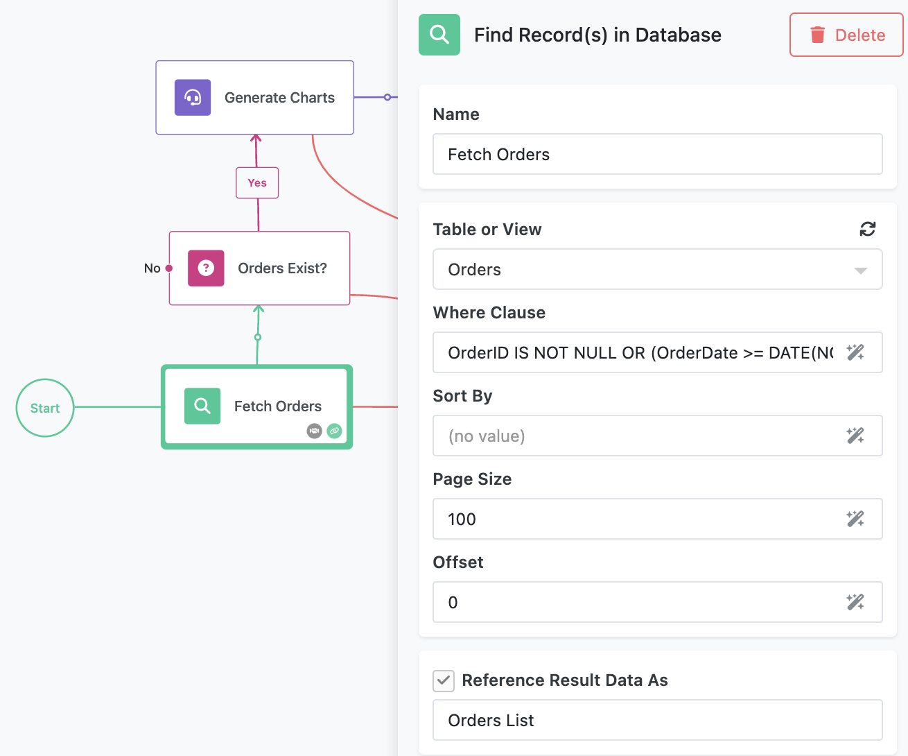
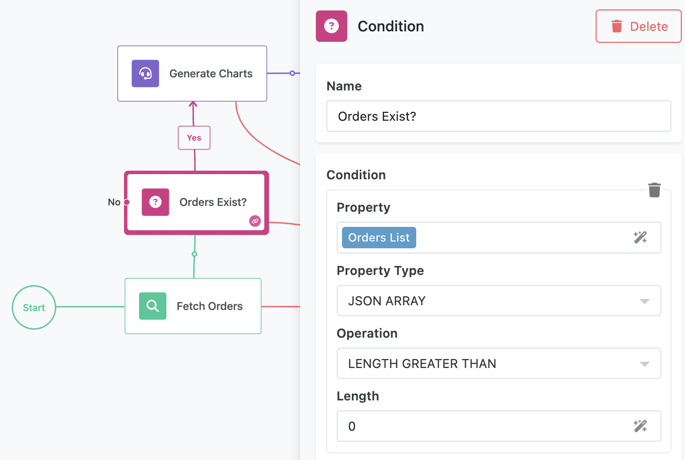
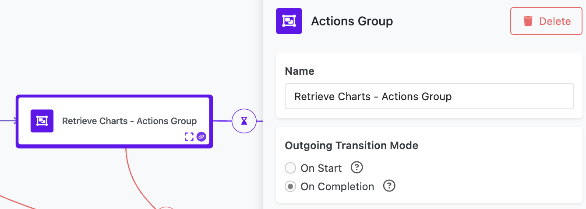
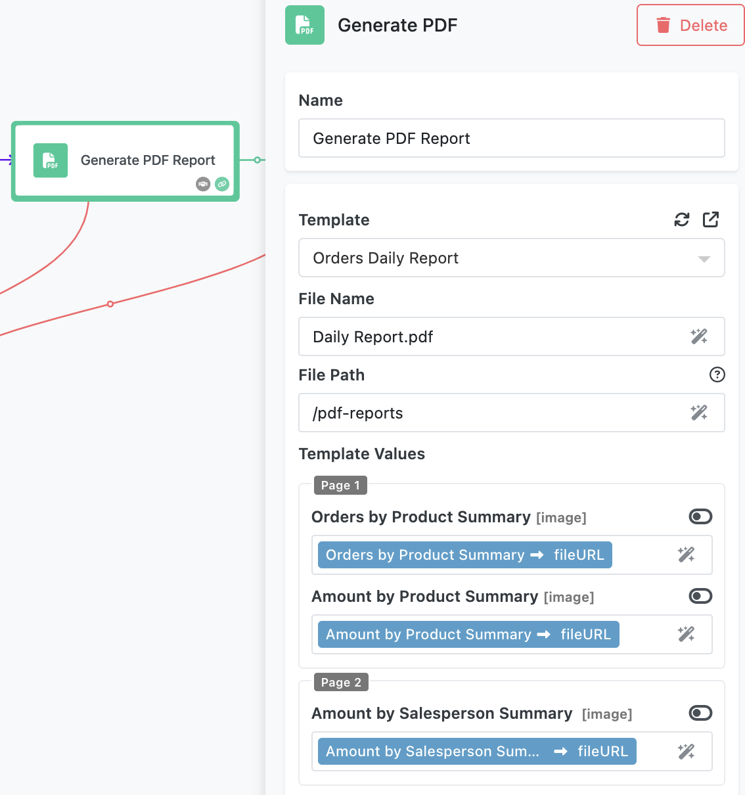
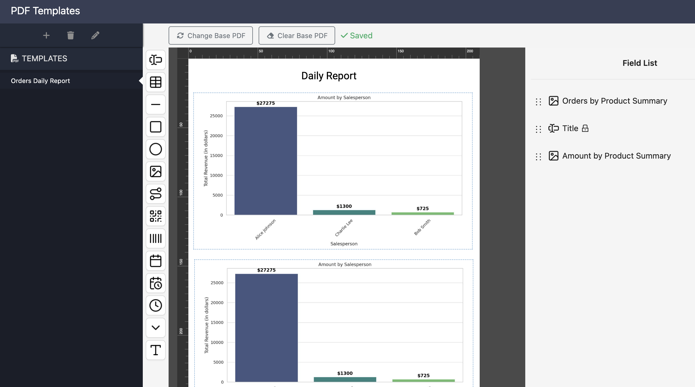
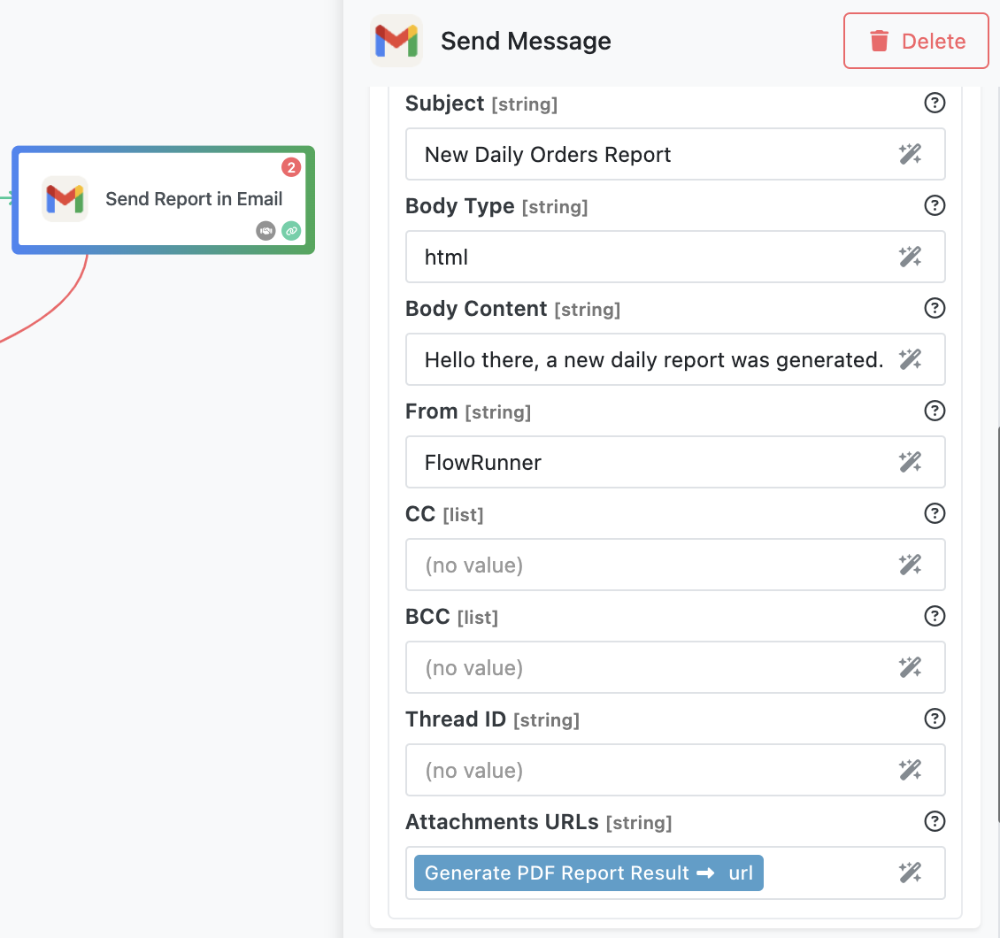
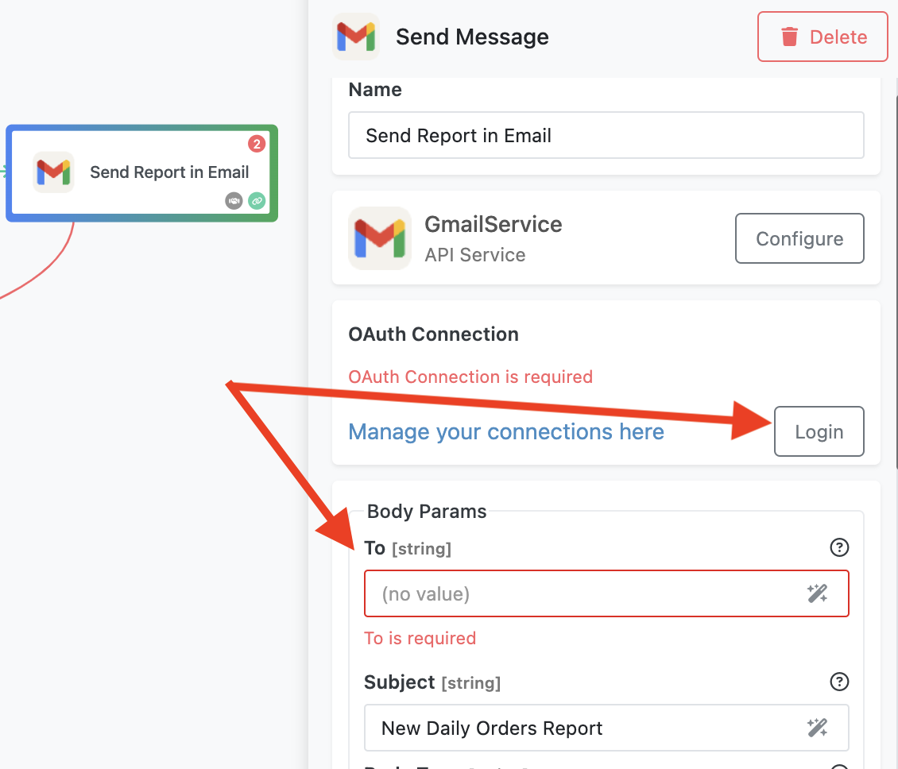

The **Daily Report Generation with AI** flow demonstrates how to automate the creation and delivery of data-driven reports using FlowRunner™. This flow leverages AI-powered chart generation, PDF templating, and email integration to deliver professional-quality reports automatically.  

<iframe style="width: 100%; aspect-ratio: 16 / 9;" src="https://www.youtube.com/embed/KMqkpkCoIPo?si=rLwxcw3T5ca1Nosp" title="YouTube video player" frameborder="0" allow="accelerometer; autoplay; clipboard-write; encrypted-media; gyroscope; picture-in-picture; web-share" referrerpolicy="strict-origin-when-cross-origin" allowfullscreen></iframe>

## How the Flow Works  

### Data Fetch
The flow is initiated daily through a configured schedule. When the flow runs, it begins with the **Fetch Orders**(1) block which  queries the **Orders** database table to retrieve order data. For demonstration purposes, the query fetches all orders, but it can be customized to include only recent entries.  Notice the result of the block is referenced as `Orders List` (see the bottom of the screenshot below). That value will be used in the next step of the flow.
{ .annotate }

1.  :man_raising_hand: The **Fetch Orders** block is an instance of [**Find Record(s) in Database**](../reference/find-records-action.md). It is an action responsible for retrieving data from the Backendless database associated with your workspace.



### Orders Exist?
The retrieved data is evaluated using a [**Condition**](../flow-editing/conditions.md) block. If no orders are returned, the flow terminates via the "No" connector on the block(1). If there are orders, the flow continues along the "Yes" branch to the next step. 
{ .annotate }

1.  :man_raising_hand: Notice the "No" connector is not connected to any blocks. When the condition is evaluated to `false` (i.e. "No") the flow will stop because it has nowhere to go.

The condition checks the `Orders List` value, which is the result returned by the **Fetch Orders** block. This value is a JSON array(1), and the condition evaluates whether the array's length is greater than 0 - effectively determining if it is not empty.  
{ .annotate }

1.  :man_raising_hand: To check what the returned data looks like, try running the **Fetch Orders** block in [Test Mode](../flow-execution/testing.md).




### Generate Charts
The next block in the sequence is the **Generate Charts** block, which is powered by an [AI Assistant](../reference/ai-assistant.md). This assistant analyzes the order data and generates three charts. The block's configuration is very simple - it passes the `Orders List` to the assistant. Notice the result of the assistant's action is referenced as `AI data analyst Result` - it will be used in the subsequent actions in the flow.


However the most interesting part is the actual assistant configuration. To see how the assistant is configured, switch to the [Blocks Toolbox](../flow-editing/floweditor.md#blocks-toolbox) view, hover the mouse pointer over the **AI data analyst** assistant and click the view assistant configuration icon. The following popup will open with the configuration (prompt) that specifies how the charts are generated:


The complete text of the assistant's prompt is below:
```text
You are an AI data analyst. I will provide you with a dataset in JSON format, 
and I want you to generate the following visualizations:

Orders by Product Summary: A bar chart showing the number of orders for each product.
Amount by Product Summary: A bar chart showing the total revenue (in dollars) generated by each product.
Amount by Salesperson: A bar chart showing the total revenue (in dollars) generated by each salesperson.

Instructions:

Use appropriate labels and titles for the charts.
If possible, include exact values on the bars for clarity.
Highlight the top-performing product and salesperson in the visualizations.
If the dataset is incomplete or malformed, suggest corrections or assumptions.
Charts should be visually appealing.
Use padding for images.
Generate the charts as separate PNG images.
For file names use chart titles.
```
### Get Charts Files
After chart generation, the flow proceeds to the **Retrieve Charts - Action Group** block. This is a special type of block in FlowRunner™ that can [group multiple actions](../flow-editing/grouping-actions.md). The group ensures that all its contained actions - such as fetching chart references - complete successfully before moving forward.  



To see the contents of the group, click the "expand" icon - :fontawesome-solid-expand:. You will see there are three actions in the group. Each action is responsible for obtaining a specific file from the AI Assistant's result. Results of the actions in a group will be visible outside of the group:


### Generate PDF
Once the charts are retrieved, the flow moves to the [**Generate PDF Report**](../flow-editing/pdf-generator.md) block. This block uses a predefined PDF Template with fields mapped to the flow data. The charts generated earlier are inserted into these fields to create a polished PDF report.  



There are several important configuration elements shown in the screenshot above:

1. The **Template** field identifies a PDF Template used by the generator (see the details about PDF templates below).
2. The **Template Values** section establishes the mappings between the data in the flow (charts extracted by the actions in the Action Group) and the "fields" in the specified template.

To further understand how it works, navigate to the PDF Template Editor by clicking the **QUICK ACCESS** button and search for "PDF". Click the **PDF Template Editor**. The **Orders Daily Report** template will open by default (if not, click the template to open). The template consists of two pages. Both pages have "fields". A field summary is displayed in the **Field List** on the right:



If you go back to the **Generate PDF Report** block's settings, you will see that the fields declared in the PDF Template are listed in the **Template Values** section. This is where data from the flow is mapped to the fields. 

### Send Email
The final step is the **Send Report in Email** block. This block uses Gmail integration to send the generated report to a specified email address. The **Generate PDF Report** block provides a URL for the generated report, which is attached to the outgoing email. 



## Configuring the Flow Schedule  

This flow is configured to run once a day. To inspect the schedule, open the **Flow Manager** interface and locate the flow by searching for **Daily Report Generation with AI**. You will notice the schedule icon is highlighted green, indicating an active schedule. Click the icon to view the schedule details, which confirm the daily execution setup.  


## Preparing to Run the Flow  

Before running the flow, you need to ensure Gmail integration is set up. Open the **Send Report in Email** block, click the **Login** button, and authenticate with your Google credentials. This step allows the flow to send emails using your Gmail account.  

Next, specify the recipient's email address in the **To** field of the same block. This address will receive the generated report.



## Running the Flow  

To start the flow, click the **Start Flow** button in the Flow Editor. The flow will execute according to its defined schedule, querying order data, generating charts and a PDF report, and emailing the report to the specified recipient.  

---

The **Daily Report Generation with AI** flow illustrates how FlowRunner™ can automate repetitive reporting tasks, incorporating AI and dynamic data handling. With its ability to produce polished, data-rich reports effortlessly, this flow serves as a powerful example of automation for professional environments.  
