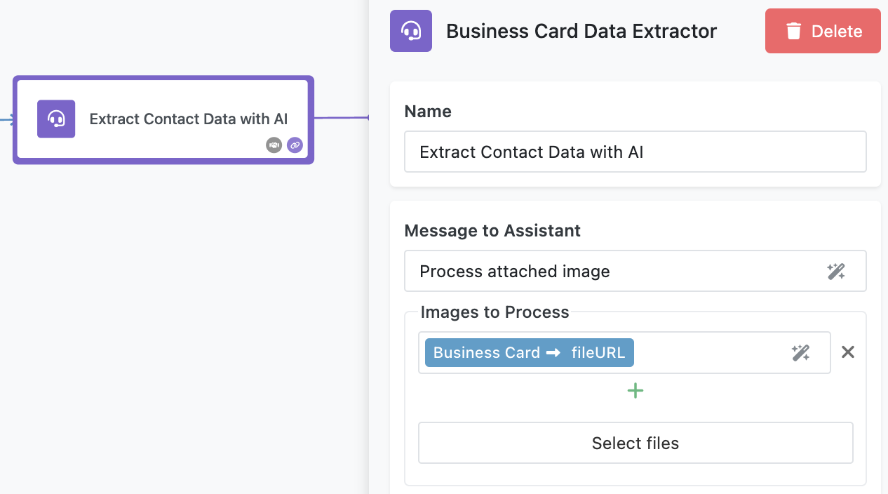

The **Business Card Data Extraction with AI** flow showcases how FlowRunner™(tm) can automate the extraction of structured data from images using AI, providing a flexible foundation for workflows that process visual inputs like business cards, documents, or scanned forms.  This flow combines file upload trigger, conditional logic, AI-powered data extraction, and database integration to deliver a seamless and efficient solution. Below is an in-depth look at how the flow works and how to use it.

<iframe style="width: 100%; aspect-ratio: 16 / 9;" src="https://www.youtube.com/embed/EAOi2I9JUpE?si=6JUWh4t9-UFKYrcj" title="YouTube video player" frameborder="0" allow="accelerometer; autoplay; clipboard-write; encrypted-media; gyroscope; picture-in-picture; web-share" referrerpolicy="strict-origin-when-cross-origin" allowfullscreen></iframe>

## What You Will Learn  
This sample flow highlights several important features and techniques in FlowRunner™:  

- **File Upload Triggers**: Automate workflows based on file uploads with validation conditions.  
- **AI Integration**: Use AI Assistants to extract meaningful data from complex inputs like images.  
- **Error Handling**: Implement robust error handling to manage and log failures gracefully.  
- **Database Integration**: Save and organize structured data for future use.  

## How the Flow Works

### App Logic Trigger for File Upload
The flow begins when a user uploads an image of a business card via a UI page. This triggers the **Business Card Uploaded** block in the flow. The trigger is an [App Logic Trigger](../reference/applogic-trigger.md). 


### AI Data Extraction
Once a flow instance is activated by the trigger, the flow sends the image URL to an **AI Assistant** configured for business card data extraction. The assistant processes the image and returns a structured **JSON response** containing the extracted contact details:  Contact's Name, Email, Phone, and Address.



The AI Assistant is configured without additonal capabilities such as "Data Analyzer" or "Data Search in Files". The assistant's prompt is below:

```
You are an AI Assistant specialized in extracting key information from images of business cards. Users will provide you with an image of a business card, and your task is to analyze the image and extract the following details:

1. Name: The name of the individual or business.
2. Email: The email address present on the card.
3. Phone Number: Any phone number(s) listed.
4. Address: The postal address, if available.

Workflow:
1. Input:
   - Accept the image of the business card as input.

2. Process:
   - Use OCR (Optical Character Recognition) to extract text from the image.
   - Identify and categorize the extracted text into the specified fields.

3. Output:
   - Return the extracted data in a structured JSON format:

     {
       "Name": "John Doe",
       "Email": "john.doe@example.com",
       "Phone": "+1 234 567 8900",
       "Address": "123 Business St, Cityville, State, ZIP"
     }

   - If multiple matches are found for a category (e.g., two phone numbers), include them in an array.
   - Return only JSON, do not include any other information.
   - Do not wrap JSON into ```json and ``` symbols 

4. Error Handling:
   - If the AI fails to recognize the business card or cannot extract all fields, return an error message in the following format:
     ```json
     {
       "error": "Unable to process the business card. Reason: [error description]."
     }
     ```
   - Possible error descriptions:
     - "Image quality is too low."
     - "No recognizable text found."
     - "Fields missing or incomplete."

5. Quality Assurance:
   - If unsure about a field (e.g., ambiguous or incomplete text), note it in the output:
     ```json
     {
       "Name": "Uncertain",
       "Email": "Uncertain",
       "Phone": "+1 234 567 ???",
       "Address": "Uncertain"
     }
     ```
6. Support multiple languages if cards are not always in English.
```

### Error Handling  
After receiving the response from the AI Assistant, the flow checks whether the assistant returned an error. The error check is done using the [Condition](../flow-editing/conditions.md) block. The condition checks the `decision` property of the AI Assistant's response. If the property has the `error` key, the response is considered to contain an error:


### Saving Data in the Database
- **If no error is detected**: The extracted contact details are saved in the **Contacts** database table, along with a link to the original image file.  

    

- **If an error occurs**: The flow logs the error message in the **Error** column of the same database table. The link to the original file is also saved for reference.  

    

## **Using the Flow**  

### **Running the Flow**  
1. **Set Up FlowLogger**:  
   Open [FlowLogger](https://logger.flowrunner.ai) and copy the session code. Click any of the **Log...** blocks and click the **Configure** button to enter the session code.

2. **Start the Flow**:
    Click the **Start Flow** button to change the flow's state to `LIVE`.

3. **Open the UI Page**:  
   Navigate to the FlowManager screen and locate the **Business Card Data Extraction with AI** flow. The description column of the flow contains a link to open a UI page from where you can scan a business card and activate a flow instance. Use the provided UI page to test image uploads. This page should be configured to accept image files and send them to the flow's trigger.  

By understanding and implementing this flow, you’ll learn how to leverage FlowRunner’s powerful automation capabilities to create intelligent and scalable solutions tailored to real-world use cases.  