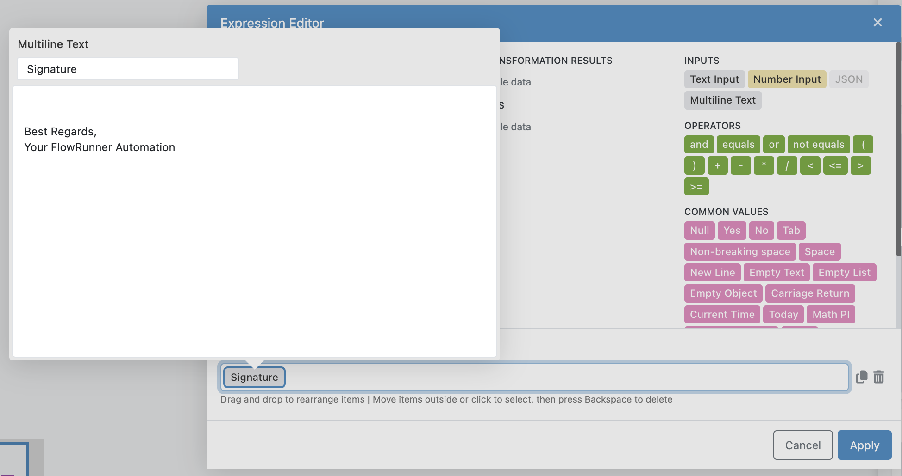
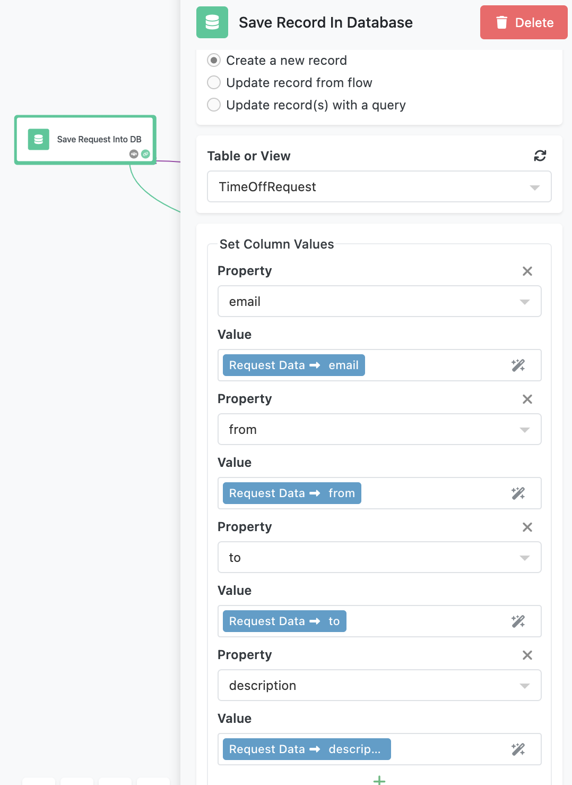
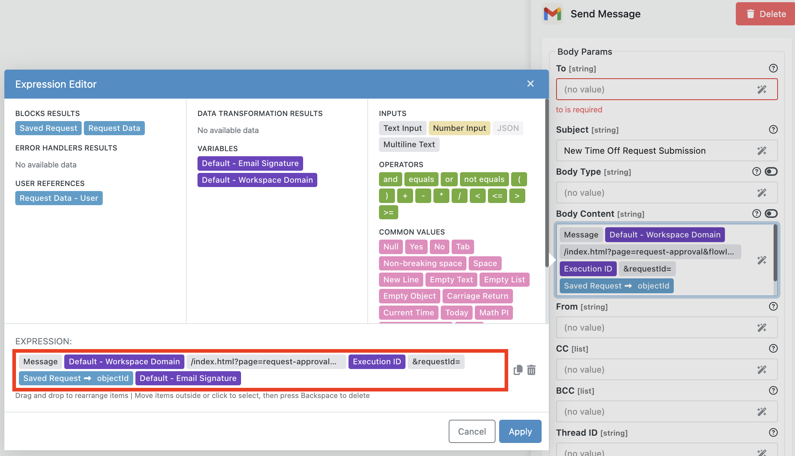
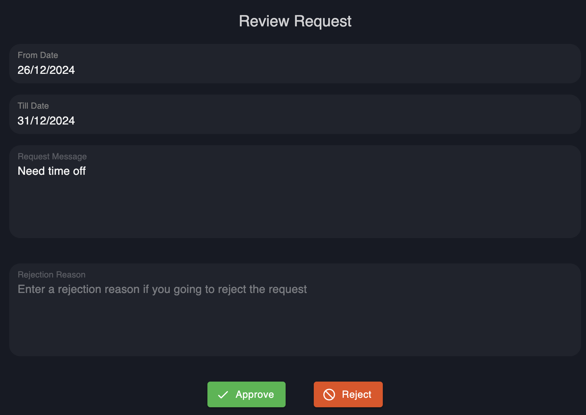
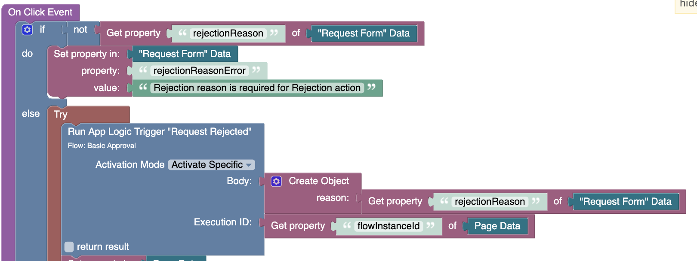
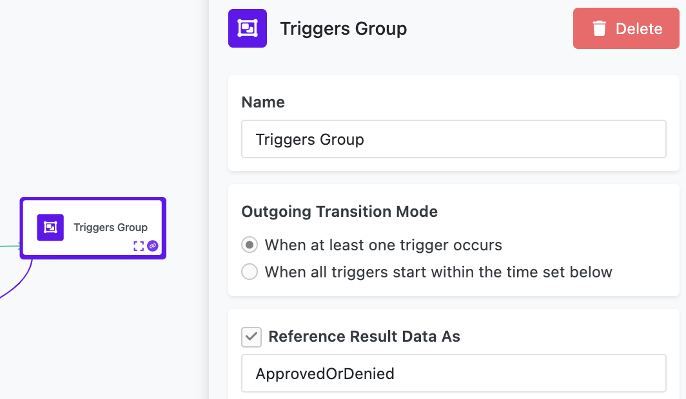

The **Basic Approval Flow** demonstrates how FlowRunner™ enables decision-based workflows. While this example focuses on handling time-off requests, the same principles can be adapted for other approval processes, such as expense approvals, project sign-offs, or purchase requests.

This flow highlights the integration of reusable variables, database storage, email notifications, and trigger-based decision routing, offering a practical and flexible template for automating approvals.

<iframe style="width: 100%; aspect-ratio: 16 / 9;" src="https://www.youtube.com/embed/gcfyJrdczKQ?si=ACZUdEcONrfQAn6x" title="YouTube video player" frameborder="0" allow="accelerometer; autoplay; clipboard-write; encrypted-media; gyroscope; picture-in-picture; web-share" referrerpolicy="strict-origin-when-cross-origin" allowfullscreen></iframe>

## Overview  

The process begins when an employee submits a time-off request using a UI form. The form collects the employee’s email address, the requested from and to dates, and a justification for the request. 


Once submitted, the flow handles the request through several key steps:

1. Saves the form data in a database.
2. Sends an email to the manager with a link to a decision page.
3. Waits for the manager to approve or reject the request.
4. Routes the flow based on the decision and sends an appropriate email response to the employee.

## Flow Details  

### Setting Variables  

The flow starts upon the UI form's submission. The first step in the flow execition is a **Set Variables** block, which initializes two reusable values:  

- **Email Signature**: A standardized signature appended to all emails sent from the flow.  
- **Workspace Domain**: The domain used for constructing URLs, such as the link to the manager's decision page.  

This approach ensures consistency and simplifies updates if variable values change in the future.  


!!! note "About Multiline Text Values"
    The `Signature` element in the value for the `Email Signature` variable is an example of multiple-line text. To see how it is configured, click the input field that shows `Signature`, it will open the Expression Editor popup. Double click the `Signature` element in the **Expression** field. You will see the multiline text editor. 

    

    The **Multiline Text** element is available in the **INPUTS** section of Expression Editor:

    

### Saving in the Database  

One of the critical steps in this flow is saving the submitted request data to the **TimeOffRequest** table in the database. The table stores:  

- The employee’s email, dates, and justification.  Notice how the form fields are mapped to the table's columns. 
- A unique identifier, `objectId`, automatically generated for each record.  



### Notifying the Manager  

The flow uses the **Send Message** block (available as a part of Gmail extension in the Marketplace) to notify the manager of the time-off request. The body of the email message is composed using Expression Editor. The most important part from the implementation detail is a link to the "Decision UI Page". The link is dynamically constructed using the **Workspace Domain** variable and the `objectId` of the saved request.  




The `Workspace Domain` variable contains the domain name assigned to your workspace. You will find more information about it in the [Setting Up the Flow](#setting-up-the-flow) section of this chapter. The value that comes after `Workspace Domain` references the page and tje `flowInstanceId` parameter:
```text
/index.html?page=request-approval&flowInstanceId=
```
The parameter value is determined dynamically using the `Execution ID` element. Following that in the **EXPRESSION** field is the `requestId` parameter. The value for that parameter is `objectId` from the record saved in the database.

!!! note "Why Use the Database?"  
    The decision page uses the `requestId` parameter to retrieve the request details dynamically from the database. This approach avoids passing large amounts of data directly through the URL. Instead, the page includes a query parameter, **requestId**, containing the `objectId` value.  

    For example, the link sent to the manager looks like this:  

    ```
    https://<workspace-domain>//index.html?page=request-approval&requestId=<objectId>
    ```  

    When the page loads, it queries the database using the `requestId` to fetch the relevant details. This design ensures:  
    1. **Efficiency**: The URL remains clean, with only the necessary identifier passed.  
    2. **Security**: Sensitive data is stored in the database and not exposed in the URL.  
    3. **Scalability**: The process can handle larger datasets without relying on direct data transmission.  

### Handling Manager Decisions  

The decision page offers two options: **Approve** or **Reject**. 



Each button in the UI triggers one of two **App Logic Trigger** blocks in the flow (to see these blocks, navigate into the **Trigger Group** block):  

- **Request Approved**: Activated when the manager clicks the **Approve** button.  
- **Request Rejected**: Activated when the manager clicks the **Reject** button.  


When you add an **App Logic Trigger** block to a flow, a Codeless block that can be used to activate the trigger is automatically created. The Codeless block can be used both in a UI page's logic and in custom Server Logic. You can find these blocks in the **Automation Flows** section in Codeless editor:


The logic behind the "Approve" and "Reject" buttons uses these Codeless blocks. For example, below is the logic for the `On Click Event` of the "Approve" button: 


To ensure the button click activates a trigger in a specific flow, the "Run App Logic Trigger" Codeless blocks use the **Execution ID** parameter. This parameter, included in the decision page URL as `flowInstanceId`, links the UI action to the specific instance of the flow processing the request. This is important because every flow instance operates on data for a specific timeoff request. 

For the rejection case, the **Run App Logic Trigger** Codeless block also receives a `Body` object containing the rejection reason entered by the manager on the decision page.  



Both decision triggers in the flow are part of a **Trigger Group** block, which ensures the flow proceeds as soon as one of the triggers is activated (see the **Outgoing Transition Mode**):  



### Routing with the Value Router  

When one of the triggers in the **Trigger Group** is activated, the group’s result contains a `source` property that identifies the activated trigger. This property determines how the flow routes to the next step.  

The flow uses a **Value Router** block to evaluate the `source` property and route the flow accordingly. The **Value Router** is configured to recognize the following expected values:  

- **Request Approved**: Corresponds to the trigger activated when the manager approves the request.  
- **Request Rejected**: Corresponds to the trigger activated when the manager rejects the request.  

For each value, the block defines a label (called "Case") to match the branch routing. The connectors on the block lead to the appropriate actions:  

- If the `source` value is **Request Approved**, the flow follows the "Approved" branch and sends a confirmation email to the employee.  
- If the `source` value is **Request Rejected**, the flow follows the "Rejected" branch. It sends an email to the employee including the rejection reason provided by the manager.  

Here’s how the **Value Router** block’s configuration looks:  

  

## Setting Up the Flow  

1. **Authorize Email Integration**  
   Open one of the **Send Message** blocks (labeled **Send Request** and **Send Decision**) in the flow. Click **Login** to establish an OAuth connection with your Google account. This step allows FlowRunner™ to send emails on your behalf.  

2. **Set the `Workspace Domain` Variable**  
   To ensure the email sent to the manager contains the correct URL, you need to configure the domain name assigned to your workspace.  

     - Click the **Manage** icon in the upper-left corner of the console:  
    
          

     - Scroll down to the **App ID and API Keys** section and copy the **Backendless subdomain** value.  

     - Navigate back to FlowRunner™ and open the **Basic Approval Flow**. Select the **Set Variables** block. Paste the copied subdomain value into the **Value** field for the `Workspace Domain` variable. Ensure the value starts with `https://`.  

3. **Set the Manager's Email Address**  
   In the **Send Request** block, enter the manager’s email address in the **To** field. This is where the email containing the Approve/Reject decision link will be sent.  

4. **Configure Logging**  

     - Select the **Log Message** block in the flow and click the **Configure** button.  
      - Open [FlowLogger](https://logger.flowrunner.ai) in a separate browser window. Copy the session code displayed in the FlowLogger window.  
     - Paste the session code into the popup in FlowRunner™ and save the configuration.  

## Running the Flow  

Click the **Start Flow** button to run the flow. Return to the Flow Manager screen. Click the link in the **Description** column of **Basic Approval Flow**. This will open the time-off request UI form which when submitted will create a new flow instance.

## Key Learning Points  

This flow introduces several foundational concepts in FlowRunner™:  
- **Database Integration**: Learn how to store and retrieve data efficiently using FlowRunner’s database features.  
- **Dynamic URLs**: Understand how query parameters like `requestId` and `flowInstanceId` enable secure and dynamic interactions between the flow and UI.  
- **Trigger-Based Decisions**: Explore how App Logic Triggers and the Trigger Group block coordinate decision handling.  
- **Value-Based Routing**: See how the Value Router block evaluates properties to direct flow execution based on specific conditions.  
