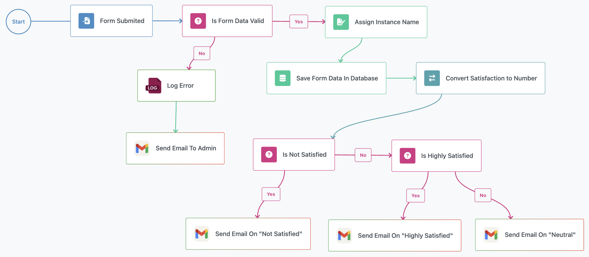
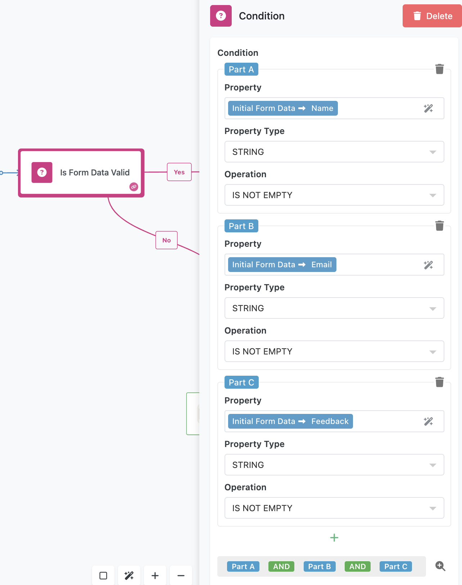
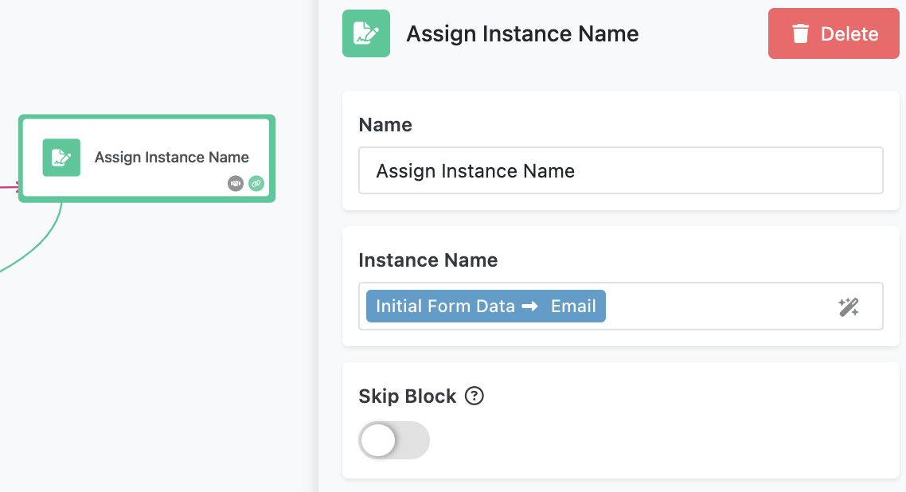
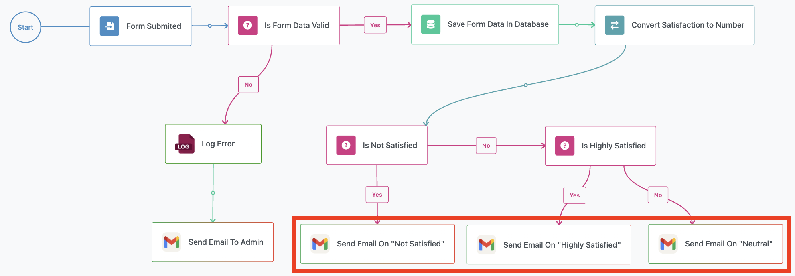

The **Customer Satisfaction Survey Flow** is an interactive demonstration of how FlowRunner™ processes external data submissions, validates input, and dynamically routes logic to automate communications. By working through this flow, you’ll learn how to integrate external systems (such as Google Forms) with FlowRunner™ and explore core concepts like validation, database interactions, and conditional logic.  



## User Experience  

This flow begins with a user filling out a Google Form, which collects the following details:  Name, Email, Satisfaction Rating, and Feedback. Upon form submission, the flow validates the input, saves it to a database, and sends a tailored email based on the satisfaction rating provided by the user.  


## Flow Implementation  

### Receiving and Validating Data  

The **Form Submitted** block receives the data submitted from the Google Form. The flow then validates the data using the **Is Form Data Valid** condition block, ensuring that the required fields (**Name**, **Email**, and **Feedback**) are present and not empty. Below is the configuration panel for the condition block. Notice how the entire condition consists of three parts - `A`, `B`, and `C`. 



The entire logical expression of the condition is shown at the bottom of the screen in the screenshot above. The `AND` operators are clickable to change between `AND` and `OR`. The individual parts can be dragged to place elsewhere in the condition expression. Finally, you can place round brackets around parts of the expression to prioritize its evaluation.


If the condition evaluates to `false`, the flow proceeds down the **No** branch. In that case, the flow logs an error message to FlowLogger and notifies the admin via email. Otherwise, the flow continues through the `Yes` branch.

### Assigning Instance Name
Each form submission initiates a new instance of the flow, and every instance maintains its own unique context to manage the data it operates on. This design is a core architectural feature of FlowRunner™, ensuring proper sandboxing to keep data isolated between different automation "runs."

To make it easier to identify individual flow instances in the analytics interface, you can assign a descriptive name to each instance. This name can be dynamically generated using any data the flow processes. For example, in this sample flow, the instance name is assigned as the user's email address. Choosing meaningful names enhances traceability and helps you quickly understand the purpose or origin of each instance.



### Saving Data to the Database  

The flow uses the **Save Record in Database** block, labeled as **Save Form Data in Database**, to persist the data in the table. Each field from the form is mapped to a corresponding column in the database. The `Property` drop-downs are populated dynamically with the names of the columns from the selected table.


!!! note
    To inspect the database, its structure/schema and the data it stores, click the `QUICK ACCESS` button in the top-left corner and navigate to **Backendless Database**. You will find the **CustomerSatisfactionSurveyFlow** table. Click the table to select it. The **DATA BROWSER** tab will display the table data. To see the table structure/schema, click the **SCHEMA** tab.

### Sending Follow-Up Emails  

The primary goal of this flow is to send a personalized follow-up email based on the user’s satisfaction rating. Each email serves a specific purpose:  

- **Highly Satisfied (9 or above)**: Thank the user for their feedback and encourage them to share a testimonial.  
- **Neutral (6 to 8)**: Request suggestions for improvement to better meet user needs.  
- **Not Satisfied (5 or below)**: Apologize and invite the user to provide additional feedback.  



### Evaluating Satisfaction Rating  

To determine which email to send, the flow evaluates the satisfaction rating submitted through the Google Form. However, since Google Forms submits the rating as a string, the flow cannot directly compare it to numeric thresholds.  

To address this, the flow uses a **Transform Data** block to convert the satisfaction rating from a string to a numeric value. The transformed value, referred to as **Satisfaction as a Number**, ensures that subsequent condition blocks can properly evaluate the rating.  


### Using Conditional Logic  

With the numeric satisfaction value ready, the flow uses two condition blocks to route the logic:  

1. The first condition checks if the satisfaction rating is **5 or below**. If true, the flow sends the "Not Satisfied" email.  
  
    

2. If the first condition is false, the flow proceeds to the second condition, which checks if the rating is **9 or above**. If true, the flow sends the "Highly Satisfied" email.  

    

3. If neither condition is true, the flow defaults to sending the "Neutral" email.  

By structuring the flow in this way, every user receives a follow-up message that reflects their feedback, enhancing the user experience and maintaining effective communication.  

## Preparing to Run the Flow  

1. **Set Up FlowLogger** - Open [FlowLogger](https://logger.flowrunner.ai) and copy the session code. Click the **Log Error** block and click the **Configure** button to enter the session code.  

2. **Authenticate Gmail Integration** - Click the **Send Email to Admin** block. Click **Login** to authenticate with your Google account, allowing the flow to send emails. Select the created OAuth connection for all other email follow-up blocks (click the block and select the connection in the **OAuth Connection** section).

3. **Set Up the Google Form** - To start working with this flow, we’ve prepared a [Google Form](https://forms.gle/F17YapwPHqBUbmY59) for testing purposes. This shared form requires you to supply your flow’s callback URL, as the URL is unique for each user. Follow these steps to link the form to your flow:  

    1. **Get Your Flow’s Callback URL**  
      Open the **Form Submitted** block in the Flow Editor, which is an External Callback. Copy the **Callback URL** from its properties.  

    2. **Paste the URL in the Google Form**  
      Use the provided [Google Form](https://forms.gle/F17YapwPHqBUbmY59) and paste your Callback URL in the first field. This ensures the form sends data to your flow.  

    Alternatively, you can [recreate the form](#set-up-your-own-google-form) specifically for your flow by following the steps below.  

## Running the Flow  

Submit the [Google Form](https://forms.gle/F17YapwPHqBUbmY59) or your custom form. Monitor the flow’s execution in FlowLogger to observe data validation, database operations, and email delivery.  

## Set Up Your Own Google Form  

1. **Create the Form**  
   Navigate to [Google Forms](https://forms.google.com) and create a new form. Add the following fields:  

    - **Name** (Short Answer)  
    - **Email** (Short Answer)  
    - **Satisfaction** (Linear Scale, 1 to 10, labeled "Dissatisfied" to "Highly Satisfied")  
    - **Feedback** (Paragraph)  

2. **Access the Script Editor**  
   In the form, click the three-dot menu in the top-right corner, then select **Script Editor**.  

3. **Add a Script to Submit Data to FlowRunner™**  
   Replace any default code in the Apps Script editor with the following script:  

     ``` { .js .copy }
     function onFormSubmit(e) { 
      var url = "YOUR_EXTERNAL_CALLBACK_URL_HERE"; // Replace with your target URL 
      var formResponse = e.response; // Extract answers from the form response 
      var itemResponses = formResponse.getItemResponses(); 
      var data = {}; 
      for (var i = 0; i < itemResponses.length; i++) { 
          var itemResponse = itemResponses[i]; 
          data[itemResponse.getItem().getTitle()] = itemResponse.getResponse(); 
      } 
      // Send data as POST request 
      var options = { 
          method: "post", 
          contentType: "application/json", 
          payload: JSON.stringify(data) 
      }; 
      UrlFetchApp.fetch(url, options); 
     }
     ```  

      Replace `YOUR_EXTERNAL_CALLBACK_URL_HERE` with the Callback URL copied from the **Form Submitted** block.  

4. **Set Up the Trigger**  
   In the Script Editor:  

    - Open the **Triggers** menu (clock icon or via Extensions > Apps Script > Triggers).  
    - Add a new trigger for the `onFormSubmit` function.  
    - Set the event type to **On form submit** and save.  

5. **Grant Permissions**  
   When saving the trigger, Google will prompt you to authorize the script. Review the permissions, select your Google account, and allow the required access.  

    Once completed, your custom form is ready to submit data to the flow.  

---

This flow serves as a practical, hands-on example of integrating external tools, managing data, and automating responses with FlowRunner™. By following the steps above, you’ll gain a deep understanding of how to build reliable, efficient workflows.  
