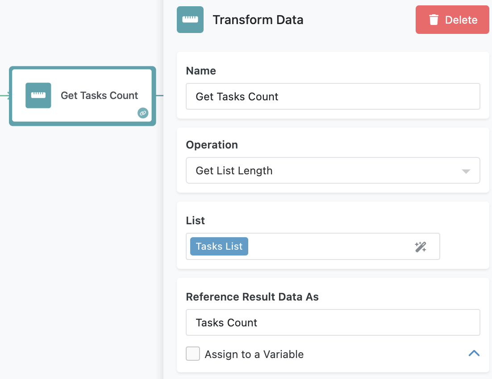
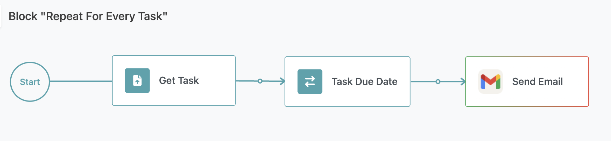
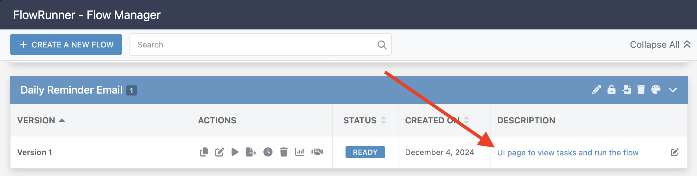
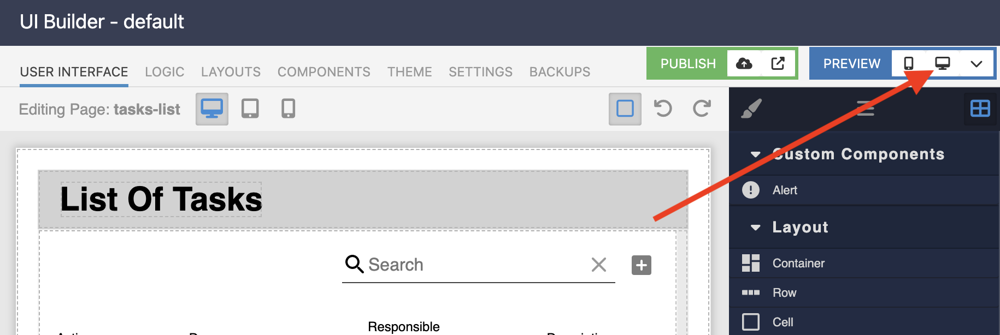

# Daily Reminder Email Flow  

The **Daily Reminder Email Flow** automates task notifications by retrieving due and incomplete tasks from a database and sending personalized reminder emails to the responsible parties. This flow provides an excellent opportunity to explore foundational FlowRunner™ features, helping you design practical and efficient automations.  

<iframe style="width: 100%; aspect-ratio: 16 / 9;" src="https://www.youtube.com/embed/g1s7EVaLKrI?si=cul3fqEOEItS2KTk" title="YouTube video player" frameborder="0" allow="accelerometer; autoplay; clipboard-write; encrypted-media; gyroscope; picture-in-picture; web-share" referrerpolicy="strict-origin-when-cross-origin" allowfullscreen></iframe>

## What You Will Learn  

By working through this flow, you’ll gain hands-on experience with several key FlowRunner™ capabilities:  

- **Querying a Database**: Learn how to fetch records dynamically based on specific conditions like task deadlines and completion status.  
- **Implementing Loops**: Understand how to process collections iteratively using the **Repeat** block.  
- **Transforming Data**: Discover how to manipulate and format data for readability or further processing.  
- **Sending Dynamic Emails**: Explore how to automate email notifications using Gmail integration, with content tailored to database records.  

These skills are essential for solving real-world problems with FlowRunner™.  

## How the Flow Works  

1. The flow starts with a database query using the **Find Record(s) in Database** block. This block retrieves task records from the **Tasks** table, filtering for tasks that are due today and not marked as done. Notice how the **Where Clause** parameter is structured. It uses the `Current Time` element from the [Expression Editor](../flow-editing/expressioneditor.md) to create a dynamic query. When the block runs according to the daily execution schedule, the query will always fetch the tasks with the `Due` date less or equal the current time. The result of the block (referenced as `Tasks List`) is a collection of task records, which serves as input for subsequent operations.(1)
{ .annotate }

    1.    :man_raising_hand: Try running the block in [Test Mode](../flow-execution/testing.md) to see how the result of the block is structured.

    

2. After the query, the flow calculates the number of tasks in the query result using a **Transform Data** block. This step provides a numeric value, referred to as **Task Count**, which determines how many iterations the flow will run in the next step.  The block uses the `Get List Length` operation. The operation's argument is the result of the database query block.

    

3. The **Repeat** block then iterates over the list of tasks. The loop runs once for each task in the collection, and during each iteration, the flow executes a predefined sequence of operations. The **Repeat** block has **Condition** which controls when the iteration over the list of tasks stops. While the condition evaluates to `true`, the iteration continues. The `Current Iteration Number` element is special, it is available in all **Repeat** blocks. The element has a number that is incremented by 1 for every new iteration. 

    

    !!! note "The Repeat Condition"
        The condition shown above works well for a loop that iterates over a list of values. The loop continues while the `Current Iteration Number` is less than the size of the list (represented by the `Tasks Count` element). 

4. Inside the **Repeat** block:  

    
    
     - A **Transform Data** block retrieves the current task based on the iteration number. This task is stored as a value called **Task**, which is used in subsequent steps.  

        

     - Another **Transform Data** block formats the task's due date into a user-friendly format, such as `MM/dd/yyyy hh:mm a`. This formatted date is used in the email body.  

        

     - The **Send Email** block uses the Gmail integration extension to send a reminder email. The email is dynamically composed using the task details, including the formatted due date and the responsible party's email address.  

        

5. The process repeats for every task in the collection until all tasks have been processed.  

## Preparing to Run the Flow  

Before running the flow, you need to configure two key elements. First, set up Gmail integration. Open the **Send Email** block inside the **Repeat** block and click the **Login** button. Authenticate with your Google account to allow the flow to send emails on your behalf.  

Next, create some tasks for testing. To do this, open the Flow Manager screen and click the link in the description of the **Daily Reminder Email** flow:

Click the "Desktop Preview" icon :material-monitor: to run the page in a browser. 

The page connects to the same **Tasks** database table used by the flow. Create a few tasks with the following conditions:  

- The **Due Date** is set to today.  
- The **Responsible Party** field contains a valid email address.  

These tasks will be included in the flow's query and used for sending reminder emails.  

## Running the Flow  

To start the flow, either click the **Start Flow** button in the Flow Editor or use the "Run the Flow" button on the demo webpage. Once triggered, the flow will query the database, process the tasks, and send emails to the designated recipients.  

After the flow completes, verify the results by checking the inboxes of the responsible parties for the reminder emails.  

