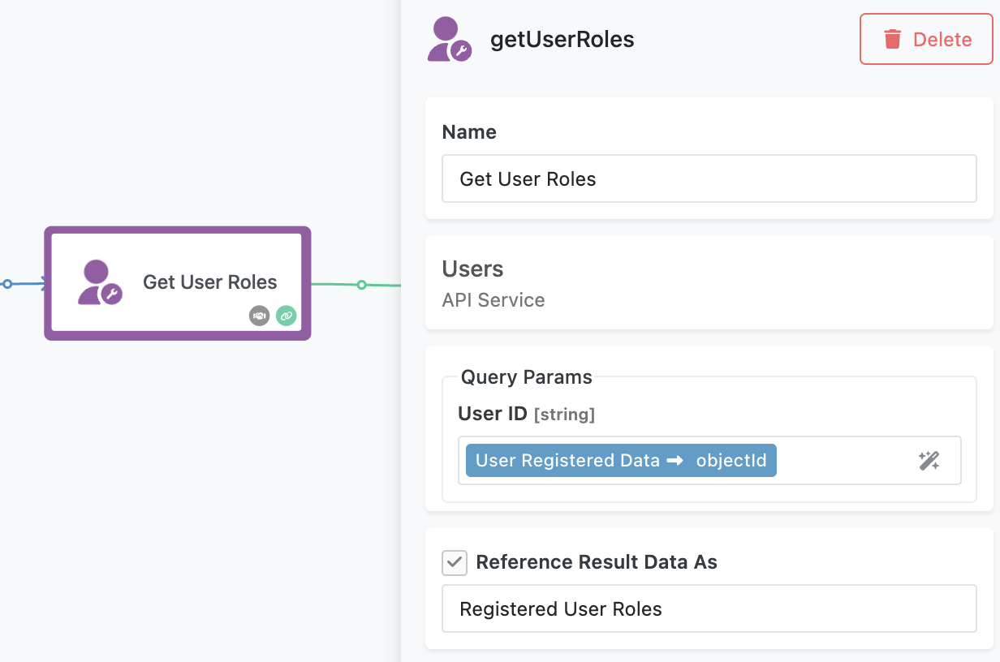

# Welcome Email Flow

The **Welcome Email Flow** is a straightforward yet effective example of automation in FlowRunner™. It demonstrates how to automatically send personalized emails to new users when they register in your application. This flow incorporates user role detection, conditional logic, and email delivery, showcasing essential FlowRunner™ capabilities.  

<iframe style="width: 100%; aspect-ratio: 16 / 9;" src="https://www.youtube.com/embed/XHEHhy2uDwM?si=FQFqkkmW7313KJgH" title="YouTube video player" frameborder="0" allow="accelerometer; autoplay; clipboard-write; encrypted-media; gyroscope; picture-in-picture; web-share" referrerpolicy="strict-origin-when-cross-origin" allowfullscreen></iframe>

## How the Flow Works  

When a new user registers in the application, the flow is triggered by the [**User Registered** block](../reference/user-registered-trigger.md). This block detects user registrations and provides user details from the registration form. These include user's `email` and the `objectId`. 


To demonstrate the flow, a sample web page is provided where users can register through a form. Once the trigger activates, the flow passes the user’s `objectId` to a **Get User Roles** custom action. This block uses Backendless APIs to retrieve all roles assigned to the user. 

!!! note
    If you are interested to find out how the custom action is implemented, navigate to the API Services section of the Backendless Console. (Click **`QUICK ACCESS`** > Select **`API Services`** -> Locate the **`Users`** service and explore the **`getUserRoles`** method)

The data returned by the custom action, a list of JSON objects, is stored as `Registered User Roles`.  



The flow then evaluates the retrieved roles using the **Is Admin** condition block. To understand how the condition works, it is important to know the format of the JSON data processed by the block. The JSON data is a value returned by the **Get User Roles** block and it looks like this:
```json
[
    {
        "system": true,
        "roleId": "67EC9EA5-C29B-44D4-B2B4-28DA66C39939",
        "name": "AuthenticatedUser"
    },
    {
        "system": false,
        "roleId": "112F0F74-93F0-40B8-AEDC-B9E737CF17CB",
        "name": "Admin"
    }
]
```

 The **Is Admin** block checks if any of the roles in the JSON array has the key `name` with the value `Admin`. 
 
 
 
 If the condition is true, the flow sends a welcome email addressed to an admin user. If the condition is false, a different email is sent to welcome a regular user.  

To send these emails, the flow uses Gmail integration for authentication and delivery. Before running the flow, you must configure the Gmail blocks by logging in and creating an OAuth connection. 


The email content, including the recipient, subject, and body, is dynamically populated based on the user's role.  

## Running the Flow  

You can test this flow using the provided web page. The web page is built in UI Builder and you are welcome to modify it to fit your scenario. The page includes a registration form where you can specify user details and assign a role (either "Admin" or "None"). Submitting the form triggers the flow.  


To access this page, navigate to **UI Builder** in the Backendless Console and locate the **RegisterUserWithRole** page. You can preview and run the page directly from the UI Builder or follow the link provided in the flow version description.  

To enable the flow, go to the **Flow Manager** in FlowRunner™ (this is the main FlowRunner™ screen with a list of flows) and click the **Start Flow** icon. Once activated, the flow will monitor for user registrations and send the appropriate welcome email based on the user’s role.  

This flow is an excellent starting point for learning FlowRunner™ basics, including triggers, conditions, and email integration. It also highlights how Backendless APIs and custom actions can work together to create dynamic, role-specific automations.  

