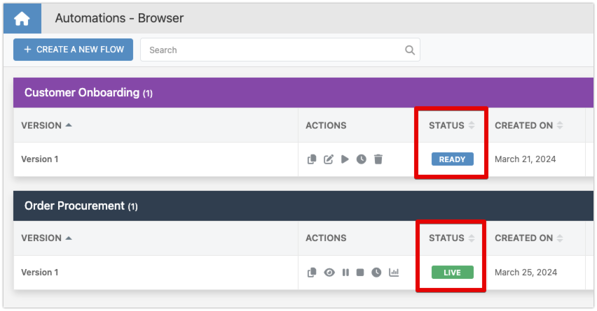
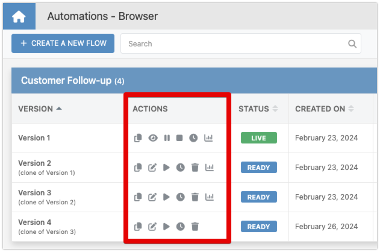

# Version Management

In the realm of Backendless Automations, understanding and effectively managing flow versions is essential for maintaining a robust and adaptable automation strategy. Each flow within your Backendless app embodies a unique sequence of triggers and actions, tailored to automate specific business processes or functions. As your needs evolve, so too may your flows, necessitating changes or adjustments. This is where flow version management becomes crucial, allowing you to navigate updates and modifications with precision and ease.

A **Flow Version** represents a variation of a flow, encompassing any changes or modifications made since its inception. You have the flexibility to create multiple versions of a flow, each capturing a different state or set of functionalities. However, it's important to note that only one version can be active and in a runnable (LIVE) state at any given time. Making updates or modifications to a flow involves cloning an existing version, applying changes, and then transitioning the updated version to LIVE status, ensuring a seamless update process.

## Version Statuses

Each flow version possesses a specific status that indicates its current state:

- **READY**: This status means the flow version has passed all Backendless validations, including checks for errors and internal consistency. It's primed for launch, awaiting your command.
- **INVALID**: A flow version with this status contains errors. Hovering over the status tag will reveal the validation error in a tooltip, providing insights for correction.
- **LIVE**: The version is currently running, actively engaging in the processes it was designed to automate.

## Version Management Functions

All version management functions are available through action icons:

* :fontawesome-regular-pen-to-square: - Edit version

* :fontawesome-solid-copy: - Clone version

* :fontawesome-solid-play: - Run/Start version

* :fontawesome-regular-clock: - Configure version schedule

* :fontawesome-solid-trash: - Delete version

* :fontawesome-solid-chart-column: - Access analytics

### Editing a Version

You can edit any flow version provided it's not in the LIVE status. Editing allows you to refine or adjust your flows, tailoring them to better meet your evolving requirements.

### Creating a Clone

Cloning a version is invaluable when you wish to experiment with changes or explore different approaches without affecting the current LIVE version. Cloning creates an identical copy of the selected version, ready for modifications.

### Starting a Version

To activate a flow version, making it the current LIVE version, you'll use the "Start Flow Version" icon. Remember, only one version can be LIVE at any time, ensuring focused and orderly execution of your automation strategies.

### Pausing/Stopping a Version

For running versions, additional actions become available:

* :fontawesome-solid-eye: - View Flow Version. Opens the version in the Flow Editor in read-only mode.

* :fontawesome-solid-pause: - Pause Flow Version. Temporarily halts new executions while allowing current processes to complete.

* :fontawesome-solid-stop: - Stop Flow Version. Completely halts all executions of the flow version, effectively taking it offline.

### Scheduling Flow Versions

Configuring a flow version schedule enables you to dictate the precise timing of your flow's execution, adding a layer of control and predictability to your automations.

### Access Flow Analytics

Backendless Automations captures analytics for each flow version, providing valuable insights into performance and execution. Accessing these analytics helps you fine-tune your flows for optimal efficiency.

### Deleting a Flow Version

When a flow version is no longer needed or relevant, you have the option to delete it. This action requires confirmation, ensuring you don't accidentally remove important versions.

## Conclusion

Version management is a pivotal component of Backendless Automations, empowering you to maintain control over your automated processes as they evolve. By leveraging the various version management operations, you can ensure that your automations remain aligned with your business objectives, adaptable to changes, and optimized for performance. Whether you're refining existing flows, experimenting with new strategies, or analyzing performance, the tools and processes outlined here will guide you toward successful automation management.