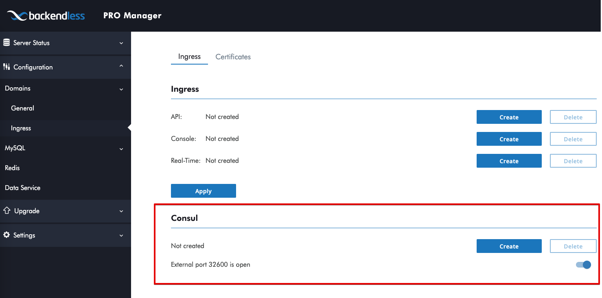

## Configuring Backendless PRO with Environment Variables and Consul

Backendless PRO offers flexible configuration options to suit different deployment needs, including the use of environment variables and Consul for key-value storage management. This section guides you through setting up and managing configurations using these methods.

### Priority of Configuration Sources
When configuring Backendless, it is important to understand the precedence of configuration sources:

1. **Environment Variables** - These have the highest priority and override any settings specified in Consul.
2. **Consul Key-Value Storage** - This serves as a centralized store for configuration but can be overridden by environment variables.

### Configuring with Environment Variables
Environment variables provide a straightforward method to configure the Backendless PRO application within a Kubernetes workload. To use environment variables for overriding Consul values, follow the naming convention:

```
BL_PROPERTY_<key-from-consul>
```

#### Example
To override the Consul key `config/application/reservedApplications` with an environment variable, you would set it up in your Kubernetes workload configuration like this:

```bash
BL_PROPERTY_config_application_reservedApplications=20
```

This sets the `reservedApplications` configuration to `20`, overriding any value provided by Consul.

### Accessing Consul
Consul is accessible through a variety of methods depending on your network setup and security preferences.

#### Direct Access via Port
To directly access the Consul UI, use the following URL pattern, substituting `<your-public-ip>` with your actual public IP address:

```
http://<your-public-ip>:32600
```

#### Configuring Access via Pro Manager
For a more secure and managed access, use the Backendless Pro Manager to set up a domain with authentication credentials. The Pro Manager also allows you to enable or disable direct port access (port 32600) for enhanced security.

1. **Navigate to the Pro Manager:** Log in with your administrator credentials.
2. **Domain Setup:** Configure the domain for accessing Consul, including setting up a user and password.
3. **Port Management:** From the same screen, you can enable or disable port 32600 to control access to your configuration values.



This setup ensures that access to your configuration via Consul is both flexible and secure, tailored to meet the specific needs of your environment.

By following these guidelines, you can efficiently manage the configuration of your Backendless PRO application using both environment variables and Consul, ensuring a robust and secure deployment.